#### DynamoDB

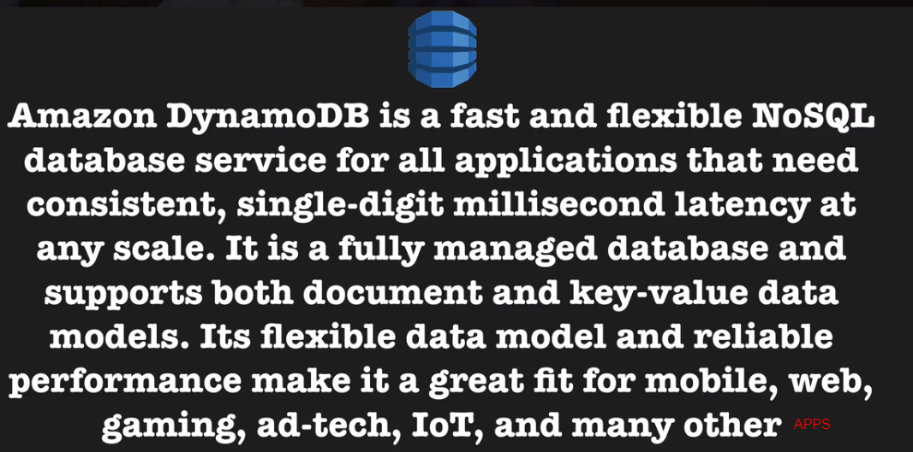

- Quick facts about DynamoDB
    - Stored on SSD storage
    - Spread Across 3 geographically distinct data centers
    - Type of data consistency
        - Eventual Consistent Reads (Default)
            - Consistency across all copies of data is usually reached within a second. 
              Repeating a read after a short time should return the updated data (Best Read Performance)
        - Strongly Consistent Reads
            - A strongly consistent read returns a result that reflect all writes that 
              received a successful response prior to the read

- The basics         
    - Table
    - Items (Think a row of data in table)
    - Attributes (Think of a column of data in a table)

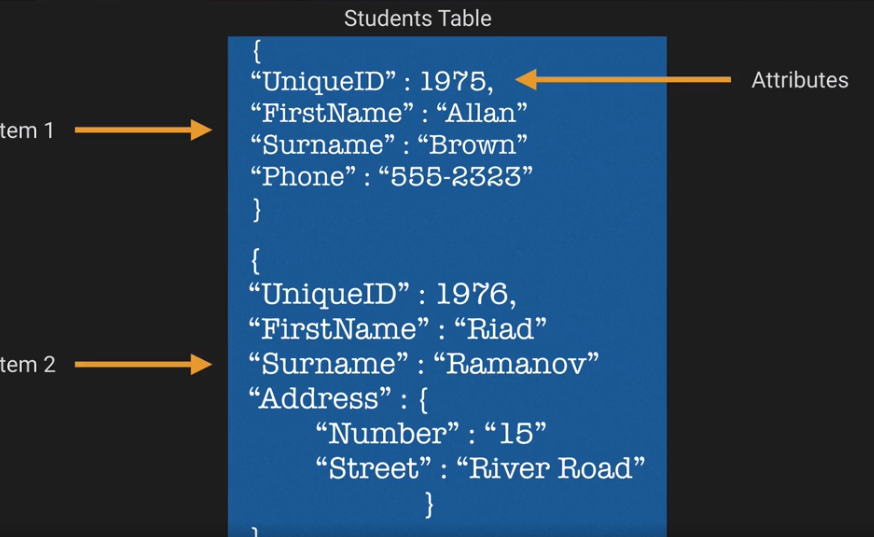

- Pricing
    - Provisioned Throughput Capacity
        - Write Throughput $0.0065 per hour for every 10 units
        - REad Throughput $0.0065 per hour for every 50 units
    - First 25 GB stored per month is free    
    - Storage costs of $0.25 GB per month there after

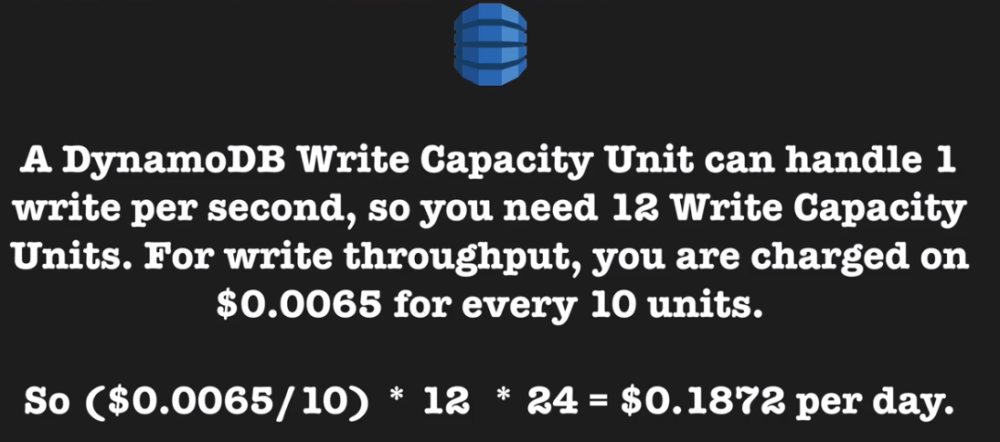

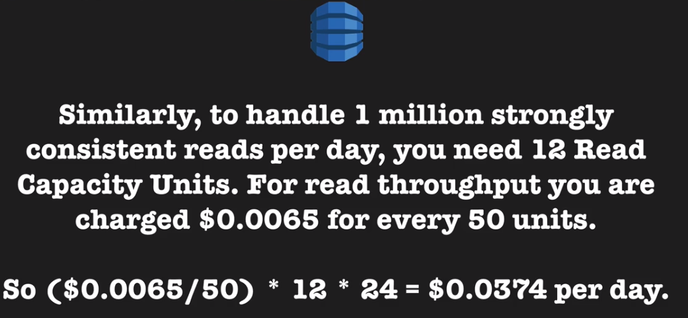

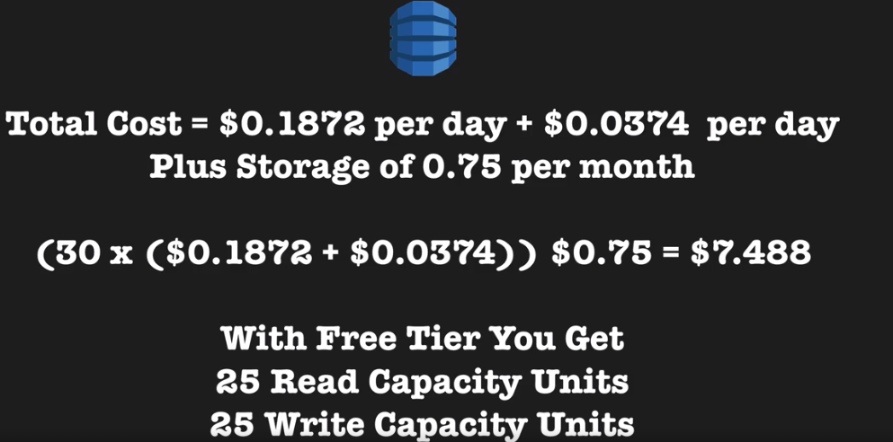

**Creating A DynamoDB Table**

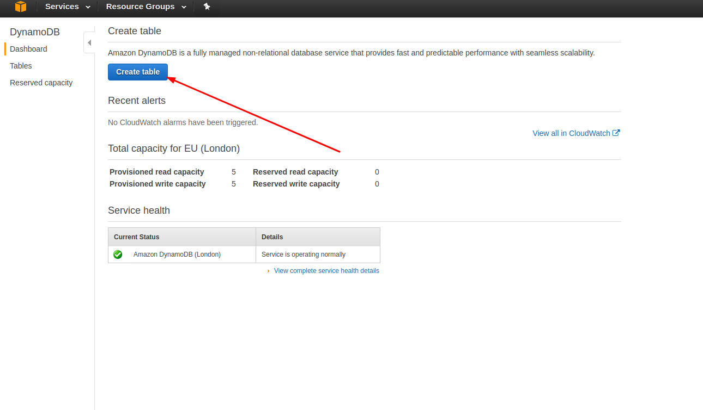

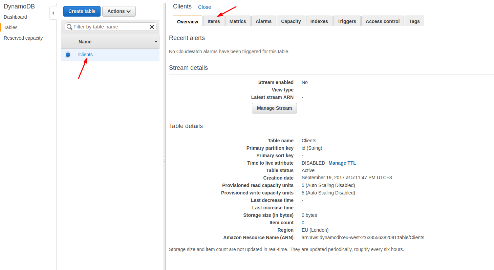

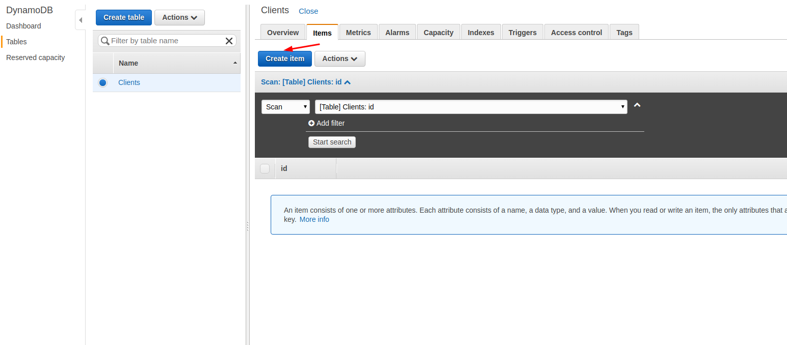

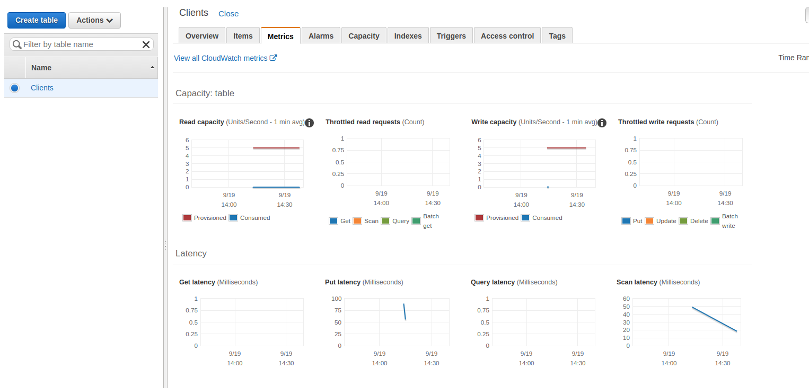

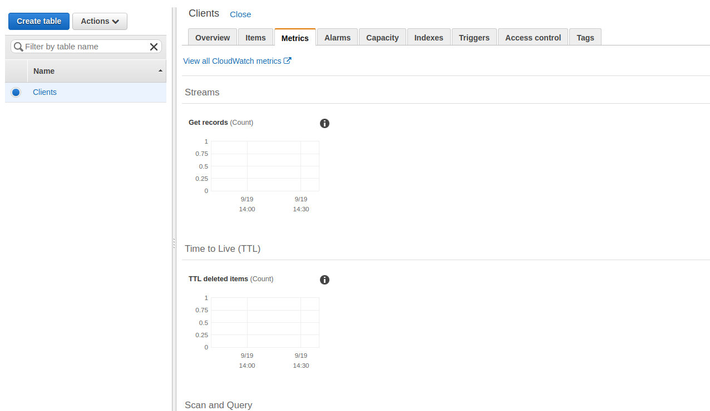

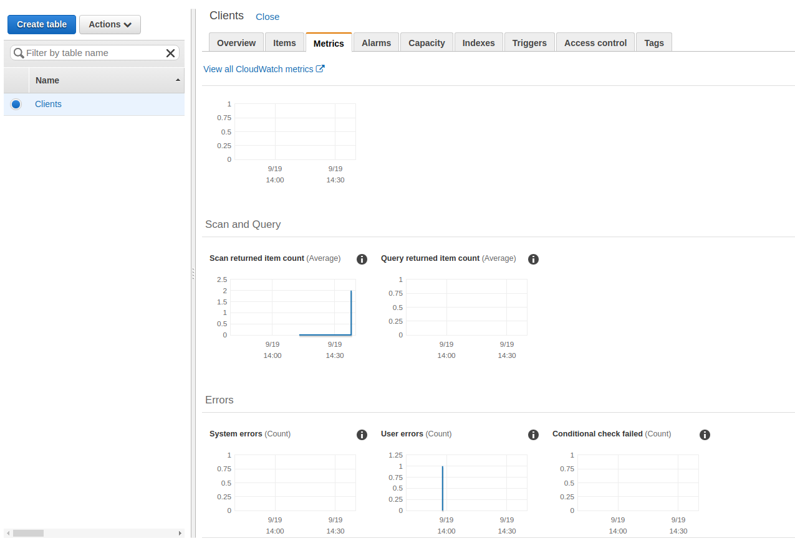

**DynamoDB Indexes**

- Primary Keys
	- Single Attribute (think unique ID)
		- Partition Key (Hash Key) composed of one attribute
	- Composite (think unique ID and date range)	
		- Partition key and Sort key (Hash and Range) composed of two attributes
		
- Partition Key
	- DynamoDB uses the partition key's value as input to an internal hash function. 
	  The output from the hash function determines the partition (this is simply the physical location in which the data is stored)
	- No two items in a table can have the same partition key value  

- Partition Key and Sort Key
	- DynamoDB uses the partition key's value as input to an internal hash function.
	  The output from thee hash function determines the partition (this is the physical location in which the data is stored)
	- Two items can have the same partition key, but they must have different sort key
	- All items with the same partition key are stored together, in sorted order by sort key value
- Indexed
	- Local Secondary Index
		- Has the SAME Partition key, different sort key
		- Can ONLY be created when creating a table. They cannot be removed or modified later
	- Global Secondary Index
		- Has DIFFERENT Partition key and different sort key
		- Can be created at table creation or added LATER
		

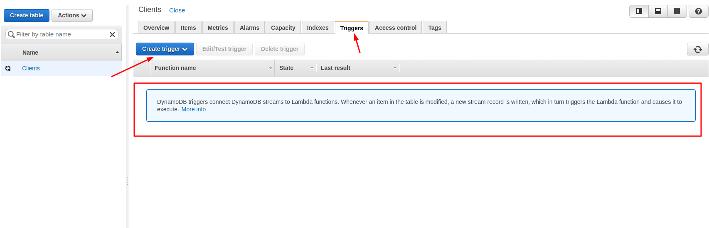

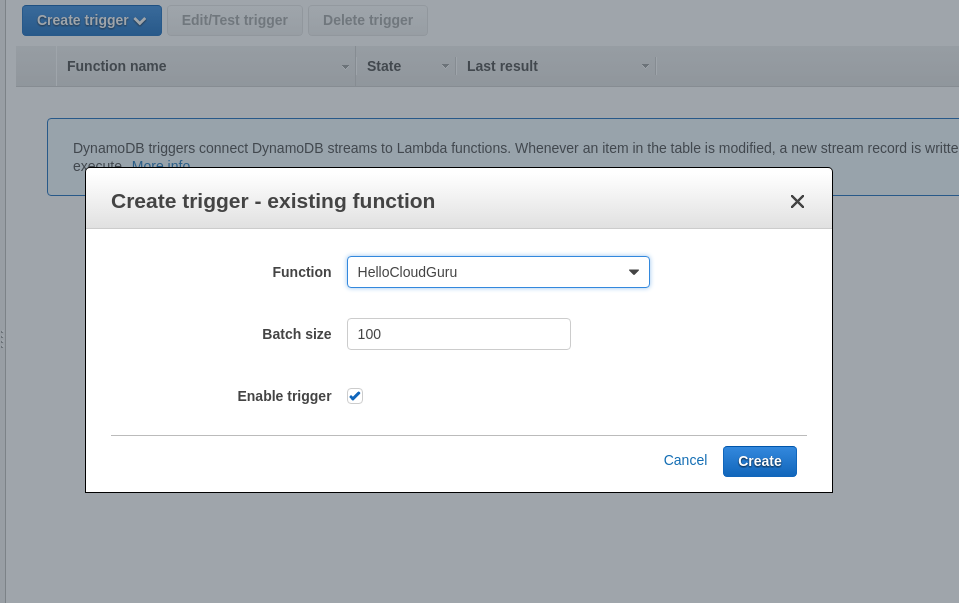
		
- Streams
	- Used to capture any kind of modification of the DynamoDB tables
		- If a new item is added to the table, the stream capture n image of the entire item, including all of its attributes
		- If an item is updated, the stream capture the "before" and "after" image of any attributes that were modified in the item
		- If an item is deleted from the table, the stream capture an image of the entire item before it was deleted
		

**Scan vs Query API Call**
- What is a Query
	- A Query operation finds items in a table using only primary key attribute values. 
	  You must provide a partition attribute name and a distinct value to search for.
	- You can optionally provide a sort key attribute name and value, and use a comparison operator to refine the search results
	- By default, a Query returns all of the data attributes for items with the specified primary key(s);
	  however you can use the ProjectionExpression parameter so that the Query only returns some of the attributes, rather than all of them
	- Query results are always sorted by the sort key. 
	  If the data type of the sort key is a number, the result are returned in numeric order; otherwise, the results are returned in order of ASCII character code values. 
	  By default, the sort order is ascending. To reverse the order, set the ScanIndexForward parameter to false
	- By default is eventually consistent but can be changed to be strongly consistent  
- What is a Scan
	- A scan operation examines every item in the table. By default, a Scan returns all of the data attributes for every item;
      however, you can use the ProjectionExpression parameter so that the Scan only returns some of the attributes, rather that all of them
- What should I use? Query or Scan?
	- Generally, a Query operation s kore efficient that a Scan operation
	  A scan operation always scans the entire table, the filters out values to provide the desired result, 
	  essentially adding the extra step of removing data from the result set. 
	  Avoid using a Scan operation on a large table with a filter that removes many results, if possible. 
	  Also, as a table grows, the Scan operation slows. The Scan operation examines every item for the requested values, 
	  and can use up the provisioned throughput for a large table in a single operation.
	  For quickly responce times, design your tables in a way that can use the Query, Get, or BatchGetItem APIs, instead.
	  Alternatively, design your application to use Scan operations in a way that minimizes the impact on your table's request rate
- Exam Tips
	- A Query operation fins items in a table using only primary key attribute values. 
	  You must provide a partition key attribute name and a distinct value to search for.
	- A Scan operation examines every item in the table. By default, a Scan returns all of the data attributes for every item; 
	  however, you can use the ProjectionExpression parameter so that the Scan only returns some of the attributes, rather than all of them
	- Query results are always sorted by the sort key in ascending order. Set ScanIndexForward parameter to false to reverse it
	- Try to use a query operation over a Scan operation as it is more efficient 
	 
**DynamoDB Provisioned Throughput**	 

- Provisioned Throughput
	- Unit of Read provisioned throughput
		- All reads are rounded up tp increments of 4 Lb
		- Eventually Consistent Reads (default) consist of 2 reads per second
		- Strongly Consistent Reads consist of 1 read rep second
	- Unit of Write provisioned throughput
		- All writes are 1 KB
		- All writes consist of 1 write per second
- Magic Formula
	- Question - You have an application that requires to read 10 items of 1 KB per second using eventual consistency.
	 What should you set the read throughput to?
	 	- (Size of Read rounded to nearest 4 KB chunk / 4 KB) * number of items = read throughput
	 	- Divide by 2 if eventually consistent
	 
	- Question - You have an application that requires to read 10 items of 1 KB peer second using eventual consistency.
	  What should you set to read throughput to?
	 	- First we calculate how many read units per item we need
	 	- 1 KB rounded to the nearest 4 KB increment = 4
	 	- 4 KB / 4 KB = 1 read unit per item
	 	- 1 * 10 read items = 10
	 	- Using eventual consistency we got 10 / 2 = 5
	 	- 5 units of read throughput
	- Question - You have an application that requires to read 1- items of 6 KB per second using eventual consistency. 
	 	What should you set the read throughput to?
	 	- First we calculate how many read units per item we need
	 	- 6 KB rounded to the nearest increment of 4 KB is 8 KB
	 	- 8 KB / 4 KB = 2 units per item
	 	- 2 * 10 read items = 20
	 	- Using eventual consistency we got 20 / 2 = 10
	 	- 10 units of read throughput
	- Question - You have an application that requires to read 5 items of 10 KB per second using eventual consistency. 
	    What should you set the read throughput to?
	    - First we calculate how many read units per item we need
	    - 10 KB rounded up to nearest increment of 4 KB is 12 KB
	    - 12 KB / 4 KB = 3 read units per item
	    - 3 * 5 read items = 15
	    - Using eventual consistency we get 15 / 2 = 7/5
	    - 8 units of read throughput
	- Question - You have an application that requires to read 5 items of 10 KB per second using strong consistency.
	   What should you set the read throughput to?
		- First we calculate how many units per item we need
		- 10 KB rounded up to nearest increment of 4 KB is 12 KB
		- 12 KB / 4 KB = 3 read units per item
		- 3 * 5 read items = 15		   
		- Using strong consistency we DON'T divide by 2
		- 15 units of read throughput
	- Question - You have an application that requires to write 5 items, wih each item being 10 KB in size per second.
	  What should you set the write throughput to?
		- Each write unit consist of 1 KB od data. You need to write 5 items per second with each item using 10 KB of data.
		- 5 * 10 KB = 50 write units
		- Write throughput of 50 Units
	- Question - You have an application that requires to write 12 items 100KB pr item each second. 
	  What should you set the write throughput to?
		- Each write unit consist of 1 KB of data. You need to write 12 items per second with each item having 100 KB of data.
		- 12 * 100 KB = 1200 write units
		- Write throughput of 1200 Units
- Error Codes
		
	400 HTTP Status Code - ProvisionedThroughputExceededException
	
	You exceeded your maximum allowed provisioned throughput for a table or for one or more global secondary indexes
	
**Using Web Identity Providers To Connect To Authenticate To DynamoDB**	

- Web Identity Providers

	You can authenticate users using Web identity providers (such as Facebook, Google, Amazon or any other Open-ID Connect-compatible Identity provider).
	This is done using AssumeRoleWithWebIdentity API.
	
	You will need to create a role first.
	
	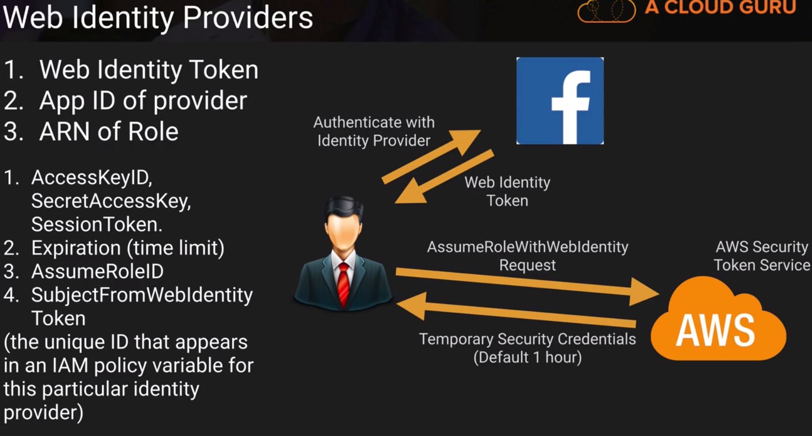
	
- Steps	taken to authenticate (comes up on exam)

1. User Authenticates with ID provider (such as Facebook)
2. They are passed a Token by their ID provider
3. Your code calls AssumeRoleWithWebIdentity API and provides the providers token and specifies the AEN for the IAM Role
4. App can now access DynamoDB from between 15 minutes to 1 hour (default is 1 hour)

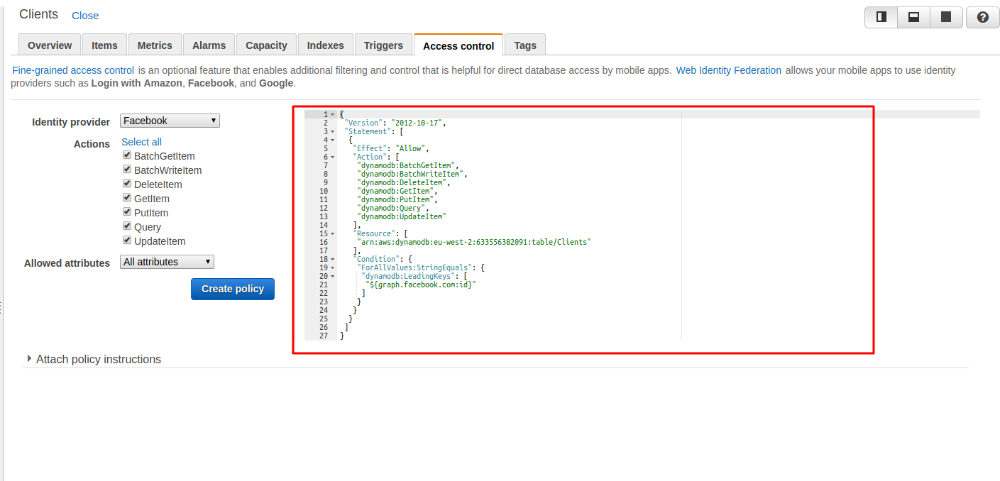

