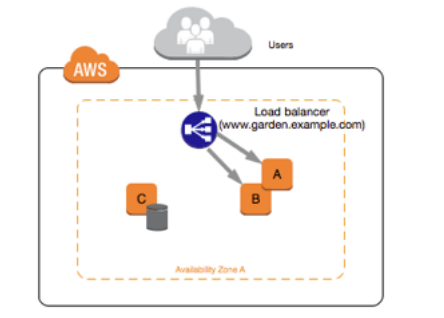
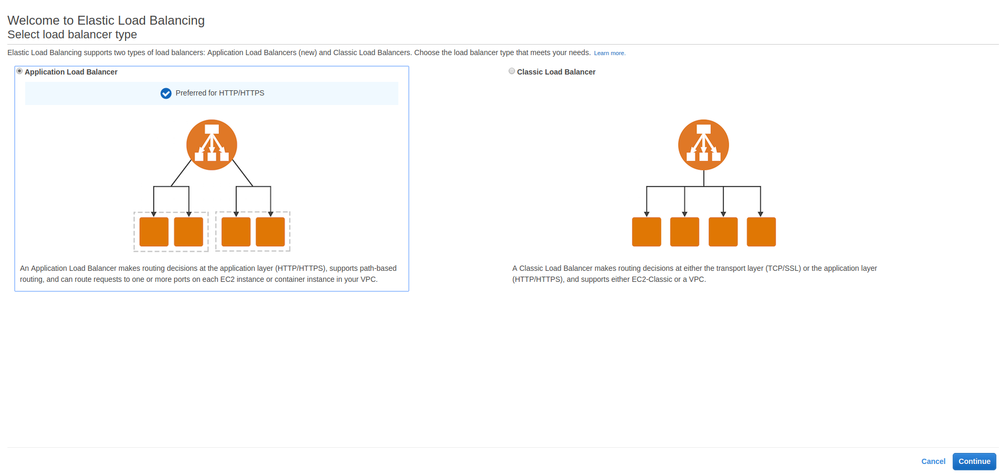
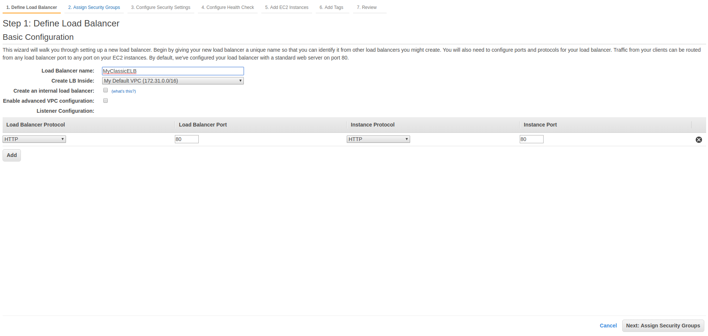

#### Elastic Load Balancer

Elastic Load Balancer to load balance the traffic between these instances. 

 - Instances monitored by ELB are reported as:
 	- InService
 	- OutOfService
 - Health checks check the instance health by talking to it
 - Have their own DNS name. You are never given an IP address
 - Read the ELB FAQ for Classic Load Balancer