### S3 

http://docs.aws.amazon.com/AmazonS3/latest/gsg/s3-gsg.pdf

**The Basics**
- S3 is Object based i.e. allows you to upload files
- Files can be 0 Bytes to 5 TB
- There is unlimited storage
- Files are stored in Bucket(Folder)
- S3 is a universal namespace, that is, name must be unique globally
- When you upload a file to S3 you will receive a HTTP 200 code if the upload was successful
- Built for 99.9% availability for the S3 platform
- Amazon Guarantee 99.9% availabilityAmazon guarantees 99.99999999% durability for S3 information (11 * 9's)
- Tiered Storage Available
- Lifecycle Management
- Versioning
- Encryption
- Secure your data using Access control Lists and Bucket Policies

**Data Consistency Model For S3**
- Read after Write consistency for PUTS of new Objects
- Eventual Consistency for overwrite PUTS and DELETED (can take some time to propagate)

**S3 - S3 is a simple key, value store**
- S3 is Object based. Objects consist of the following:
	- Key (This is simply the name of the  object)
	- Value (This is simply the data and is made up of a sequence of bytes)
	- Version ID (Important for versioning)
	- Metadata (Data about the data you are storing)
	- Subresources
		- Access Control Lists
		- Torrent
		
**S3 - Storage Tiers/Classes**	
	- S3 - 99.99% availability, 99.9999999% durability, stored redundantly across multiple devices in multiple facilities and 
	is designed to sustain the loss of 2 facilities concurrently
	- S3 - IA (Infrequently Accessed) For data that is accessed less frequently, but requires rapid access when needed.
	 Lower fee that S3, but you are charged a retrieval fee.
	- Reduced Redundancy Storage - Designed to provide 99.999% durability and 99.99% availability of objects over a given year.
	- Glacier - very cheap, but used for archival only. It takes 3 - 5 hours to restore from Glasier.
	

**S3 - Charges**
- Charged for
	- Storage
	- Requests
	- Storage Management Pricing
	- Data Transfer Pricing
	- Transfer Acceleration 
	
	

	

**Exam tips**
- Remember that S3 is Object based i.e. allows you to upload files (Files, videos, pictures)
- Not suitable to install an operation system or data base
- There is unlimited storage
- Files are stored in Buckets (Folders)
- S3 is a universal namespace, that is, names must be unique globally
- Read after Write consistency for PUTS of new Objects
- Eventually Consistency for overwrite PUTS and DELETES (can take some time to propagate)
- S3 Storage Classes/Tiers
	- S3 (durable, immediately available, frequently accessed)
	- S3 - IA (durable, immediately available, infrequently accessed)
	- S3 - Reduced Redundancy Storage (data that is easily reproducible, such as thumb nails etc)
	- Glacier - archived data, where you can wait 3 - 5 hours before accessing
- Remember the core fundamentals of an S3 objects
	- Key (name)
	- Value(data)
	- Version ID
	- Metadata
	- Subresources
		- ACL
		- Torrent
- Successful uploads will generate a HTTP 200 status code
- Read the S3 FAQ before taking the exam. It comes up A LOT!

**How to create bucket**

	

	

Name of bucket must be:
- unique
- lowercase

	

	
	
How to upload a file
	
	
	
	

	
	
	
	
	

	

	

**Hosting static web site**

	

	

**Build A Serverless Webpage**

**S3 Version Control**

- Size of bucket will be summary of versioned files
- Stores all versions of an object
- Great backup tool
- Once enabled, Versioning cannot be disabled, only suspended
- Integrates with Lifecycle rules
- Versioning's MFA Delete capability, which uses multi-factor authentication, can be used to 
provide an additional layer of security

**Cross Region Replication**

- Versioning must be enabled on both the source and destination buckets
- Regions must be unique
- Files in an existing bucket are not replicated automatically. All subsequent updated files will be replicated automatically
- You cannot replicate to multiple buckets or use daisy chaining (at this time)
- Delete markers are replicated
- Deleting individual versions or delete markers will not be replicated
- Understanding what Cross Region Replication is at a high level

**S3 Lifecycle Management & Glacier**

- Can be used in conjunction with versioning
- Can be applied to current versions and previous versions
- Following actions can now be done
	- Transition to Standard - Infrequent Access Storage Class (128 Kb and 20 days after the creation date)
	- Archive to the Glacier Storage Class (30 days after IA, if relevant)
	- Permanently Delete
	
	

**Cloud Front Overview**

 - Edge Location - This is the location where content will be cached. This is separate to an AWS Region/AZ
 - Origin - This is the origin of all the files that the CDN will distribute. 
 This can be either an S3 Bucket, an EC2 Instance, an Elastic Load Balancer or Route 53
 - Distribution - This is the same given the CDN which consists of a collection of Edge Locations
 
 

 

 

 

- Web Distribution - Typically used for Websites
- RTMP - Used for Media Streaming

`Exam Tips`
- Edge Location - This is the location where content will be cached. This is separate to an AWS Region/AZ
- Origin - This is the origin of all the files that the CDN will distribute. 
  This can be either an S3 Bucket, an EC2 Instance, an Elastic Load Balancer or Route53
- Distribution - This is the same given the CDN which consists of a collection of Edge Locations 
	- Web Distribution - Typically used for Websites
    - RTMP (Adobe Flash Media Server's RTMP protocol) - Used for Media Streaming
- Edge Locations are not just READ only, you can write to them too 
  (ie put an object on to them)    
- Objects are cached for the life of the TTL(Time to Live)  
- You can clear cached objects, but you will be charged

**Create A CDN (Content Distribution Network, Content Delivery Network)**

You can increase the performance of your web site by deploying Cloud Front.
To deliver content to end users with lower latency, Amazon CloudFront uses a global network of 82 edge locations and 11 regional edge caches across 23 countries and 49 cities for content delivery. 

Местный очень фичастый Content Delivery Network. CDN — это такая штука, которая позволяет подвинуть контент (обычно статический — CSS, JS, картинки, файлы) физически ближе к пользователю. 
За счет меньшего летенси контент доставляется намного быстрее, плюс происходит распределение нагрузки
  
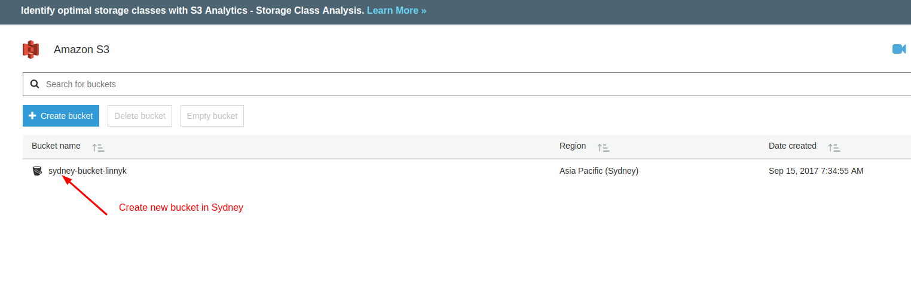  

 

 

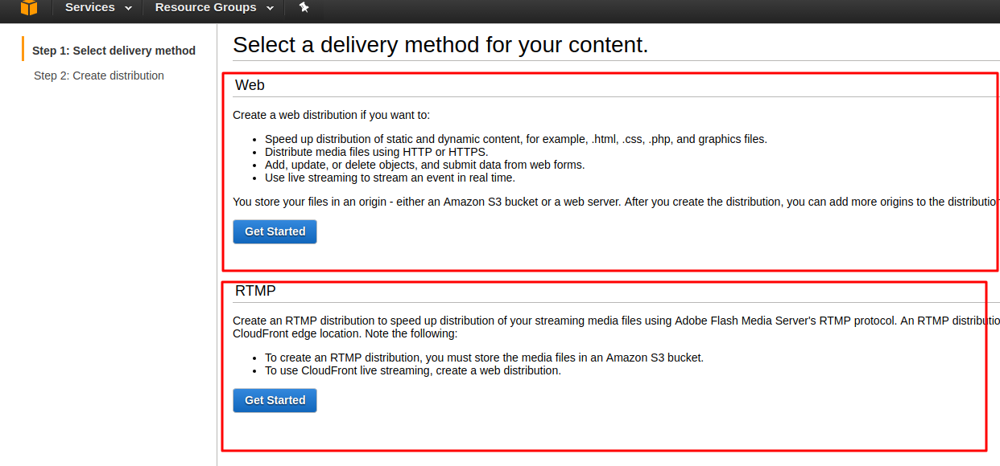 

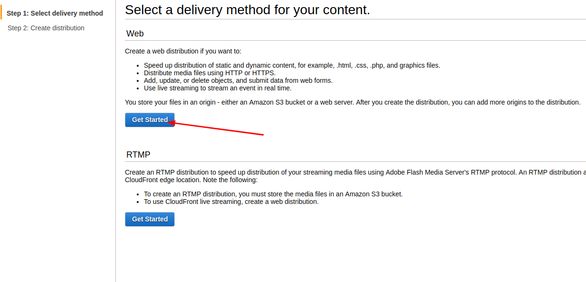 

 

 

 

 

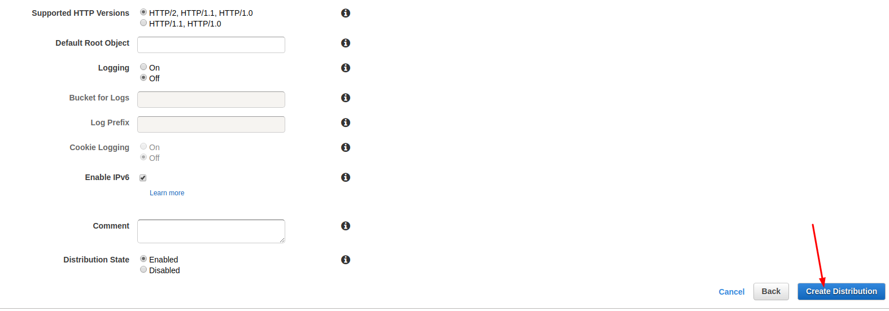 

 

 

 

**S3 - Security and Encryption**

- Securing:
	- By default, all newly created bucket are PRIVATE
	- You can setup access control to your buckets using
		- Bucket Policies
		- Access Control Lists
	- S3 buckets can be configured to create access logs which log all requests made to the S3 buckets. This can be done to another bucket
- Encryption
	- In Transit (from PC to bucket)
		- SSL/TLS
	- At Rest 
		- Server Side Encryption
			- S3 Managed Keys - SSE-S3 
			- AWS Key Management Service, Managed Keys - SSE-KMS
			- Server Side Encryption With Customer Provided Keys - SSE-C
		- Client Side Encryption	

**Storage Gateway**

- How can I backup my data?
	- Write backup data to S3 directly, using API calls
	- Write backup data to Storage Gateway, which then securely replicates t to S3
- Storage Gateway 2017
	- File Interface
	- Volumes Interface
		- Gateway-Cached Volumes
		- Gateway-Stored Volumes
	- Tape Interface
		- Gateway-Virtual Tape Library
	- FileVolumes	
		- NFS
	- Volume Gateway
		- Cached (Gateway-Cached Volumes)
			- iSCSI based block storage
		- Stored (Gateway-Stored Volumes)	
			- iSCSI based block storage
	- Tape Gateway (Gateway-Virtual Tape Library)		
		- iSCSI  base virtual tape solution
		
		
- File Gateway 
	- Unlimited amount of storage. However maximum file size is 5 TB
		
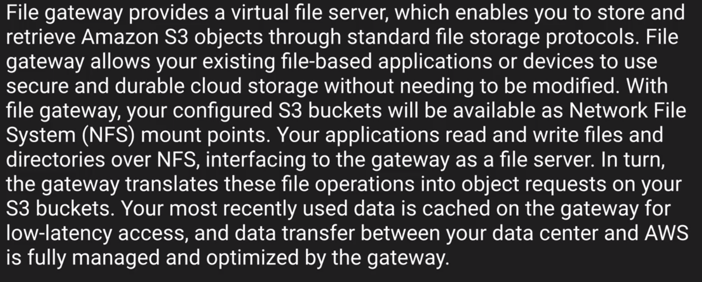 
		
- Gateway-Cached Volumes
	- Each Volume can store up to 32 TB in Size
	- 32 Volumes supported. 1 PB of data can be stored (32 * 32)

 

- Gateway-Stored Volumes
	- Each Volume can store up to 16 TB in Size
	- 32 Volumes supported. 512 tb of data can be stored (32 * 16)

 

- Gateway-Virtual Tape Library
	- Virtual Tape Library (S3) 1500 virtual tapes (1 PB)
	- Virtual Tape Shelf (Glasier) unlimited tapes

 

- General Facts
	- Can be deployed on-premise, or as an EC2 instance
	- Can schedule snapshots
	- You can use Storage Gateway with Direct Connect
	- You can implement bandwidth throttling
	- On-premise need either Vmware's ESXi or Hyper-V
	- Hardware Requirements
		- 4 or 8vCPUs
		- 7.5 GB of RAM
		- 75 GB for installation of VM image and system data
		
- Storage Requirements	
	- For gateway-cached volume configuration, you will need storage for the local cache and an upload buffer
	- For gateway-stored volume configuration, you will need storage for your entire dataset and an upload buffer.
	  Gateway-stored volumes can range form 1 GiB to 1 Tb. Each gateway configured for gateway-stored volumes
	  can support up to 12 volumes and a total volume storage of 16 TB
	- For gateway-VTL configuration, you will need storage for the local cache and an upload buffer  
	
- Networking Requirements		
	- Open port 443 on your firewalls
	- Internally, you will need to allow port 80 (activation only), port 3260 (by local systems to connect to iSCSI targets exposed the gateway) 
	  and port UDP 53 (DNS)
- Encryption
	- Data in transit is secured using SSL
	- Data at rest can be encrypted using AES-256
- Gateway-Cached and Gateway-Stored Volumes
	- You can take point-in-time incremental snapshot of your volume and store them in Amazon S3 in the form of Amazon EBS snapshots
	- Snapshots can  be initiated on a scheduled or ad-hoc basic
	- Gateway-Stored Snapshots	
		- If your volume data is stored on-premises, snapshots provide durable, off-site backups in Amazon S3
		- You can create a new Gateway-Stored volume form a snapshot in the event you need to recover a backup
		- You also use a snapshot of your Gateway-Stored volume as the starting point for 
		  a new Amazon EBS volume which you can then attach to an Amazon EC2 instance
	- Gateway-Cached	  
		- Snapshots can be used to preserve versions of your data, allowing you to revert to a prior version when required or 
		  to repurpose a point-in-time version as a new Gateway-Cached volume
- Gateway-Virtual Tape Library Retrieval	
	  
	The virtual tape containing your data must be stored in a Virtual Tape Library before it can be access. 
	Access to virtual tapes in your Virtual Tape Library is instantaneous.
	  
    If the virtual tape containing your data is in your Virtual Tape Shelf, you must first retrieve the virtual tape form your Virtual Tape Shelf.
    It takes about 24 hours for the retrieved virtual tape to be available in the selected Virtual Tape Library    
	  
- Gateway-Virtual Tape Library Supports
	  - Symantec NetBackup version 7.x
	  - Symantec Backup Exec 2012
	  - Symantec Backup Exec 2014
	  - Symantec Backup Exec 15
	  - Microsoft System Center 2012 R2 Dta Protection Manager
	  - Veeam Backup and Replication V7
	  - Veeam Backup and Replication V8
	  - Dell NetVault Backup 10.0

- `Exam Tips`
	- Know the four different Storage Gateway Types:
		- File Gateway
		- Volume Gateway
			- Cached - OLD NAME (Gateway-Cached Volumes)
			- Stored - OLD NAME (Gateway-Stored Volumes)
		- Tape Gateway - OLD NAME(Gateway-Virtual Tape Library)	
		- Remember that access to virtual tapes in your tape library are instantaneous. 
		  If you tape is in the virtual tape shelf (glacier) it can take 24 hours t get back to your virtual tape library
		- Encrypted using SSL for transit and is encrypted at rest in Amazon S3 using ES-256  
		- Gateway-Stored Volumes - stored data as Amazon EBS Snapshots in S3
		- Snapshots can be scheduled
		- Bandwidth can be throttled (good for remote sites)
		- You need a storage gateway in each site if using multiple locations
	
**Snowball**			

- Import/Export Disk

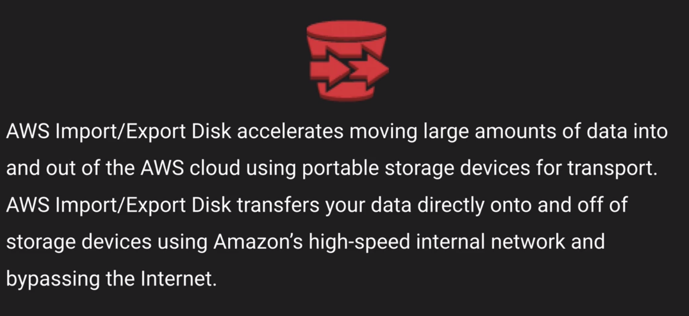 

- Types of Snowballs

	- Snowball
	
	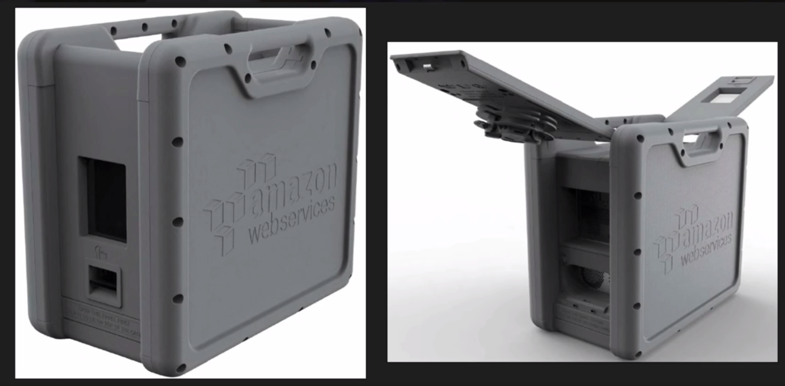
	
	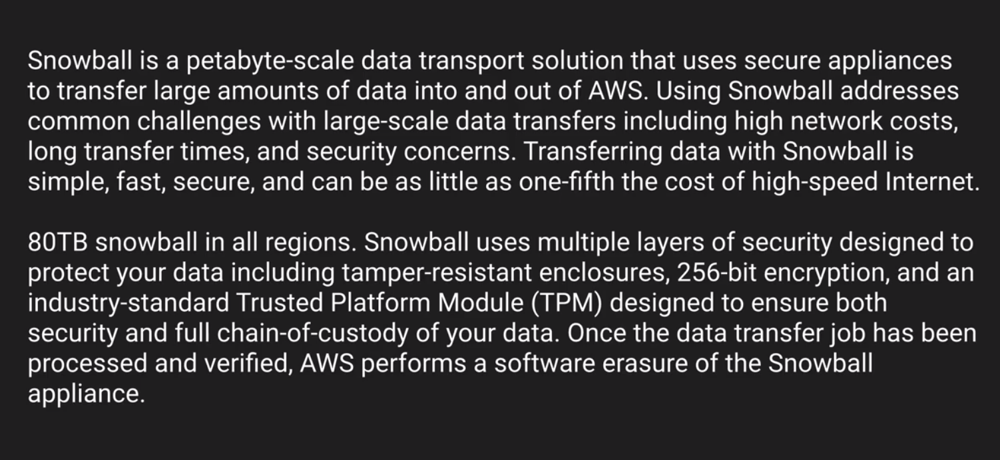
	
	- Snowball Edge
	
	
	
	- Snowmobile
	
	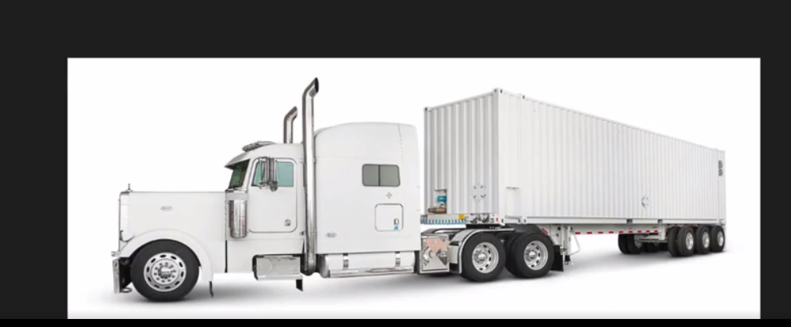
	
	
	
- `Exam tips`	
	- Understand what Snowball is
	- Understand what Import Export is
	- Snowball Can
		- Import to S3
		- Export form S3
		
**S3 Transfer Acceleration**	
	
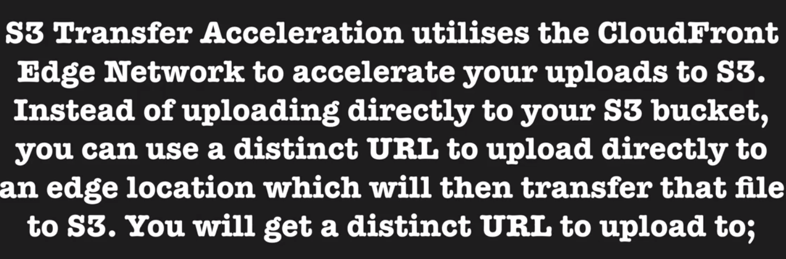

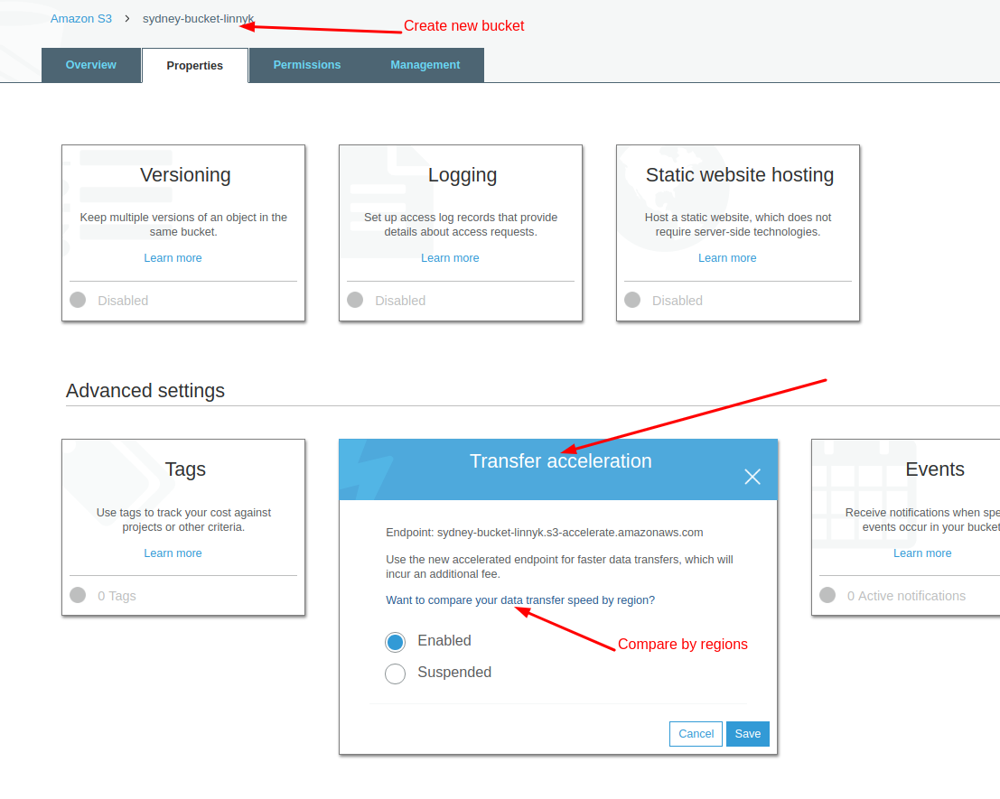

	
	
	