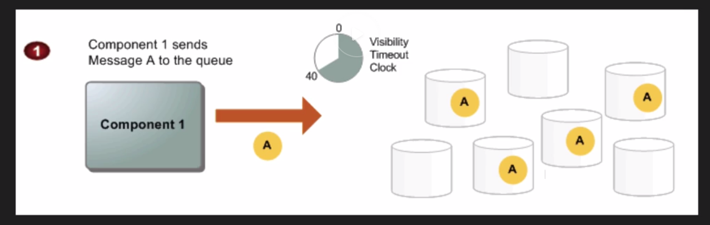
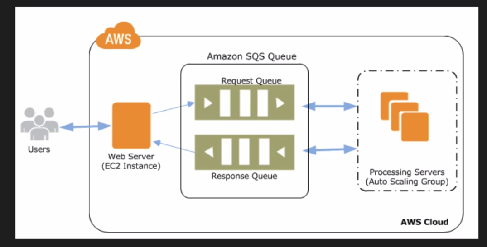

### Simple Queue Service (SQS)

Amazon SQS is a web service that gives you access to a message queue that can be used to store messages
while waiting for a computer to process them.

Amazon SQS is a distributed queue system that enables web service applications to quickly and reliable queue massages 
to be consumed by another component. A queue is a temporary repository for messages that a awaiting processing. 

Using Amazon SQS, you can decouple the components of an applications so they tun independently, with Amazon SQS
easing message management between components. Any component of a distributed application can store messages in a fail-safe queue.

Messages can contain up to `256 KB` of text n any format. 
Any component can later retrieve the messages programmatically using the Amazon SQS API.

The queue acts as a buffer between the component producing and saving data, and the component receiving the data for processing.

This means the queue resolves issues that arise if the producer is producing work faster than the consumer can process it,
or if the producer or consumer are ony intermittently connected to the network.

Amazon SQS ensures delivery of each message at least once, and supports multiple readers and writers interacting with the same queue.

A single queue can be used simultaneously by many distributed application components, with no need for those components to coordinate
with each other to share the queue.

Amazon SQS is engineered to always be available and deliver messages. One of the resulting trade offs is that SQS does not
guarantee first in, first out delivery of messages. For many distributed applications, each message can stand on its own, 
and as long as all messages are delivered, the order is not important.

If your system required that order be preserved you can place sequencing information in each message, 
so that you can reorder the messages when the queue returns them.

To illustrate, suppose you have a number of image files to encode. In an Amazon SQS worker queue, you create an Amazon SQS
message for each file specifying the command (jpeg-encode) and the location of the file in Amazon S3.
 
A pool of Amazon EC2 instances running the needed image processing software does the following:

**SQS Exam Tips**
1. Asynchronously pulls the task messages from the queue
2. Retrieves the named file
3. Processes the conversion
4. Writes the image back to Amazon S3
5. Writes a "task complete" messages to another queue 
6. Deletes the original task message
7. Check for more messages in the worker queue

**SQS Diagram**
	

	

	

**SQS Autoscaling**

	

**SQS Exam Tips**

 - Does not offer FIFO
 - 12 hours visibility time out
 - Amazon SQS is engineered to provide "at least once" delivery of all messages in its queues. 
 Although most of the time each messages will be delivered to your application exactly once, yu should design your
 system so that processing a message more then once does not create any errors or inconsistencies
 - 256 KB message size now available
 - Billed at 64 KB "Chunks"
 - A 256 KB message will be  4 * 64 KB "chunks"

**SQS Pricing**

- First 1 million Amazon SQS Requests per month are free
- $ 0.50 per 1 million Amazon SQS Requests per month thereafter ($ 0.00000050 per SQS Request)
- A single request can have from 1 to 10 messages, up to a maximum total payload of 256 KB
- Each 64 KB "chink" of payload is billed as 1 request. 
  For example, a single API cal with a 256 KB payload will be billed as four request
  
**SQS Developer Exam Tips**  

- SQS Delivery
	- SQS Messages can be delivered multiple times and in any order
- SQS - Default Visibility Time Out
	- Default Visibility Time out is 30 Seconds
	- Maximum Time out is 12 Hours
	- When you receive a message from a queue and begin processing it, you may find the visibility timeout for
	  the queue is insufficient to fully process and delete that message. To give yor self more time to process 
	  the message, you can extend its visibility timeout by using ChangeMessageVisibility action to specify
	  a new timeout value. Amazon SQS restarts the timeout period using the new value.
- SQS - Long Polling
	- SQS long polling is a way to retrieve messages form your SQS queues. 
	While the traditional SQS short polling returns immediately, even fi the queue being polled is empty, 
	SQS long polling doesn't return a responce until a message arrives in the queue, or the long poll times out. 
	SQS long polling  makes it easy and inexpensive to retrieve messages from your SQS queue as soon as they are available.
	- Maximum Long Poll Time Out = 20 seconds  
	- Example Questing:
		- Polling in a tight loops is burning CPU cycles and costing the company money. How would you fix this?
	- Answer: 
		- To enable long polling
- SQS -	Fanning out	
	- Create an SNS topic first using SNS. The n create and subscribe multiple SQS queues to the sns TOPIC
	- Now whenever a message is sent to the SNS topic, the messages will be fanned out to the SQS queues, 
	i.e. SNS will deliver the message to all the SQS queues that are subscribed to the topic
	 
	
 
 
 
