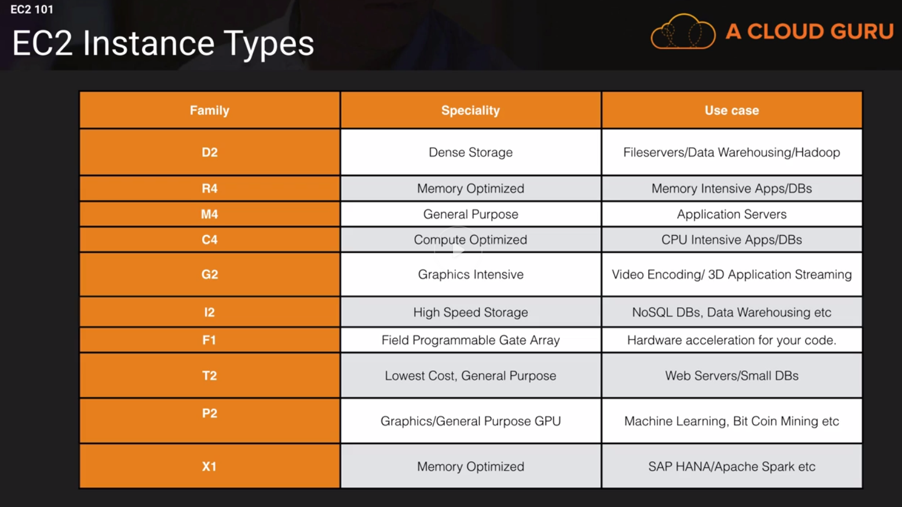

### EC2 Tips Exam

- Know the difference between
	- On demand
	- Spot
	- Reserved
	- Dedicated Hosts
- Remember with spot instances
	- If you terminate the instance, you for the hour
	- If AWS terminates the spot instance, you get the hour it was terminated in for free	

**EC2 Instance types**
	

**Exam tips EBS**

- EBS Consists of
	- SSD, General Purpose - GP2 - (Up to 10000 IOPS)
	- SSD, Provisioned IOPS - IO1 - (More than 1000 IOPS)
	- HHD, Throughput Optimized - S - frequently accessed workloads
	- HDD, Cold - SC1 - less frequently accessed data
	- HDD, Magnetic - Standard - cheap, infrequently accessed storage
- You cannot mount 1 EBS volume to multiple EC2 instances, instead use EFS	

**EC2 Lab Exam tips**

- Termination Protection is turned off by default, ou must turn it on
- On an EBS-backed instance, the default action is for the root EBS volume to be deleted when the instance is terminated
- Root volumes 	cannot be encrypted by default, you need a third party tool (such as bit locker etc) to encrt the root volume
- Additional volumes can be encrypted

**Volumes vs Snapshots**
- Volumes exist on EBS
	- Virtual Hard Disk
- Snapshots exist on S3	
- You can take  snapshot of a volume, this will store that volume on S3
- Snapshots are incremental, this means that only the blocks that have changed since your last snapshot are moved to S3
- If this is first snapshot, it may take some time to create

**Volumes vs Snapshots - Security**
- Snapshots of encrypted volumes are encrypted automatically
- Volumes restored from encrypted snapshots are encrypted automatically
- You can share snapshots, but only if they are unencrypted
	- These snapshots can be shared with other AWS accounts or made public

**Snapshots of Root Device Volumes**
- To create a snapshot for Amazon EBS volumes that serve as root devices, you should stop the instance before taking the snapshot

**EBS vs Instance Store - Exam Tips**
- Instance Store Volumes are sometimes called Ephemeral Storage
- Instance Store Volumes cannot be stopped. If the underlying host fails, you will lose your data.
- EBS backed instances can be stopped. You will not lose the data on this if it is stopped
- You can reboot both, you will not lose your data.
- Be default, both ROOT volumes will be deleted on termination, however with EBS volumes, you can tell AWS to keep the root device volume

**Amazon Machine Images - Exam tips**
- AMI's are regional You can ony launch an AMI from the region in which it is stored. However you can copy AMI's to other regions 
	using the console, command line or the Amazon EC2 API

**Exam Tips**
- Standard Monitoring  = 5 Minutes
- Detailed Monitoring = 1 Minutes
- CloudWatch is for performance monitoring
- CloudTrail is for auditing

**What can I do with CloudWatch**
- Dashboard - Create awesome dashboards to see what is happening with your AWS environment
- Alarms - Allows you to set Alarms that notify you when particular thresholds are hit
- Events - CloudWatch Events helps you to respond to state changes in your AWS resources
- Logs - CloudWatch Logs helps you to aggregate, monitor, and store logs.

**Roles Lab**
- Roles are more secure than storing your access key and secret access key on individual EC2 Instance
- Roles are easier to manage
- Roles can be assigned to an EC2 instance AFTER it has been provisioned using both the command line and the AWS console
- Roles are universal, you can use them in any region

**Instance Meta-data**
- Used to get information about an instance (such as public ip)
- curl http://169.254.169.254/latest/meta-data/
- No such thing as user-data for an instance

**EFS Features**
- Supports the Network file System version 4 (NFSv4) protocol
- You only pay for the storage you use (no pre-provisioning required)
- Can scale up to the petabytes
- Can support thousand of concurrent NFS connections
- Data is stored across multiple AZ's within a region
- Read After Write Consistency

**What is Lambda?**
AWS Lambda is a compute service where you can upload your code and create a Lambda function. 
AWS Lambda takes care of provisioning and managing the servers that you use to run the code. 
You don't have to worry about operating systems, patching, scaling, etc. You can use Lambda in the following ways:
- As an event-driven compute service where AWS Lambda runs your code in responce to events.
  These events could be changes to data in an Amazon S3 bucket or an Amazon DynamoDB table.
- As a compute service to run your code in response to HTTP requests using Amazon API Gateway or 
  API calls made using AWS SDKs