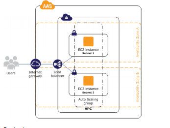
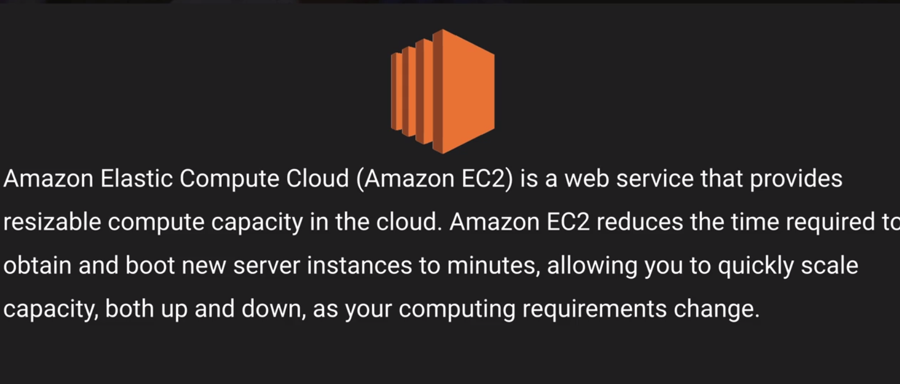
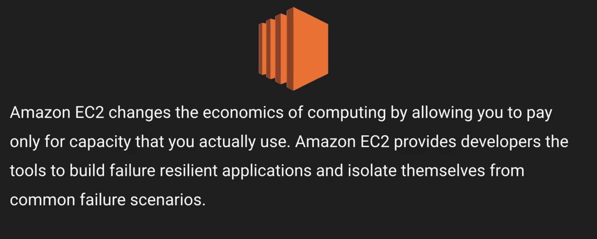
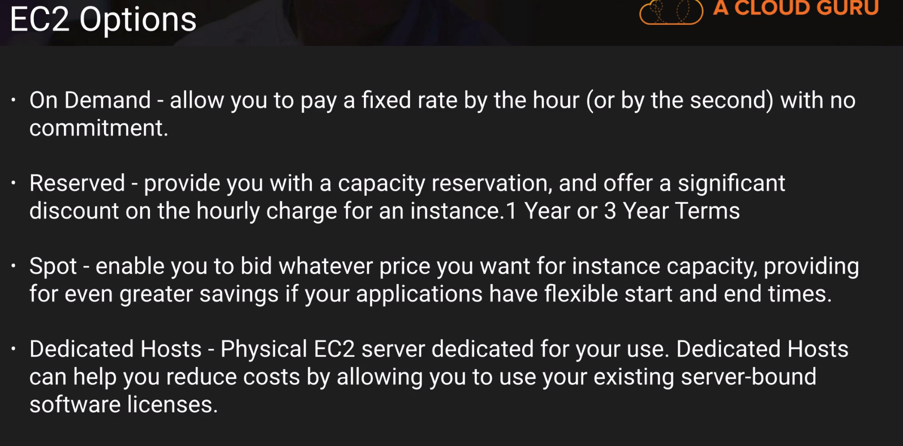
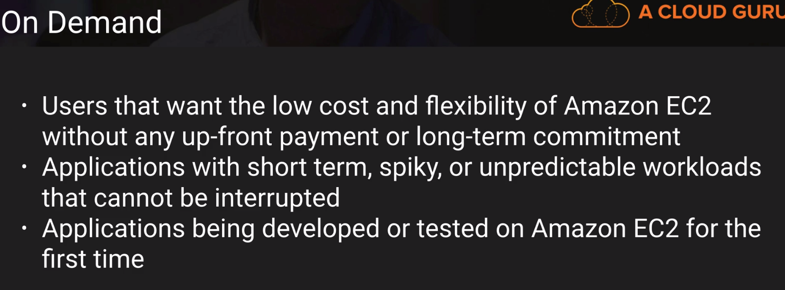
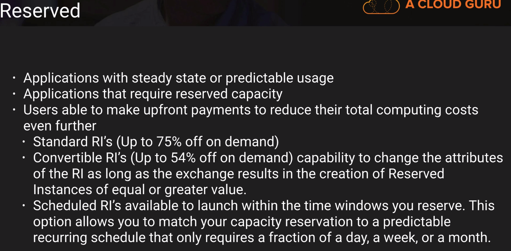
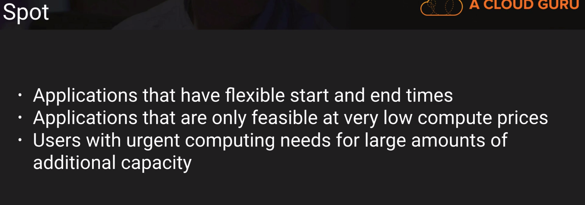
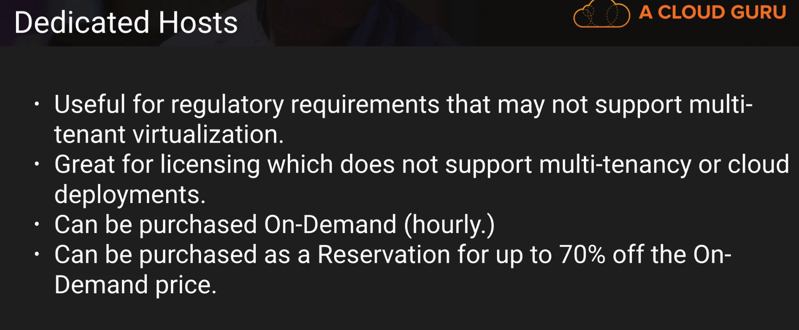
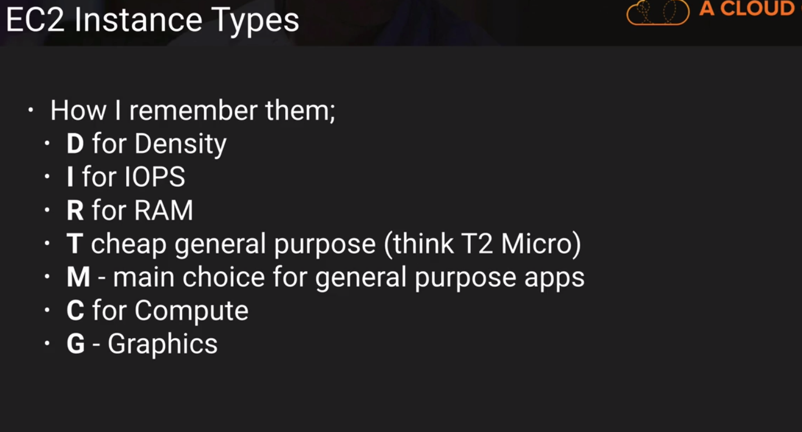

### EC2 - Elastic Compute Cloud

http://docs.aws.amazon.com/AWSEC2/latest/UserGuide/ec2-ug.pdf

	

	

	
	

	

	

	
**Exam Tips EC2**
1. Know the differences between:
	- On Demand
	- Spot
	- Reserved
	- Dedicated Hosts
2. Remember with the spot instances
	- If you terminate the instance, you pay for the hour
	- If AWS terminates the spot instance, you get the hour it was terminated on for free
	
**How to connect through ssh**	
- chmod 400 *.pem 
- ssh ec2-user@public_ip -i *.pem 
- yum install httpd -y
- service httpd start
- cd /var/www/html/
- nano index.html

chkconfig httpd on - run automatically
