### Lambda


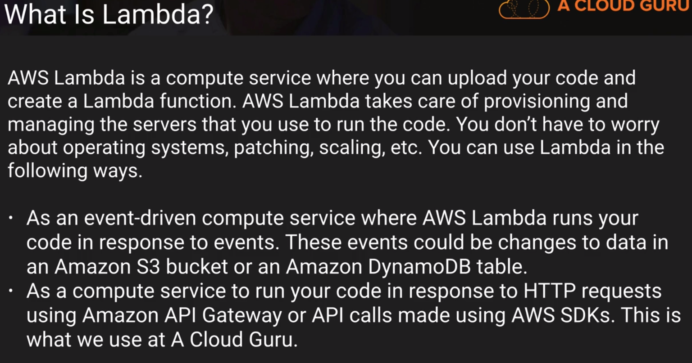

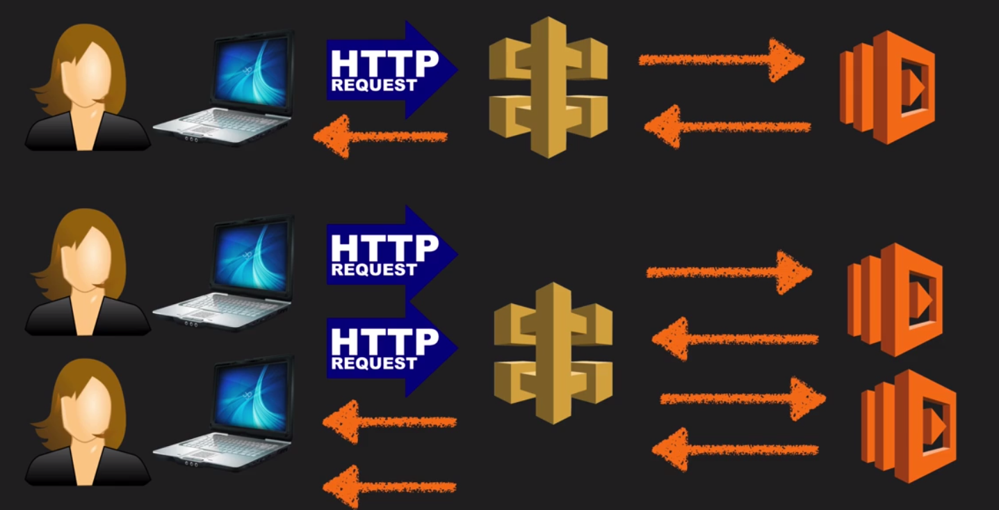


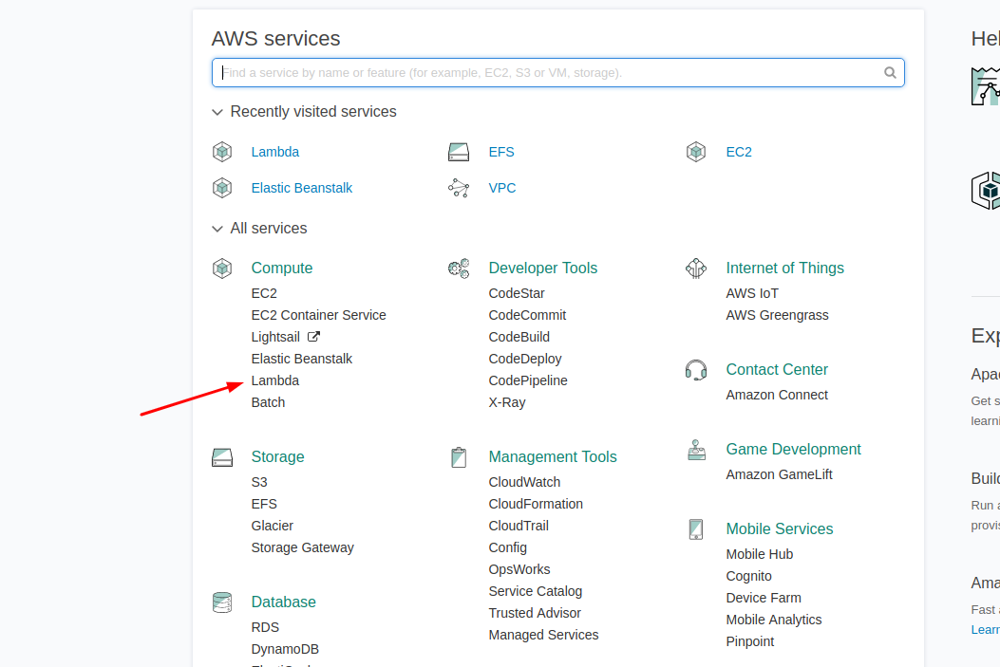

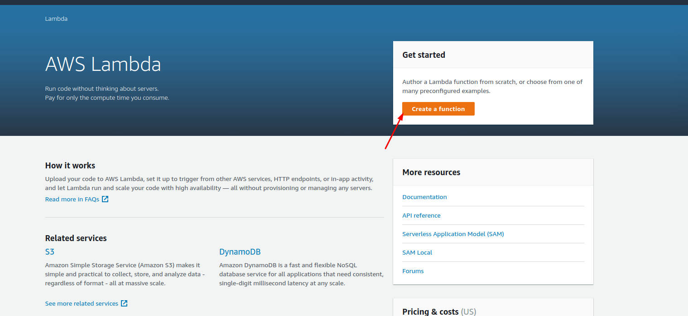

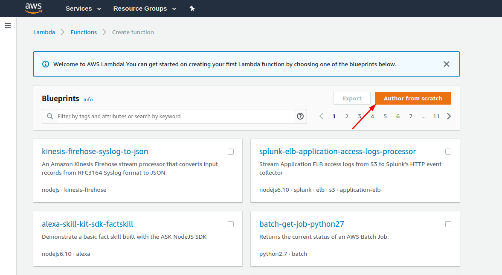

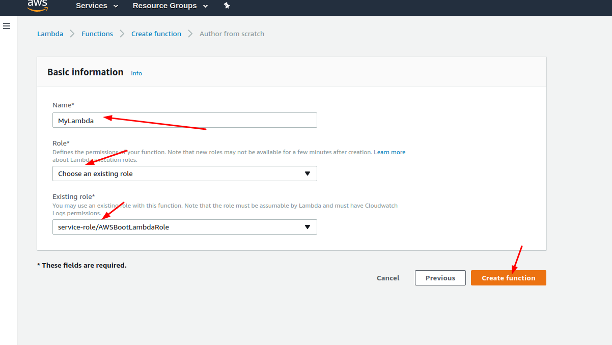

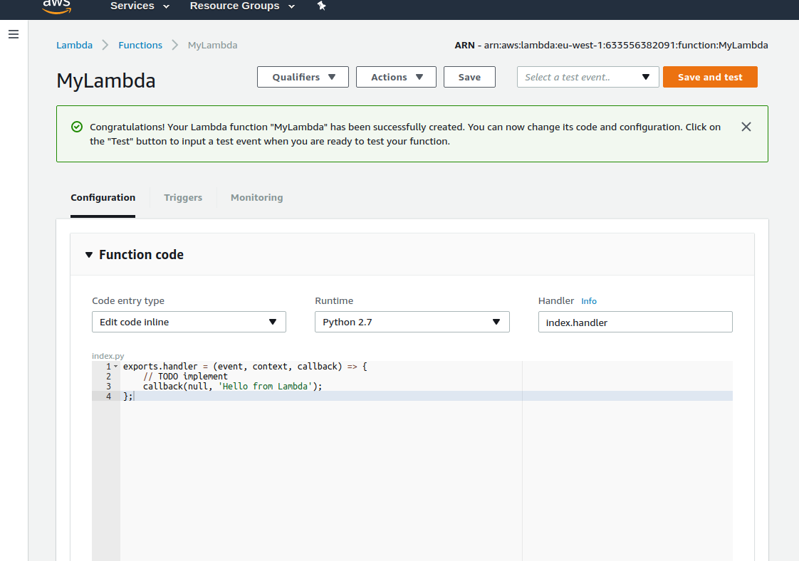

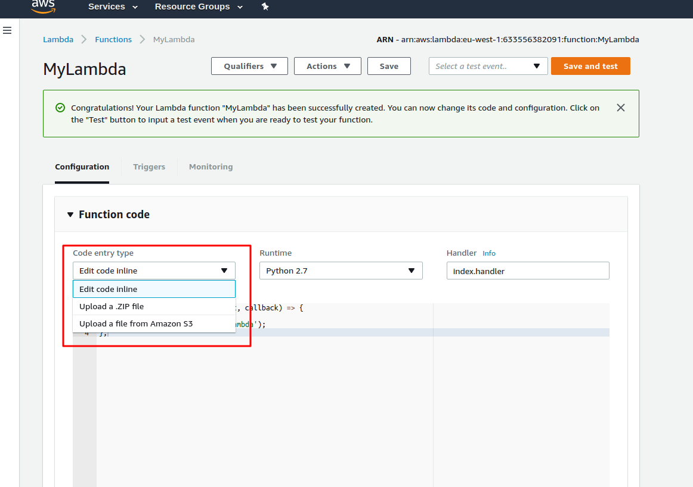


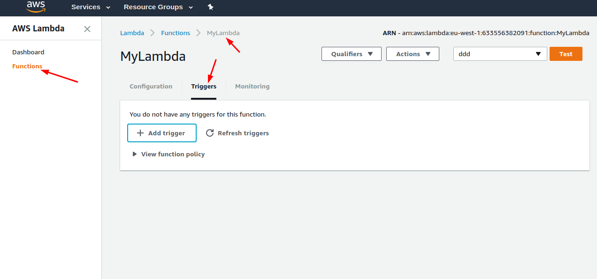

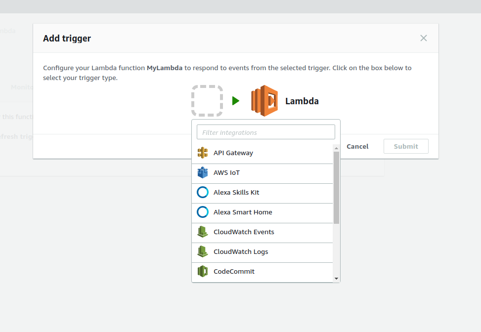

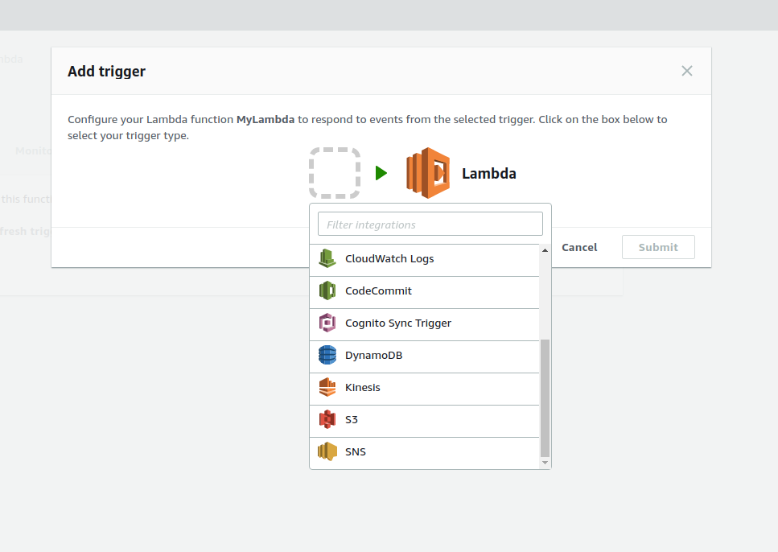

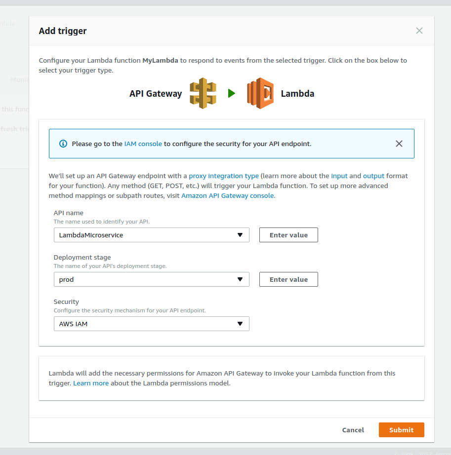

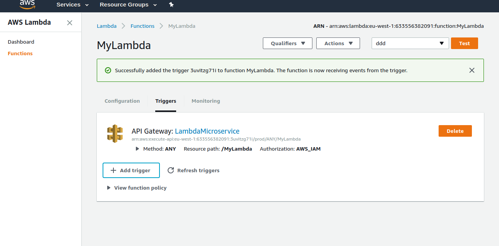

 
**_Lambda scales out automatically_**
 
#### On Exam 
- If we have two user that is sending two http requests that is going to 
 trigger two lambda functions and both going to respond back two responses
 Every time user sends a request to API Gateway, invoked a new lambda function
 Tree requests then three lambda functions
 
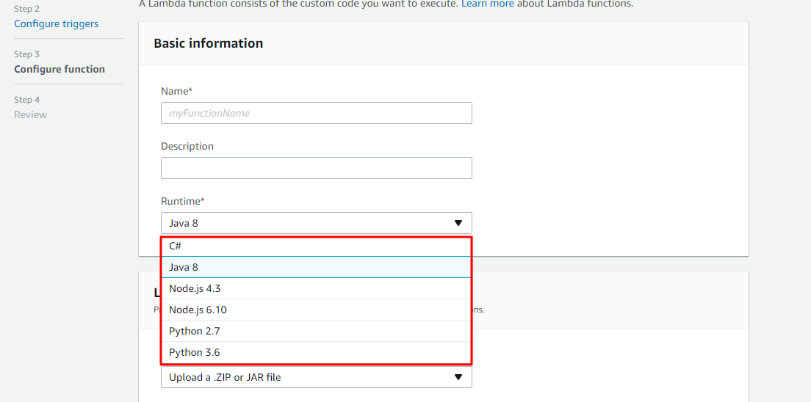
 

 

 

**_Lambda duration time maximum is 5 minutes_**

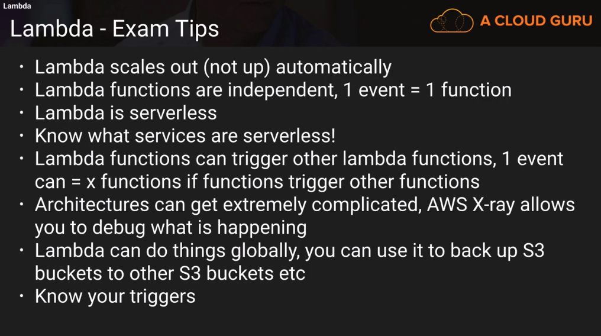


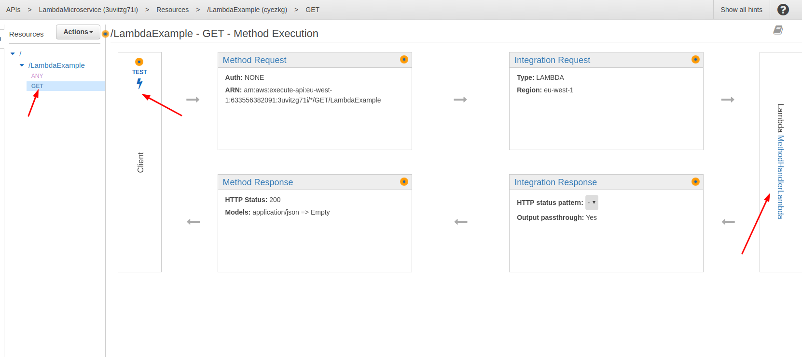

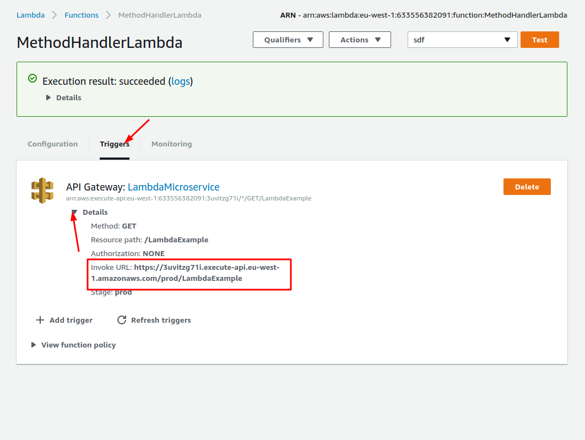

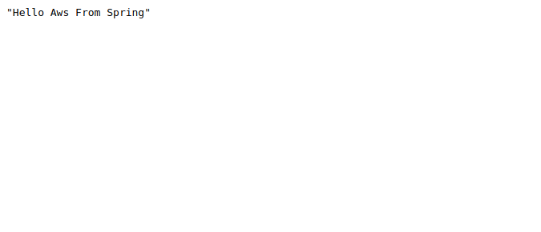


```java
@Component
@ComponentScan(value = "com.aws.boot.linnyk")
public class MyLambdaFunctionHandler implements RequestHandler<Map<String, Object>, String> {

	private MyServices myServices;

	public String handleRequest(final Map<String,Object> input, final Context context) {
		final ApplicationContext applicationContext = new AnnotationConfigApplicationContext(MyLambdaFunctionHandler.class);
		this.myServices = applicationContext.getBean(MyServices.class);
		myServices.doBusiness("Message sent from Lambda");
		return "Hello AWS From Spring";
	}

}

@Component
class MyServices {

	public void doBusiness(final String s) {
		System.out.println(s);
	}
}
```

