### IAM -  Identity Access Management  

https://aws.amazon.com/ru/iam/

Allows you yo manage users and their level of access to the AWS console. 
It is important to understand IAM and how it works, both for the exam and for the administrating a company's AWS account in real life

**What does IAM give you**

1. Centralised control of your AWS account
2. Shared Access to your AWS account
3. Granular permission
4. Identity Federation (including Active Directory, Facebook, Linkedin) 
5. Multi-factor Authentication
6. Provide temporary access for users/devices and services where necessary
7. Allows you to set up your own password rotation policy
8. Integrates with many different AWS services 
9. Support PCI DSS Compliance
10. IAM consists of the following:
	 - Users
	 - Groups (A way to group our users and apply polices to them collectively) 
	 - Roles
	 - Policy Documents
11. IAM is universal. It does not apply to regions at this time 	 
12. The `root account` is simply the account created when first setup your AWS account. It has complete Admin access by default
13. New Users have NO permissions when first created
14. New Users are assigned Access Key ID & Secret Access Keys when first created
15. These are not the same as a password, and you cannot use the Access KeyID & Secret Access Key to Login in to the console. You can use this to access AWS via the APIs and Command Line however
16. You only get to view these once. If you lose them, you have to regenerate them. So save them in a secure location.
17. Always setup Multi-factor Authentication on yur root account
19 You can create and customise your own password rotation policies

IAM does not require region election:

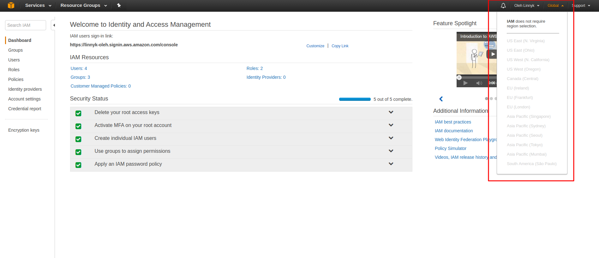

IAM users sign-in link:

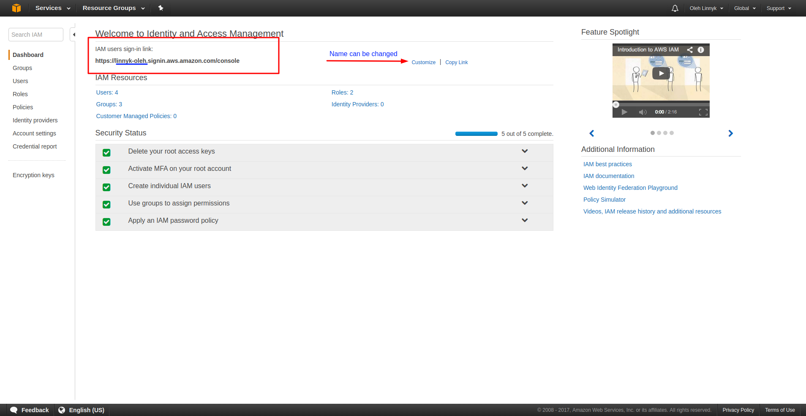

**Critical Terms**:

1. `Users` - End Users (think people) 

 	- How to create user:
 	
	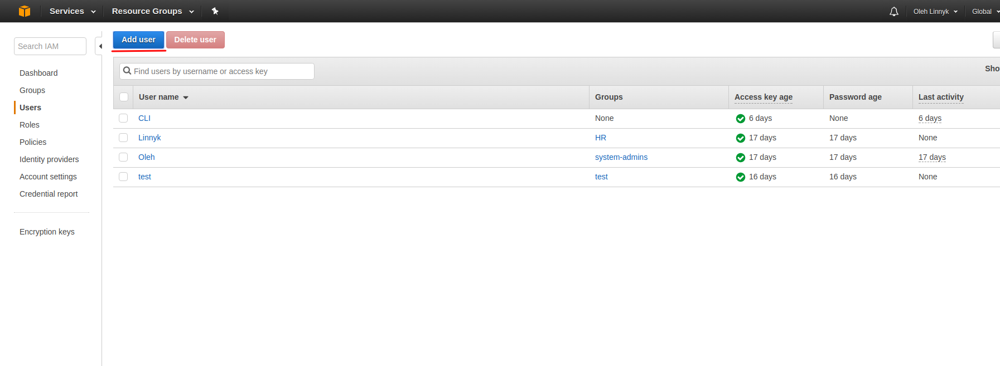
	
	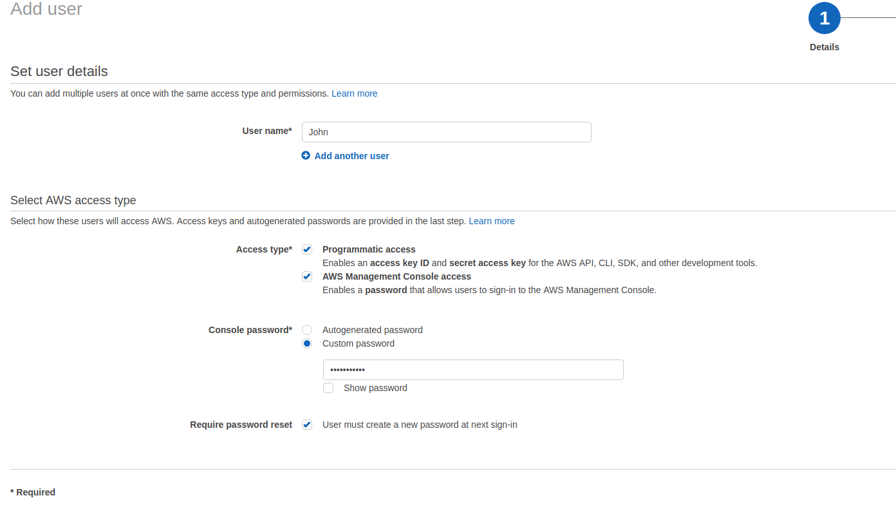
	
	- Access type:
		- Programmatic access.
		
		  Enables an access key ID and secret access key for the AWS API, CLI, SDK, and other development tools
		  
		- AWS Management Console access.
		
		  Enables a password that allow users to sing-in to te AWS Management console
		  
	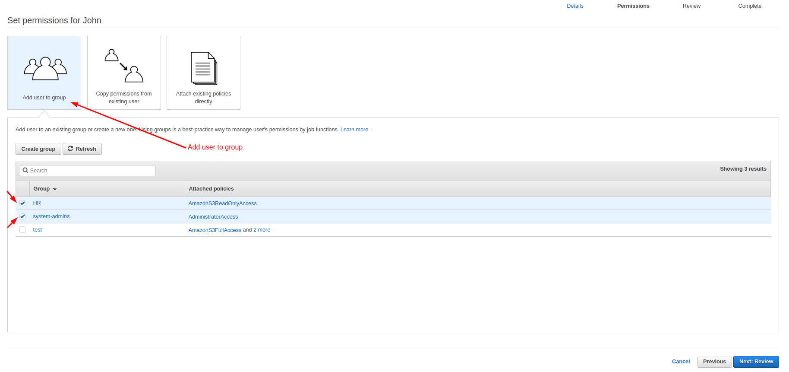	  
	
	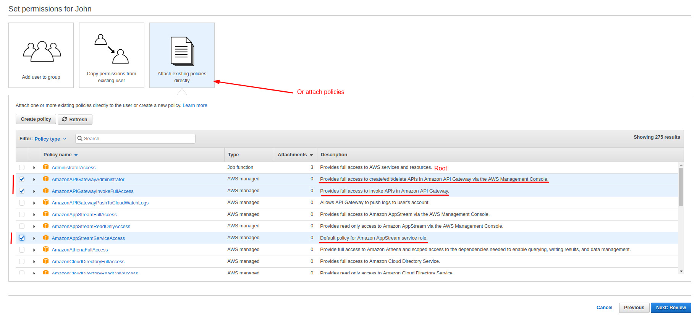
	
	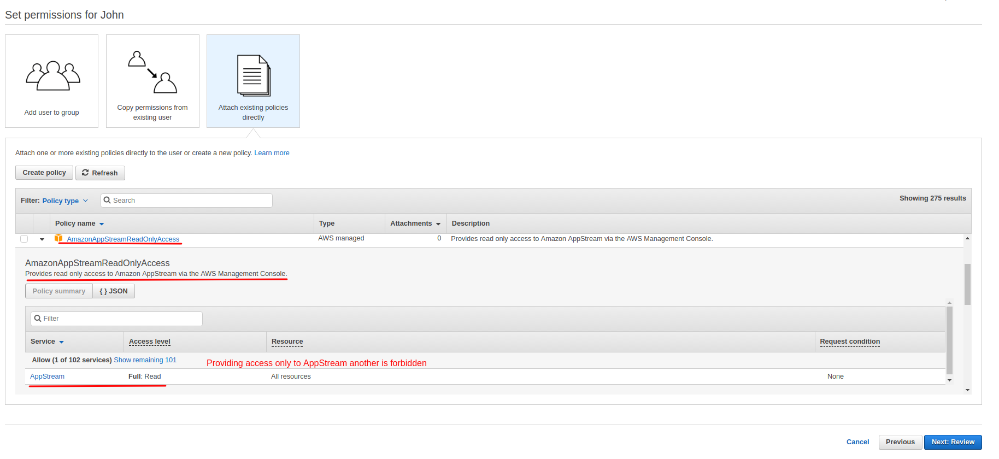
	
	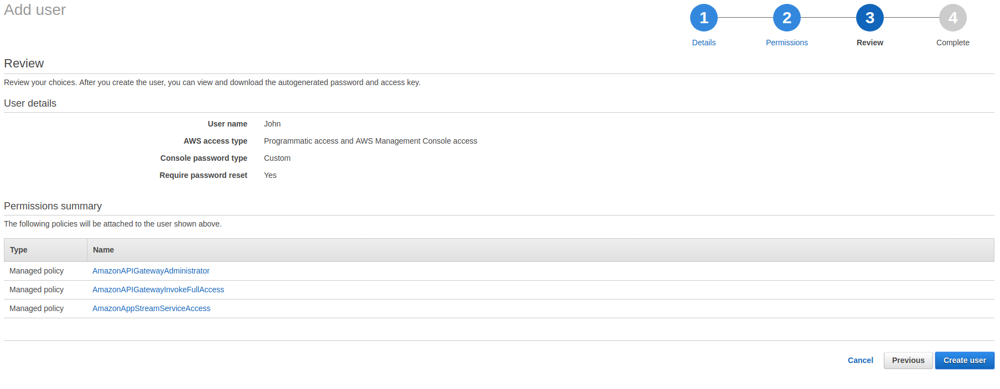
 	
2. `Groups` - A collection of users under one set of permission

	
	
	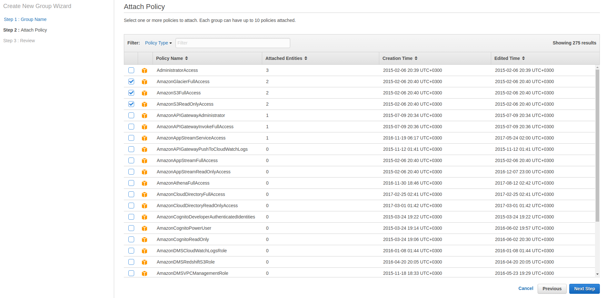
	
	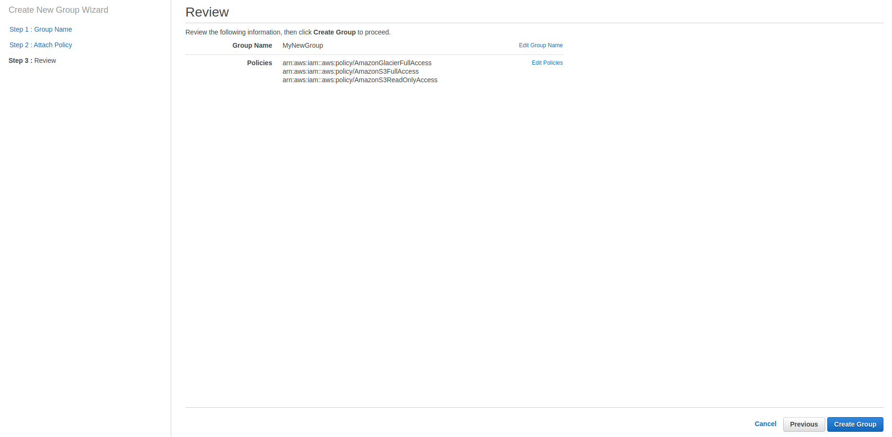
	
	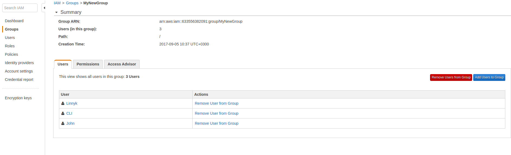
	
	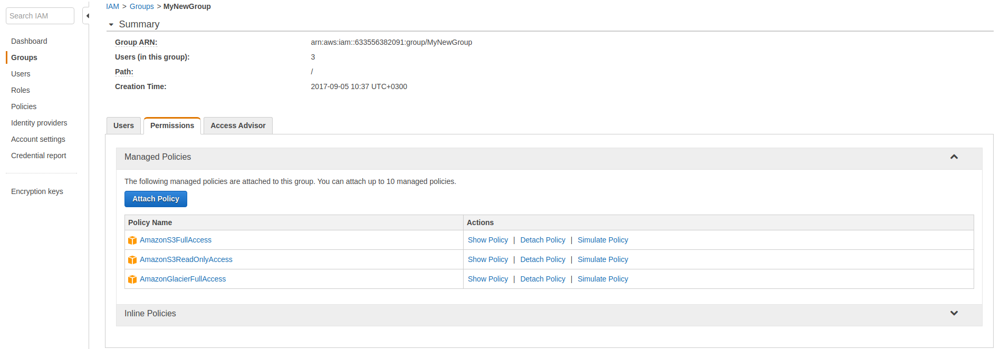
	
3. `Roles` - You create roles and can then assign them to AWS resources

	AWS identity with permission policies that determine what the identity can and cannot do in AWS.
	However, instead of being uniquely associated with one person, a role is intended to be assumable by anyone who needs it. 
	Also, a role does not have any credentials (password or access keys) associated with it. 
	Instead, if a user is assigned to a role, access keys are created dynamically and provided to the user.
	You can use roles to delegate access to users, applications, or services that don't normally have access to your AWS resources
	
	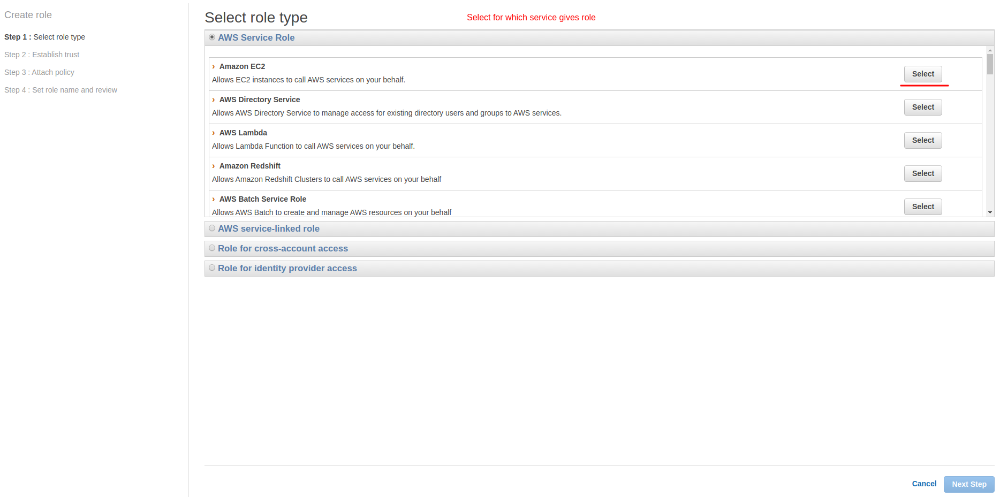
	
	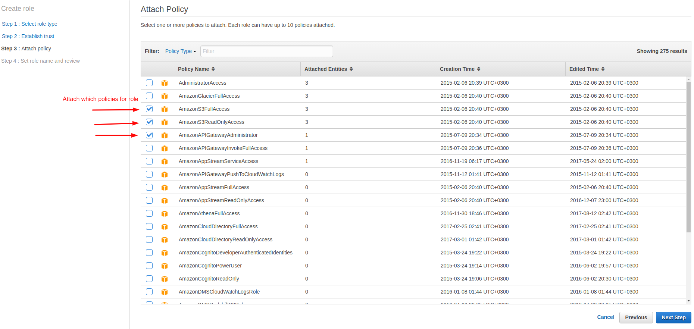
	
	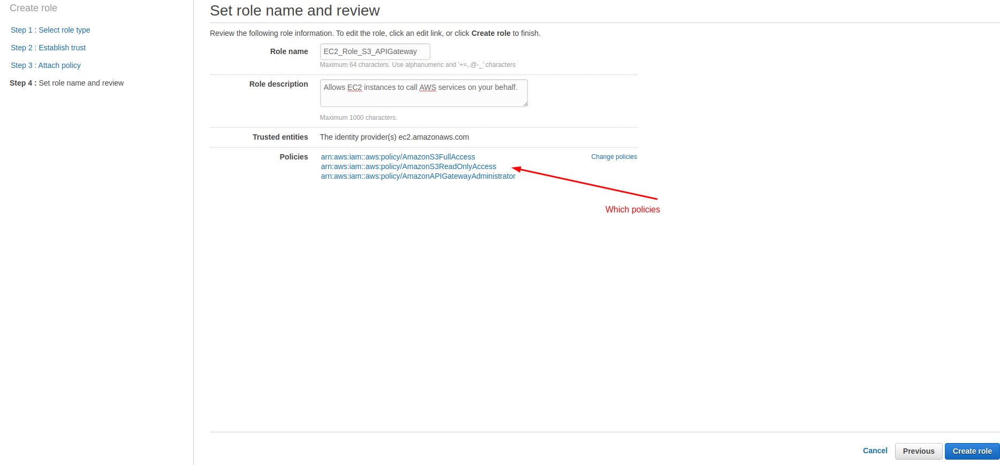
	
4. `Policies` - A document that defines one or more permissions
	- To assign permissions to a user, group, role, or resource, you create a policy, which is a document that explicitly lists permissions. 
	  In its most basic sense, a policy lets you specify the following:
		- Actions: what actions you will allow. Each AWS service has its own set of actions. For example, you might allow a user to use the Amazon S3 ListBucket action, which returns information about the items in a bucket. Any actions that you don't explicitly allow are denied.
		- Resources: which resources you allow the action on. For example, what specific Amazon S3 buckets will you allow the user to perform the ListBucket action on? Users cannot access any resources that you have not explicitly granted permissions to.
		- Effect: what the effect will be when the user requests access—either allow or deny. Because the default is that resources are denied to users, you typically specify that you will allow users access to resource.
		
		
	
	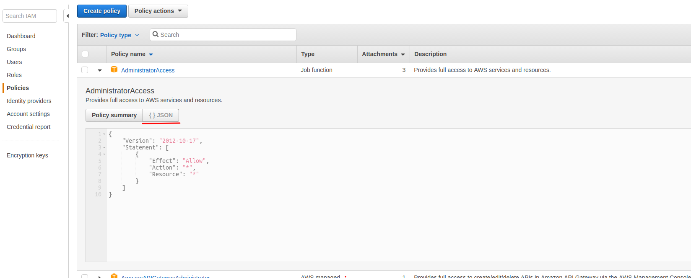	

5. `MFA` - multi-factor authentication

	
	
	
	
	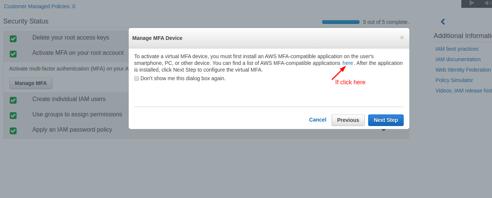
	
	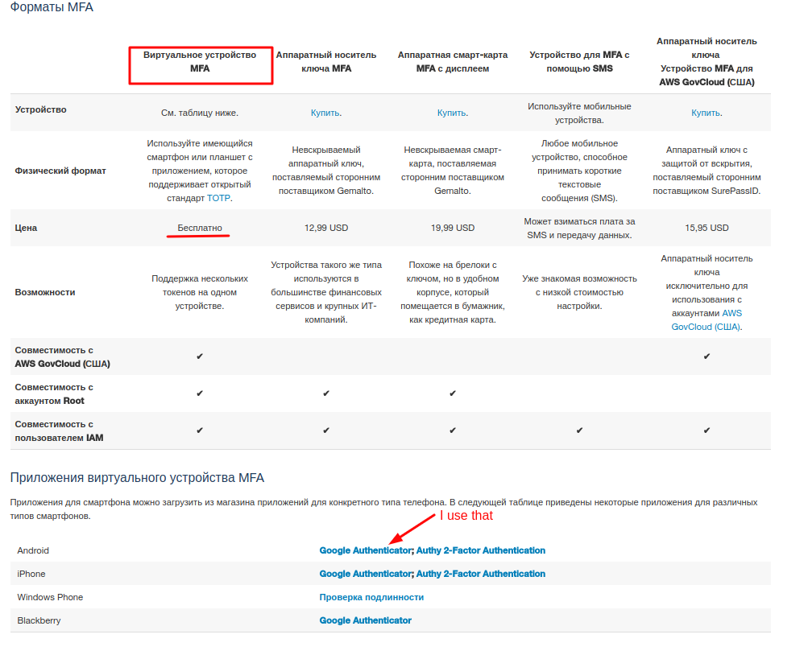
	
	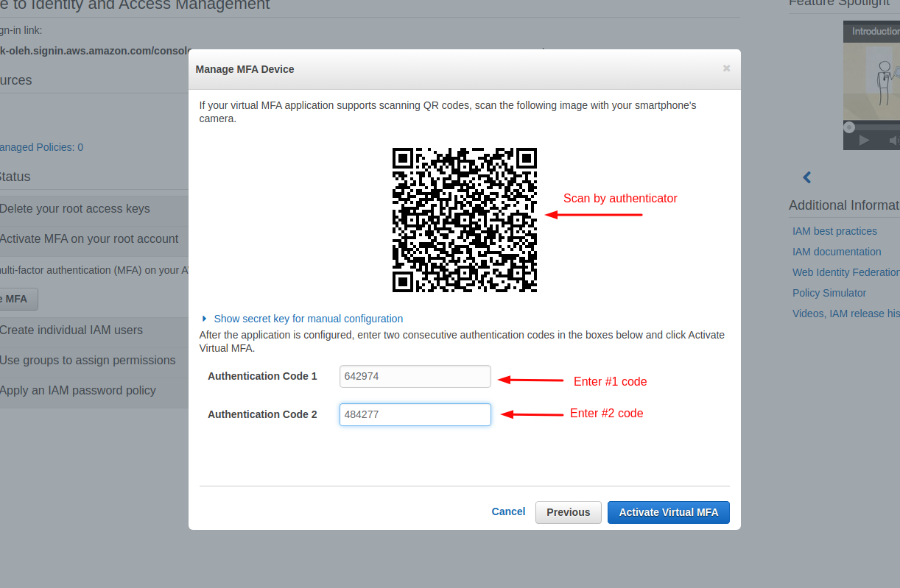

6. `Root account` - email for sign up to AWS
	- When you first create an Amazon Web Services (AWS) account, you begin with a single sign-in identity that has complete access to all AWS services and resources in the account. 
	  This identity is called the AWS account root user and is accessed by signing in with the email address and password that you used to create the account.

7. `Access key ID` and `Secret Access key` - token would you use in order to programmatically interact with AWS you can't use them to login to AWS console
		
	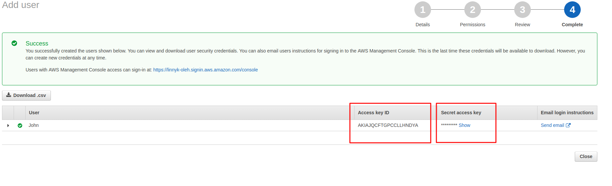

**IAM Best practices**	

Enables you to control who can do what in your AWS account

Users, groups, roles and permissions

Control
	- Centralized
	- Fine-grained - APIs, resources, and AWS console
Security
	- Secure by default
	- Multiple users, individual security credentials and permissions
	
	
---

### Security Token Service (STS)

Grants users limited and temporary access to AWS resources. Users can come from three sources:
- Federation (typically Active Directory)
	- Uses Security Assertion MarkUp Language (SAML)
	- Grants temporary access based off the users Active Directory credentials. Does not need to be a user in AIM
	- Single sigh on allows users to log in to AWS console without assigning IAM credentials
- Federation with Mobile Apps
	- Use Facebook/Amazon/Google or the OpenID providers to log on
- Cross Account Access
	- Let's users from one AWS account access resources in another 	

**Understanding Key Terms**:
- Federation: combining or joining a list of users in one domain(such as IAM) with a list of users in another domain (such as Active Directory, Facebook, Linkedin etc)
	- Identity Broker: a service that allows you to take an identity from point A and join it (federate it) to point B
	- Identity Store - Services like Active Directory, Facebook, Google etc
	- Identities - a user of a service like Facebook etc

**How it works(have to be on exam)**
1. Develop an Identity Broker to communicate with LDAP and AWS STS
2. Identity Broker always authenticates with LDAP first, THEN with AWS STS
3. Application then gets temporary access to AWS resources 

		
**On exam:**
1. Can you authenticate with active directory?
	- Yes, using SAML
2. What type of authenticate?
	- SAML (security assertion markup language)
3. Whether or not your authenticating to active directory first and then giving a temporal security credential or if you get a temporal security credential first which is then authenticate againt to active directory?
	- You always authenticate to active directory first and then you will be assign security credential
4. What is Arn?
	- Amazon Resource Name
5. Have you to create new role in new region?
	- No, because all roles are global
6. Weather or not is it possible to attach role	to running EC2 instance
	- It is now possible
	
	
