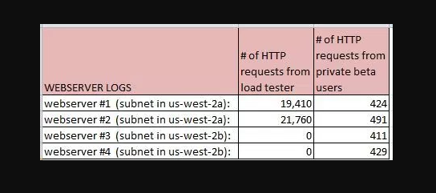

 **_1. Per the AWS Acceptable Use Policy, penetration testing of EC2 instances:_**
   
- May be performed by AWS, and is periodically performed by AWS.
- May be performed by AWS, and will be performed by AWS upon customer request.
- May be performed by the customer on their own instances, only if performed from EC2 instances
- Are expressly prohibited under all circumstances.
- **May be performed by the customer on their own instances with prior authorization from AWS.**

https://aws.amazon.com/security/penetration-testing/

1. Permission is required for all penetration tests.
2. To request permission, you must be logged into the AWS portal using the root credentials associated with the instances you wish to test, otherwise the form will not pre-populate correctly. 
If you have hired a third party to conduct your testing, you must complete the form and then notify your third party when we grant approval. 
AWS will not grant approval to a third party testing company.

---

**_2. After creating a new IAM user which of the following must be done before they can successfully make API calls?_**
   
- Enable Multi-Factor Authentication for the user.
- Add a password to the user
- Assign a Password Policy to the user.
- **Create a set of Access Keys for the user.**   

http://docs.aws.amazon.com/IAM/latest/UserGuide/id_users_create.html

"Give the user programmatic access. This requires access keys"

---

**_3. Which features can be used to restrict access to data in S3? Choose 2 answers_**

- **Set an S3 ACL on the bucket or the object.**
- Create a CloudFront distribution for the bucket.
- **Set an S3 bucket policy.**
- Use S3 Virtual Hosting
- Enable IAM Identity Federation
   
https://aws.amazon.com/blogs/security/how-to-restrict-amazon-s3-bucket-access-to-a-specific-iam-role/

1. The IAM user’s policy and the role’s user policy grant access to “s3:*”.
2. The S3 bucket policy restricts access to only the role.

---

**_4. An Auto-Scaling group spans 3 AZs and currently has 4 running EC2 instances. 
When Auto Scaling needs to terminate an EC2 instance by default, Auto Scaling will: Choose 2 answers_**
   
- Terminate the instance with the least active network connections. If multiple instances meet this criterion, one will be randomly selected.
- **Send an SNS notification, if configured to do so.**
- **Terminate an instance in the AZ which currently has 2 running EC2 instances.**
- Allow at least five minutes for Windows/Linux shutdown scripts to complete, before terminating the instance.
- Randomly select one of the 3 AZs, and then terminate an instance in that AZ.  
   
"Auto Scaling determines whether there are instances in multiple Availability Zones. 
If so, it selects the Availability Zone with the most instances and at least one instance that is not protected from scale in. 
If there is more than one Availability Zone with this number of instances, Auto Scaling selects the Availability Zone with the instances that use the oldest launch configuration.

When you use Auto Scaling to scale your applications automatically, it is useful to know when Auto Scaling is launching or terminating the EC2 instances in your Auto Scaling group. 
Amazon SNS coordinates and manages the delivery or sending of notifications to subscribing clients or endpoints."

---

**_5. In order to optimize performance for a compute cluster that requires low inter-node latency, which of the following feature should you use?_**

- Multiple Availability Zones
- VPC private subnets
- **Placement Groups**
- AWS Direct Connect
- EC2 Dedicated Instances
   
http://jayendrapatil.com/aws-ec2-placement-groups/
http://docs.aws.amazon.com/AWSEC2/latest/UserGuide/placement-groups.html

"A placement group is a logical grouping of instances within a single Availability Zone. Placement groups are recommended for applications that benefit from low network latency, high network throughput, or both. 
To provide the lowest latency, and the highest packet-per-second network performance for your placement group, choose an instance type that supports enhanced networking"

---

**_6. If you want to launch Amazon Elastic Compute Cloud (EC2) instances and assign each instance a predetermined private IP address you should:_**

- Launch the instance from a private Amazon Machine Image (AMI).
- **Launch the instances in the Amazon Virtual Private Cloud (VPC).**
- Assign a group of sequential Elastic IP address to the instances.
- Launch the instances in a Placement Group.
- Use standard EC2 instances since each instance gets a private Domain Name Service (DNS) already.

http://docs.aws.amazon.com/AmazonVPC/latest/UserGuide/vpc-ip-addressing.html

"You can assign additional private IP addresses, known as secondary private IP addresses, to instances that are running in a VPC. 
Unlike a primary private IP address, you can reassign a secondary private IP address from one network interface to another. 
A private IP address remains associated with the network interface when the instance is stopped and restarted, and is released when the instance is terminated."

---

**_7. You need to configure an Amazon S3 bucket to serve static assets for your public-facing web application. 
Which methods ensure that all objects uploaded to the bucket are set to public read? Choose 2 answers_**

- **Set permissions on the object to public read during upload**
- **Configure the bucket policy to set all objects to public read**
- Configure the bucket ACL to set all objects to public read
- Amazon S3 objects default to public read, so no action is needed
- Use AWS Identity and Access Management roles to set the bucket to public read

http://docs.aws.amazon.com/AmazonS3/latest/user-guide/upload-objects.html
http://jayendrapatil.com/aws-s3-permisions/

"Under Manage public permissions you can grant read access to your objects to the general public (everyone in the world), for all of the files that you're uploading."

---

**_8. After launching an instance that you intend to serve as a NAT (Network Address Translation) device 
in a public subnet you modify your route tables to have the NAT device be the target of internet bound traffic of your private subnet. 
When you try and make an outbound connection to the Internet from an instance in the private subnet, you are not successful. 
Which of the following steps could resolve the issue?_**

- **Disabling the Source/Destination Check attribute on the NAT instance**
- Attaching an Elastic IP address to the instance in the private subnet
- Attaching a second Elastic Network Interface (ENI) to the instance in the private subnet, and placing it in the public subnet
- Attaching a second Elastic Network interface (ENI) to the NAT instance, and placing it in the private subnet

http://docs.aws.amazon.com/AmazonVPC/latest/UserGuide/VPC_NAT_Instance.html

Each EC2 instance performs source/destination checks by default. This means that the instance must be the source or destination of any traffic it sends or receives. 
However, a NAT instance must be able to send and receive traffic when the source or destination is not itself. 
Therefore, you must disable source/destination checks on the NAT instance.

---

**_9. A company has a workflow that sends video files from their on premise system to AWS for transcoding. 
They use EC2 worker instances that pull transcoding jobs from SQS. Why is SQS an appropriate service for this scenario?_**

- SQS checks the health of the worker instances.
- **SQS helps to facilitate horizontal scaling of encoding tasks.**
- SQS synchronously provides transcoding output.
- SQS guarantees the order of the messages.

http://docs.amazonaws.cn/en_us/AWSSimpleQueueService/latest/SQSDeveloperGuide/sqs-throughput-horizontal-scaling-and-batching.html

"Horizontal scaling means increasing the number of your message producers (making SendMessage requests) and consumers (making ReceiveMessage and DeleteMessage requests) in order to increase your overall queue throughput"

---

**_10. You are working with a customer who has 10 TB of archival data that they want to migrate to Amazon Glacier. 
The customer has a 1-Mbps connection to the Internet. Which service or feature provides the fastest method of getting the data into Amazon Glacier?_**

- Amazon Glacier multipart upload
- VM Import/Export
- AWS Storage Gateway
- **AWS Import/Export**

http://docs.aws.amazon.com/amazonglacier/latest/dev/uploading-an-archive.html

"To upload existing data to Amazon Glacier, you might consider using the AWS Import/Export service. 
AWS Import/Export accelerates moving large amounts of data into and out of AWS using portable storage devices for transport."

---

**_11. You are tasked with setting up a Linux bastion host for access to Amazon EC2 instances running in your VPC. 
Only clients connecting from the corporate external public IP address 72.34.51.100 should have SSH access to the host. 
Which option will meet the customer requirement??_**

- **Security Group Inbound Rule: Protocol – TCP. Port Range – 22, Source 72.34.51.100/32**
- Security Group Inbound Rule: Protocol – UDP, Port Range – 22, Source 72.34.51.100/32
- Network ACL Inbound Rule: Protocol – UDP, Port Range – 22, Source 72.34.51.100/32
- Network ACL Inbound Rule: Protocol – TCP, Port Range-22, Source 72.34.51.100/0

http://docs.aws.amazon.com/AmazonVPC/latest/UserGuide/VPC_SecurityGroups.html

"A security group acts as a virtual firewall for your instance to control inbound and outbound traffic. 
When you launch an instance in a VPC, you can assign up to five security groups to the instance. Security groups act at the instance level, not the subnet level. 
Therefore, each instance in a subnet in your VPC could be assigned to a different set of security groups. 
If you don't specify a particular group at launch time, the instance is automatically assigned to the default security group for the VPC."

---

**_12. You run an ad-supported photo sharing website using S3 to serve photos to visitors of your site. 
At some point you find out that other sites have been linking to the photos on your site, causing loss to your business. 
What is an effective method to mitigate this?_**

- Store photos on an EBS volume of the web server.
- Block the IPs of the offending websites in Security Groups.
- Use CloudFront distributions for static content.
- **Remove public read access and use signed URLs with expiry dates.**

"Signed URLs allow you to provide users access to your private content. 
A signed URL includes additional information (e.g., expiration time) that gives you more control over access to your content. 
This additional information appears in a policy statement, which is based on either a canned policy or a custom policy"

---

**_13. You are configuring your company’s application to use Auto Scaling, and need to move user state information. 
Which of the following AWS services provides a shared data store with durability and low latency?_**

- AWS ElastiCache Memcached
- Amazon Simple Storage Service
- Amazon EC2 instance storage
- **Amazon DynamoDB**

https://aws.amazon.com/dynamodb/

"Amazon DynamoDB is a NoSQL database service that delivers consistent, single-digit millisecond latency at any scale. 
DynamoDB provides the performance and availability you need to create real-time bidding (RTB) platforms and recommendation engines"

---

**_14. Which Amazon Elastic Compute Cloud feature, can you query from within the instance to access instance properties?_**

- Resource tags
- Amazon Machine Image
- Instance user data
- **Instance metadata**

http://docs.aws.amazon.com/AWSEC2/latest/WindowsGuide/ec2-instance-metadata.html

"Instance metadata is data about your instance that you can use to configure or manage the running instance.
You can also use instance metadata to access user data that you specified when launching your instance"

---

**_15. A company needs to deploy services to an AWS region, which they have not previously used. 
The company currently has an AWS identity and Access Management (IAM) role for the Amazon EC2 instances, which permits the instance to have access to Amazon DynamoDB.
 The company wants their EC2 instances in the new region to have the same privileges. How should the company achieve this?_**
 
- Copy the IAM role and associated policies to the new region and attach it to the instances
- Create a new IAM role and associated policies within the new region
- **Assign the existing IAM role to the Amazon EC2 instances in the new region**
- Create an Amazon Machine Image (AMI) of the instance and copy it to the desired region using the AMI Copy feature

"An IAM role is an IAM entity that defines a set of permissions for making AWS service requests. 
IAM roles are not associated with a specific user or group. Instead, trusted entities assume roles, such as IAM users, applications, or AWS services such as EC2."

---

**_16. On the Amazon S3, the object you request does not exist and you did not have the s3:ListBucket permission also. S3 will return?_**

- HTTP status code 401 ("access denied")
- **HTTP status code 403 ("access denied")**
- HTTP status code 404 ("no such key") error
- HTTP status code 402 ("permission denied")

http://docs.aws.amazon.com/AmazonS3/latest/API/ErrorResponses.html

"If the object you request does not exist, the error Amazon S3 returns depends on whether you also have the s3:ListBucket permission.
If you have the s3:ListBucket permission on the bucket, Amazon S3 will return an HTTP status code 404 (“no such key”) error.
If you don’t have the s3:ListBucket permission, Amazon S3 will return an HTTP status code 403 (“access denied”) error."

---

**_17. A user has stored data on an encrypted EBS volume. The user wants to share the data with his customer’s AWS account. How can user achieve this_**

- **Take a snapshot and share the snapshot with a customer**
- If both the accounts are using the same encryption key then the user can share the volume directly
- Create an AMI from the volume and share the AMI
- Copy the data to an unencrypted volume and then share

http://docs.aws.amazon.com/AWSEC2/latest/UserGuide/ebs-modifying-snapshot-permissions.html

"You can share an encrypted snapshot with specific AWS accounts, though you cannot make it public. For others to use the snapshot, you must also share the custom CMK key used to encrypt it. 
Cross-account permissions may be applied to a custom key either when it is created or at a later time. 
Users with access can copy your snapshot and create their own EBS volumes based on your snapshot while your original snapshot remains unaffected."

---

**_18. Amazon EBS snapshots have which of the following two characteristics? choose 2 answers_**

- EBS snapshots can only be restored to an EBS volume of the same size or smaller
- **EBS snapshots only save incremental changes from snapshot to snapshot**
- EBS snapshots can only be restored and mounted to an instance in the same Availability Zone as the original EBS volume
- **EBS snapshots can be created in real-time without stopping an EC2 instance**

"You can back up the data on your EBS volumes to Amazon S3 by taking point-in-time snapshots. Snapshots are incremental backups, which means that only the blocks on the device that have changed after your most recent snapshot are saved. 
Snapshots occur asynchronously; the point-in-time snapshot is created immediately, but the status of the snapshot is pending until the snapshot is complete (when all of the modified blocks have been transferred to Amazon S3), 
which can take several hours for large initial snapshots or subsequent snapshots where many blocks have changed. While it is completing, an in-progress snapshot is not affected by ongoing reads and writes to the volume."

---

**_19. For EC2 instances, who is responsible for management of the guest OS (including updates and security patches)?_**

- AWS
- Shared Responsibility
- **Customer**
- OS Vendor

https://aws.amazon.com/compliance/shared-responsibility-model/

"The customer assumes responsibility and management of the guest operating system (including updates and security patches), other associated application software as well as the configuration of the AWS provided security group firewall. "

---

**_20. In the shared security model, AWS is responsible for which of the following security best practices (check 3 answers)_**

- **Penetration testing**
- Life-cycle management of IAM credentials
- **Threat modelling**
- Security Group and ACL (Access Control List) settings
- Patch management on the EC2 instances operating system
- **Static code analysis**
- Encryption of EBS (Elastic Block Storage) volumes

"In the Shared Security Responsibility Model, AWS is responsible for securing the underlying infrastructure that supports the cloud, and you’re responsible for anything you put on the cloud or connect to the cloud."

---

**_21. If I want my instance to run on a single-tenant hardware, which value do I have to set the instance’s tenancy attribute to?_**

- independent
- **dedicated**
- isolated
- single

"Each instance that you launch into a VPC has a tenancy attribute. This attribute has the following values.
default – Your instance runs on shared hardware.
dedicated – Your instance runs on single-tenant hardware.
host- Your instance runs on a Dedicated Host, which is an isolated server with configurations that you can control."

---

**_22. A start-up deploys its photo-sharing site in a VPC. An elastic load balancer distributes web traffic across two subnets. The load balancer session stickiness is configured to use the AWS-generated session cookie, with a session TTL of 5 minutes. 
The web server Auto Scaling group is configured as min-size=4, max-size=4. The start-up is preparing for a public launch, by running load-testing software installed on a single Amazon Elastic Compute Cloud (EC2) instance running in us-west-2a. 
After 60 minutes of load-testing, the web server logs show the following. Select 2 answers_**

- Configure Elastic Load Balancing session stickiness to use the app-specific session cookie.
- Launch and run the load-tester Amazon EC2 instance from us-east-1 instead.
- **Re-configure the load-testing software to re-resolve DNS for each web request.**
- Configure Elastic Load Balancing and Auto Scaling to distribute across us-west-2a and us-west-2b.
- **Use a third-party load-testing service which offers globally distributed test clients.**

https://aws.amazon.com/articles/1636185810492479

---

**_23. The customer wants to decouple the data sending such that the application keeps processing and sending data but does not wait for an acknowledgement of receiving application.
 Which of the below mentioned service helps in this situation?_**

- AWS SNS
- AWS SES
- **AWS SQS**
- AWS Cloud Watch

https://docs.aws.amazon.com/aws-sdk-php/v3/guide/examples/sqs-examples.html

"Amazon Simple Queue Service (SQS) is a fast, reliable, scalable, fully managed message queuing service. SQS makes it simple and cost-effective to decouple the components of a cloud application. 
You can use SQS to transmit any volume of data, at any level of throughput, without losing messages or requiring other services to be always available."

---

**_24. From what services I can block incoming/outgoing IPs?_**

- Security Groups
- ELB
- **NACL**
- VPC Subnet
- IGW

http://docs.aws.amazon.com/AmazonVPC/latest/UserGuide/VPC_ACLs.html

"A Network Access Control List (ACL) is an optional layer of security for your VPC that acts as a firewall for controlling traffic in and out of one or more subnets."

---

**_25. A company is storing data on Amazon Simple Storage Service (S3). The company’s security policy mandates that data is encrypted at rest. 
Which of the following methods can achieve this?(choose 3 Answers)_**

- **Use Amazon S3 server-side encryption with customer-provided keys.**
- Use Amazon S3 server-side encryption with EC2 key pair.
- **Use Amazon S3 server-side encryption with AWS Key Management Service managed keys.**
- **Encrypt the data on the client-side before ingesting to Amazon S3 using their own master key.**
- Use Amazon S3 bucket policies to restrict access to the data at rest.
- Use SSL to encrypt the data while in transit to Amazon S3.

1.Use Server-Side Encryption with Amazon S3-Managed Keys (SSE-S3) – Each object is encrypted with a unique key employing strong multi-factor encryption. As an additional safeguard, it encrypts the key itself with a master key that it regularly rotates. Amazon S3 server-side encryption uses one of the strongest block ciphers available, 256-bit Advanced Encryption Standard (AES-256), to encrypt your data.
2.Use Server-Side Encryption with Customer-Provided Keys (SSE-C) – You manage the encryption keys and Amazon S3 manages the encryption, as it writes to disks, and decryption
3.You can have your own encryption libraries to encrypt data before storing it in Amazon S3.

---

**_26. In dynamo db, The DeleteTable operation deletes a table and all of its items. After a DeleteTable request, the specified table is in the DELETING state until DynamoDB completes the deletion. If the table is in the ACTIVE state, you can delete it. If a table is in CREATING or UPDATING states, then DynamoDB returns a_**

- ResourceNotFoundException
- **ResourceInUseException.**
- ResourceProhibitedException
- LimitExceededException

http://docs.aws.amazon.com/cli/latest/reference/dynamodb/delete-table.html

"The DeleteTable operation deletes a table and all of its items. After a DeleteTable request, the specified table is in the DELETING state until DynamoDB completes the deletion. 
If the table is in the ACTIVE state, you can delete it. If a table is in CREATING or UPDATING states, then DynamoDB returns a ResourceInUseException.
If the specified table does not exist, DynamoDB returns a ResourceNotFoundException. 
If table is already in the DELETING state, no error is returned."

---

**_27. Company D is running their corporate website on Amazon S3 accessed from http//www.companyd.com. Their marketing team has published new web fonts to a separate S3 bucket accessed by the S3 endpoint: https://s3-uswest1.amazonaws.com/cdfonts.
While testing the new web fonts, Company D recognized the web fonts are being blocked by the browser. What should Company D do to prevent the web fonts from being blockedby the browser?_**

- Create a policy on the cd fonts bucket to enable access to everyone
- Enable versioning on the cdfonts bucket for each web font
- Add the Content-MD5 header to the request for webfonts in the cdfonts bucket from the website
- **Configure the cdfonts bucket to allow cross-origin requests by creating a CORS configuration**

http://docs.aws.amazon.com/AmazonS3/latest/dev/cors.html

"Cross-origin resource sharing (CORS) defines a way for client web applications that are loaded in one domain to interact with resources in a different domain. 
With CORS support in Amazon S3, you can build rich client-side web applications with Amazon S3 and selectively allow cross-origin access to your Amazon S3 resources.
•Scenario 2: Suppose you want to host a web font from your S3 bucket. Again, browsers require a CORS check (also referred as a preflight check) for loading web fonts, so you would configure the bucket that is hosting the web font to allow any origin to make these requests."
 
---
 
**_28. What does the “Server Side Encryption” option on Amazon S3 provide?_**

- It doesn’t exist for Amazon S3, but only for Amazon EC2.
- It provides an encrypted virtual disk in the Cloud.
- **It encrypts the files that you send to Amazon S3, on the server side.**
- It allows to upload files using an SSL endpoint, for a secure transfer

http://docs.aws.amazon.com/AmazonS3/latest/dev/UsingServerSideEncryption.html

"Server-side encryption is about protecting data at rest. Server-side encryption with Amazon S3-managed encryption keys (SSE-S3) employs strong multi-factor encryption.
Amazon S3 encrypts each object with a unique key. As an additional safeguard, it encrypts the key itself with a master key that it regularly rotates.
Amazon S3 server-side encryption uses one of the strongest block ciphers available, 256-bit Advanced Encryption Standard (AES-256), to encrypt your data.
Amazon S3 supports bucket policies that you can use if you require server-side encryption for all objects that are stored in your bucket."
 
---
  
**_29. What is the maximum number of S3 Buckets available per AWS account?_**

- 100 per region
- **100 per account**
- 100 per IAM user
- 200 per region

https://aws.amazon.com/s3/faqs/

"By default, customers can provision up to 100 buckets per AWS account. However, you can increase your Amazon S3 bucket limit by visiting AWS Service Limits."
 
---
  
**_30. Which of the following statements about SWF are true? Choose 3 answers_**

- **SWF uses deciders and workers to complete tasks**
- SWF triggers SNS notifications on task assignment
- **SWF tasks are assigned once and never duplicated**
- SWF requires at least 1 EC2 instance per domain
- SWF requires an S3 bucket for workflow storage
- **SWF workflow executions can last up to a year**

Amazon SWF

1. By implementing workers and deciders, you focus on your differentiated application logic as it pertains to performing the actual processing steps and coordinating them. Amazon SWF handles the underlying details such as storing tasks until they can be assigned, monitoring assigned tasks, and providing consistent information on their completion.
2.Amazon SWF stores tasks, assigns them to workers when they are ready, and monitors their progress. It ensures that a task is assigned only once and is never duplicated
3. Maximum workflow execution time – 1 year

---