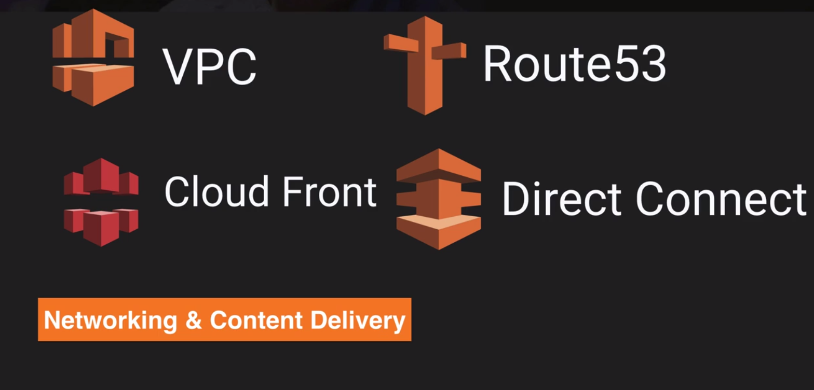
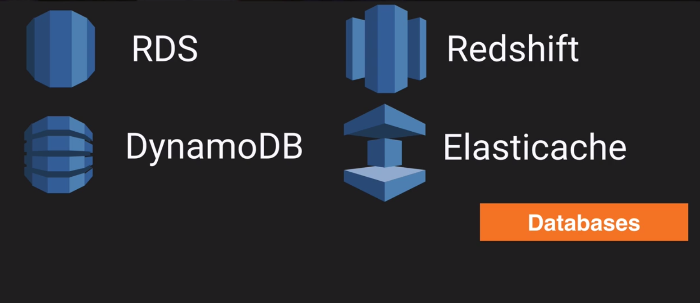

## Concepts and  Components
 
### Network and Content delivery
 
  
  
 **VPC** - virtual private cloud, virtual data center, virtual data center.
 
 **Route53** - amazon dns service, port 53
 
 **Cloud Front** - edge locations, storage section
 
 **Direct Connect** - way to connection your physical data center to AWS directly using dedicated telephone line
 
 
### Compute

  

  **EC2** - stands for elastic compute cloud, virtual machines in a cloud
  
  **EC2 Container Service** - highly scalable high performing container management service that support docker containers
  
  **Elastic Beanstalk** - if you don't know anything about AWS and you want to deploy your application to AWS, prevision all underlying infrastructure need to it
  
  **Lambda** - lets you run code without provisioning or managing servers
  
  **Lightsail** - out of a box cloud, automatically deploy
  
  
### Storage 
 
   
  
   **S3** - virtual disk on a cloud that store objects(files, documents, movies), no database or games
   
   **Glacier** - extremely low-cost, storage files for complaints reasons
   
   **EFS** - Elastic File System, file by storage and you can share it with multiple virtual machines
   
   **Storage Gateway** - way to connecting up S3 to own data center
   
   
### Databases   

   
  
   **RDS** - relational database service, consist different number of database technologies(MySql, SQL, Oracle, PostgresSql)
   
   **DynamoDB** - no relational database, really really scalable, high performance
   
   **RedShift** - amazon's warehouses solution
   
   **Elasticache** - way of caching your data in a cloud
   
   
### Migration   

   
  
   **Snowball** - way doing migration in enterprise level, move terabytes data into the cloud
   
   **DMS** - database migration service, allow to migrate your database to AWS cloud
   
   **Server Migration Service (SMS)** - exactly the same as DMS 
   
   
### Analytics   

   
  
   **Athena** - run sql query on S3, bunch on scv, json file
   
   **EMR** - Elastic MapReduce, useful for big data processing. Process large amount of data. hadoop
   
   **Cloud Search** - provided by AWS, allow to create search capabilities within your site or application
   
   **Elastic Search** - open source, allow to create search capabilities within your site or application
   
   **Kinesis** - way of streaming and analyzes real time data massive scale, analyzes social media, pulling twitter, facebook data
   
   **Data pipeline** - service to allow move data one place to another. For example move data from DynamoDB to S3
   
   **Quick sight** - business analytic tool, create visualization, dashboard for your data
   
   
### Security and Identity

   
  
   **AIM** - Identity service manager, fundamental component of AWS, how you group users, administrator or developer group
   
   **Inspector** - agent that you install on your virtual machine, inspects, securing virtual machine
   
   **Certificate Manager** - ssl certificate
   
   **Directory Service** - way of using active directory
   
   **WAF** - web application firewall, gives you application level protection to website, network protection 
   
   **Artifacts** - way of getting your documentations in AWS
   
   
### Management Tools

   
  
   **Cloud watch** - monitor performance on AWS environment
   
   **Cloud formation** - document that describe your AWS environment
   
   **Cloud trial** - way of ordering your AWS resources
   
   **Opsworks** - way of automatic deployment using Chef
   
   **Config** - way of ordering your environment, securing group, policy, monitor changes to your environment
   
   **Service catalog** - service for larger enterprises
   
   **Trusted advisor** - gives tips for customisation, performance optimisation, secure fix, fault tolerance
   
   
### Application services

   
  
   **Step function** - service for visualisation what is going on inside application
   
   **SWF** - simple workflow service, automating tasks
   
   **API Gateway** - access to backend services on AWS
   
   **AppStream** - way of streaming desktop application to users
   
   **Elastic Transcoder** - transcode your uploaded video to different format
   
   
### Developer tools

   
  
   **CodeCommit** - store your code on cloud
   
   **CodeBuild** - compiling your code on different environments
   
   **CodeDeploy** - deploying your code to EC2
   
   **CodePipeline** - tracking your different versions of code (test, dev or prod)
   

### Mobile services

   
  
   **Mobile hub** - simplifies the process of building, testing, and monitoring mobile applications that make use of one or more AWS services
   
   **Cognito** - sign up to your apps, social identity provider (first name, sir name, email)
   
   **Device Farm** - testing on hundred smartphones 
   
   **Mobile analytics** - collect and analyse app usage data
   
   **Pinpoint** - like google analytics for your mobile application
   
   
   
### Business productivity

      
   
   **WorkDocs** - storing important documents in a cloud
   
   **WorkMail** - sending/receiving emails
   
   
### Internet of things

      
   
   **IOT** - tracking billion devices IOT gateway
   
   
### Desktop and App streaming

      
   
   **WorkSpaces** - having desktop in a cloud
  
   **AppStream 2.0** - way of streaming desktop applications to your users
   
   
### Artificial Intelligence

      
   
   **alexa** - amazon voice service in a cloud 
   
   **lex** - voice service, creating software embed in different devices
   
   **Polly** - convert any text into voice, different voices, different languages
   
   **Machine learning** - analyzing data set for future decision
   
   **Rekognation** - upload a picture and get a text of it, compare faces, percentage rekognition
   
   
### Messaging

     
  
  **SNS** - simple notification service, way of notifying you, email, http endpoints
  
  **SQS** - way of decoupling of application, stores jobs, queue
  
  **SES** - simple email service, way of sending/receiving emails    
  