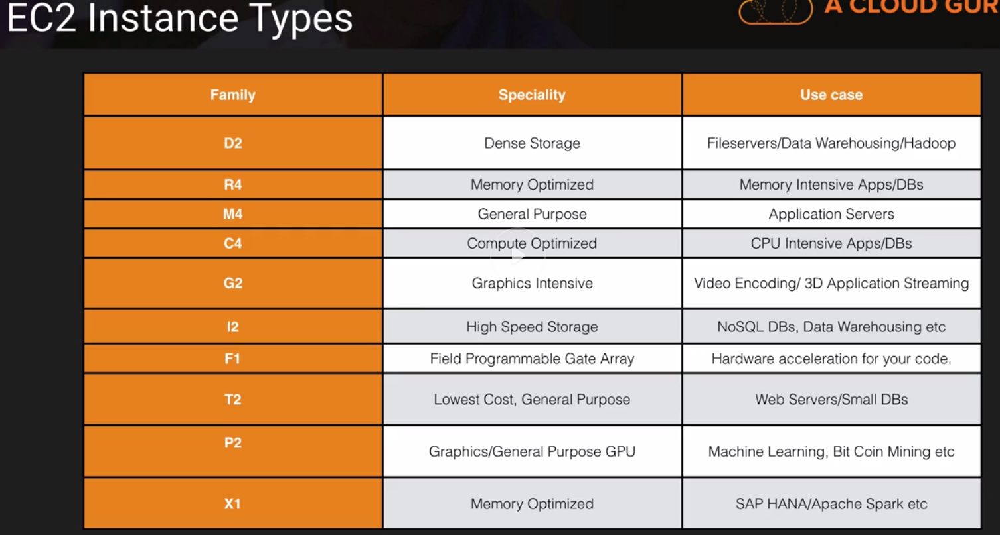
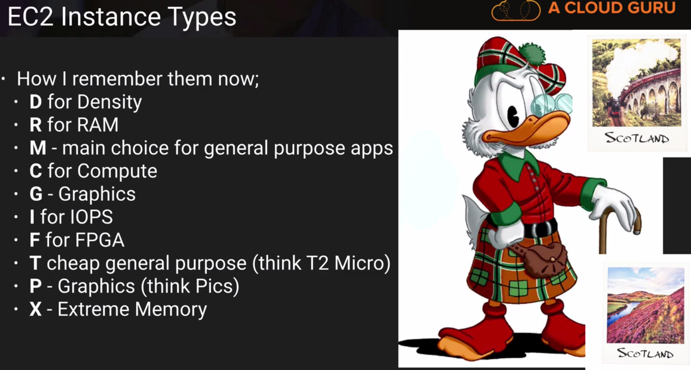

### EC2 - Elastic Compute Cloud

#### Part 1 
> Amazon Elastic Compute Cloud(Amazon EC2) is a web service that provides resizable compute capacity in the cloud. 
> Amazon EC2 reduces the time required to obtain and boot new server instances to minutes, allowing you to quickly
> scale capacity, bth up and down, as your computing requirements change.

#### Pricing Options:
- `On Demand` - allow you to pay a fixed rate by the hour with no commitment
	- Users that want low cost and flexibility of Amazon EC2 without any up-front payment or long-term commitment
	- Applications with short term, spiky, or unpredictable workloads that cannot be interrupted
	- Applications being developed or tested on Amazon EC2 for the first time
- `Reserved` - provide you with a capacity reservation, and offer a signification discount on the hourly
	charge for an instance. 1 Year or 3 Year Terms
	- Applications with steady state or predictable usage
	- Applications that require reserved capacity
	- Users able to make upfront payments to reduce their total computing costs even further
- `Spot` - enable you to bid whatever price you want for instance capacity, providing for even greater savings 
	if your application have flexible start and end times.
	- Application that have flexible start and end times
	- Applications that are only feasible at very low compute prices
	- Users with urgent computing needs for large amounts of additional capacity
	- Exam Tip
		> If the Spot instance is terminated by Amazon EC2, you will not be charged for a partial hour of usage.
		> However, if you terminate the instance yourself, you will be charged for any hour in which the instance ran
- `Dedicated Hosts` - Physical EC2 server dedicated for your use. Dedicated Hosts can help you reduce costs	
	by allowing you to use your existing server-bound software licenses.
	- Useful for regulatory requirements that may not support multi-tenant virtualization
	- Great for licensing which does not support multi-tenancy or cloud deployments
	- Can be purchased On-Demand(hourly)
	- Can be purchased as a Reservation for up to 70 % off the On-Demand price
	
	

	

#### DIRTMCGFPX

#### DR Mc GIFT PX

	

#### EBS Elastic Block Store

> Amazon EBS allow you to create storage volumes and attach them to Amazon EC2 instances. Once attached, you can create a file
> system on top of these volumes, run a database, or use them in any other way you would use a block device. Amazon EBS volumes
> are placed in a specific Availability Zone, where they are automatically replicated to protect you from the failure of a single component.

#### EBS Volume Types
- `General Purpose SSD (GP2)`
	- General purpose, balances both price and performance
	- Ratio of 3 IOPS per GB with up 10000 IOPS  and the ability to burst up to 3000 IOPS for extended periods of time for volumes under 1 Gib
- `Provisioned IOPS SSD (IO1)	`
	- Designed for I/O intensive applications such as large relational or NoSQL databases
	- Use if you need more then 10000 IOPS
	- Can provision up to 20000 IOPS per volume
- `Throughput Optimized HDD (ST1)`
	- Big Data
	- Data warehouses
	- Log processing
	- Cannot be a boot volume
- `Cold HDD (SC1)`
	- Lowest Cost Storage for infrequently accessed workloads
	- File server
	- Cannot be a boot volume
- `Magnetic (Standard)`
	- Lowest cost per gigabyte of all EBS volume types that is bootable. Magnetic volumes are ideal for workloads where data is accessed infrequently, 
		and applications where the lowest storage is important
		
#### Exam Tips EC2
1. Know the differences between:
	- On Demand
	- Spot
	- Reserved
	- Dedicated Hosts
2. Remember with the spot instances
	- If you terminate the instance, you pay for the hour
	- If AWS terminates the spot instance, you get the hour it was terminated on for free
3. EBS Consists:
	- SSD, General Purpose - GP2 - (Up to 10000 IOPS)
	- SSh, Provisioned IPS - IO1 - (More than 10000 IOPS)
	- HDD, Throughput Optimized - ST1 - frequently accessed workloads
	- HDD, Cold - SC1 - less frequently accessed data
	- HDD, Magnetic - Standard - cheap, infrequently accessed storage
4. You cannot mount 1 EBS volume to multiple Ec2 instances, instead use EFS 

#### Summary
- Termination Protection is turned off by default, you must turn it on
- On a EBS-backed instance, the default action is for the root EBS volume to be deleted when the instance is terminated
- EBS Root Volumes of your DEFAULT AMI's (Amazon Machine Image) cannot be encrypted. You can also use a third party tool (such as bit locker etc)
   to encrypt the root volume, or this can be done when creating AMI's (lab to follow) in the AWS console or using the API
- Additional volumes can be encrypted

#### EBS (Elastic Block Store) Volumes Exam tips
- EBS Volumes can be changed on the fly (except for magnetic standard)
- Best practices to stop the EC2 instance and then change the volume
- You can change volume types by taking a snapshot and then using the snapshot to crate a new volume
- If you change a volume on the fly you must wait for 6 hours before making another change
- You can scale EBS Volumes up only
- Volumes must be in the same AZ(available zones) as the EC2 instances
		
#### How to connect through ssh	
- chmod 400 *.pem 
- ssh ec2-user@public_ip -i *.pem 
- yum install httpd -y
- service httpd start
- cd /var/www/html/
- nano index.html

chkconfig httpd on - run automatically
