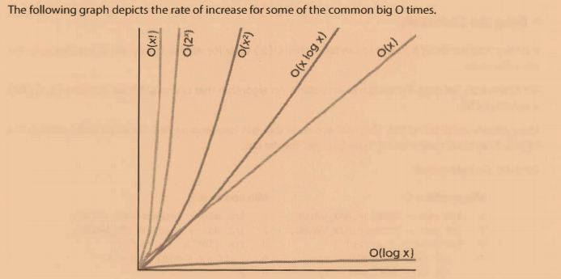
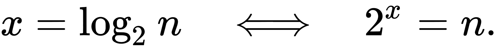

# BigO

[Big-O Complexity Chart](http://bigocheatsheet.com/) 

- Big O time is the language and metric used to describe the efficiency of algorithms.

### Time Complexity

- O (big 0): describes an upper bound on the time. An algorithm that prints all the
  values in an array could be described as O(N), but it could also be described as O(N2), O(N3), or 0( 2
  N) (or many other big O times). The

#### Best Case, Worst Case, and Expected Case

- **Best Case**: If all elements are equal, then quick sort will, on average, just traverse through the array once.
    - This is `O(N)`
- **Worst Case**: What if we get really unlucky and the pivot is repeatedly the biggest element in the array?    
  In this case, our recursion doesn't divide the
  array in half and recurse on each half. It just shrinks the subarray by one element. 
    - This will degenerate to an `O(N2)` runtime.
- **Expected Case**
    - We can expect a runtime of `O(NlogN)`
    
### Space Complexity

- Time is not the only thing that matters in an algorithm. We might also care about the amount of memory or space-required by an algorithm.    
- Space complexity is a parallel concept to time complexity. If we need to create an array of size n, this will
  require `0(n)` space. If we need a two-dimensional array of size nxn, this will require `O(n2)` space.
  
  

  


| Big-O      |  computations for 10 things |  computations for 100 things
|------------|-----------------------------|---------------------------
|O(1)        |   1                         |     1
|O(log(n))   |   3                         |     7
|O(n)        |  10                         |   100
|O(n log(n)) |  30                         |   700
|O(n^2)      | 100                         | 10000

For example: 
```java
List<int> numbers = new List<int> {1,2,3,4,5,6,7,12,543,7};
```

- `O (1)`

```java
return numbers.First();
```

- `O (n) `
	- `O (n)` означает, что время, затрачиваемое вашим алгоритмом, растет линейно по мере увеличения вашего ввода. 

```java
int result = 0;
foreach (int num in numbers){
    result += num;
}
return result;
```

- `O (n log (n))`

```java
int result = 0;
foreach (int num in numbers)
{
    int index = numbers.length - 1;
    while (index > 1)
    {
        // yeah, stupid, but couldn't come up with something more useful :-(
        result += numbers[index];
        index /= 2;
    }
}
return result;
```

- `O (n ^ 2)`
	- `O (n ^ 2)` означает, что время, в течение которого ваш алгоритм растет, становится квадратом вашего ввода

```java
int result = 0;
foreach (int outerNum in numbers)
{
    foreach (int innerNum in numbers)
    {
        result += outerNum * innerNum;
    }
}
return result;
```

##### Примеры

- `O(1) — константная сложность`
Также случается, что время работы алгоритма вообще не зависит от размера входных данных. 
Тогда сложность обозначают как O(1). Например, для определения значения третьего элемента массива не нужно ни запоминать элементы, ни проходить по ним сколько-то раз

- `O(n) — линейная сложность`
Такой сложностью обладает, например, алгоритм поиска наибольшего элемента в не отсортированном массиве. 
Нам придётся пройтись по всем n элементам массива, чтобы понять, какой из них максимальный.

- `O(log n) — логарифмическая сложность`
Простейший пример — бинарный поиск. Если массив отсортирован, мы можем проверить, есть ли в нём какое-то конкретное значение, методом деления пополам. 
Проверим средний элемент, если он больше искомого, то отбросим вторую половину массива — там его точно нет. 
Если же меньше, то наоборот — отбросим начальную половину. И так будем продолжать делить пополам, в итоге проверим log n элементов.

  

- `O(n2) — квадратичная сложность`
Такую сложность имеет, например, алгоритм сортировки вставками. В канонической реализации он представляет из себя два вложенных цикла: 
один, чтобы проходить по всему массиву, а второй, чтобы находить место очередному элементу в уже отсортированной части. 
Таким образом, количество операций будет зависеть от размера массива как n * n, т. е. n2.


# Tasks

### Hash Tables

A hash table is a data structure that maps keys to values for highly efficient lookup. There are a number of
ways of implementing this. Here, we will describe a simple but common implementation.
In this simple implementation, we use an array of linked lists and a hash code function. To insert a key
(which might be a string or essentially any other data type) and value, we do the following:

1. First, compute the key's hash code, which will usually be an int or long. Note that two different keys
could have the same hash code, as there may be an infinite number of keys and a finite number of ints.
2. Then, map the hash code to an index in the array. This could be done with something like hash (key)
% array_length. Two different hash codes could, of course, map to the same index.
3. At this index, there is a linked list of keys and values. Store the key and value in this index. We must use a
linked list because of collisions: you could have two different keys with the same hash code, or two different
hash codes that map to the same index.

To retrieve the value pair by its key, you repeat this process. Compute the hash code from the key, and then
compute the index from the hash code. Then, search through the linked list for the value with this key.

If the number of collisions is very high, the `worst case` runtime is `O(N)`, where N is the number of keys.
However, we generally assume a good implementation that keeps collisions to a minimum, in which case
the lookup time is `0(1)`.

### Linked list 

Linked list is a data structure that represents a sequence of nodes. In a singly linked list, each node
points to the next node in the linked list. A doubly linked list gives each node pointers to both the next
node and the previous node. 

Unlike an array, a linked list does not provide constant time access to a particular "index" within the list.
This means that if you'd like to find the Kth element in the list, you will need to iterate through K elements.

The benefit of a linked list is that you can add and remove items from the beginning of the list in constant
time

### Stack

- A stack uses `LIFO` (last-in first-out) ordering. 
  That is, as in a stack of dinner plates, the most recent item added to the stack is the first item to be removed.
  
- It uses the following operations:
	- pop() : Remove the top item from the stack.
	- push(item): Add an item to the top of the stack.
	- peek(): Return the top of the stack.
	- isEmpty(): Return true if and only if the stack is empty.  

- Unlike an array, a stack does not offer constant-time access to the i th item. 
  However, it does allow constant time adds and removes, as it doesn't require shifting elements around. 	
 
- One case where stacks are often useful is in certain recursive algorithms

### Queue

- A queue implements `FIFO` (first-in first-out) ordering. 
  As in a line or queue at a ticket stand, items are removed from the data structure in the same order that they are added.   
  
- It uses the operations:
	- add(item): Add an item to the end of the list.
	- remove(): Remove the first item in the list.
	- peek() : Return the top of the queue.
	- isEmpty(): Return true if and only if the queue is empty.   

- One place where queues are often used is in breadth-first search or in implementing a cache. 	