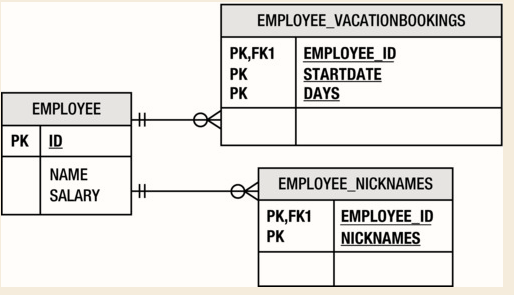
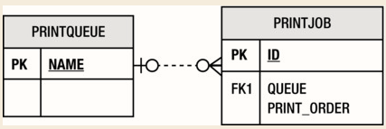
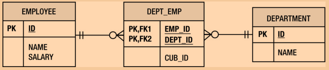
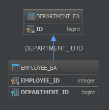
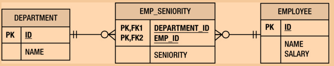
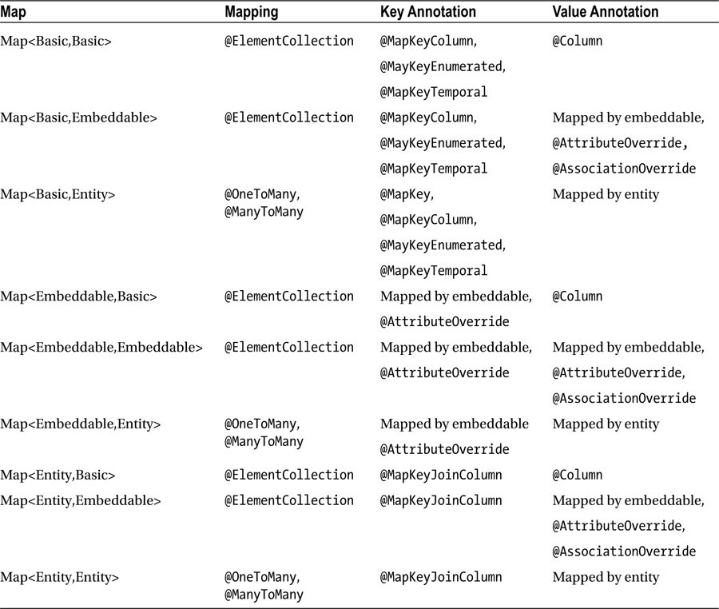

## Chapter 5, Collection mapping

- Objects that can be mapped as collection:
    - Entities
    - Embeddables
    - Basic types
    
- element collections require a separate table called a collection table

**Element Collections of Embeddables and Basic Types**    
```java
@Embeddable
public class VacationEntry {
    @Temporal(TemporalType.DATE)
    private Calendar startDate;

    @Column(name="DAYS")
    private int daysTaken;
    // ...
}
```
```java

@Entity
public class Employee {
    @Id private int id;
    private String name;
    private long salary;
    // ...

    @ElementCollection(targetClass=VacationEntry.class)
    private Collection vacationBookings;

    @ElementCollection
    private Set<String> nickNames;

    // ...
}
```


**Overriding Collection Table Columns**  
```java
@Entity
public class Employee {
    @Id private int id;
    private String name;
    private long salary;
    // ...

    @ElementCollection(targetClass=VacationEntry.class)
    @CollectionTable(
        name="VACATION",
        joinColumns=@JoinColumn(name="EMP_ID"))
    @AttributeOverride(name="daysTaken",
                       column=@Column(name="DAYS_ABS"))
    private Collection vacationBookings;

    @ElementCollection
    @Column(name="NICKNAME")
    private Set<String> nickNames;
    // ...
}
```  

    
***Support for collections for embeddable and simple types was added in JPA 2.0.***

- **@ElementCollection(target="x")** 
 - **@Embeddable**
 - **@CollectionTable**
    Default naming is referencing entity `_` entity attribute. The default name of the join column is referencing entity `_` name of primary key.
- @AttributeOverride overrides the column names.


- **Collection:** superinterface, most common used
- **Set:** will prevent duplicates
- **List:** user defined order
- **Map**


- `@OrderBy`
    - Default is ASC and order by primary key.
    ```java
    @Entity
    public class Department {
        // ...
        @OneToMany(mappedBy="department")
        @OrderBy("status DESC, name ASC")
        private List<Employee> employees;
        // ...
    }
    ```
- `@OrderColumn(name="x")`
    ```java 
    @Entity
    public class PrintQueue {
         @Id private String name;
        // ...
        @OneToMany(mappedBy="queue")
        @OrderColumn(name="PRINT_ORDER")
        private List<PrintJob> jobs;
        // ...
    }
    ```
    
    - Using an @OrderColumn annotation precludes the use of @OrderBy, and vice versa
    - Name defaults in name of entity attribute "_ORDER"
    - Order column stored depends on mapping. Usually the table that stores the entity or the element being stored.
    - One-to-many - Stores in the 'many'
    - Element collection - Stores in the collection table
    - Many-to-many - stores in the join table
    
    
#### Maps
- Associate key with arbitrary value object
- Key rules are:
    - They must be comparable an respond to hashCode() and equals() method.
    - Need to be unique 
    - Must not change while object is acting as a key.
- When keys are basic or embeddable types, they are stored directly in the table being referred to. 
  Depending upon the type of mapping, it can be either the target entity table, join table, or collection table. 
  When keys are entities, only the foreign key is stored in the table because entities are stored in their own table, 
  and their identity in the database must be preserved.
- If the values are entities, the Map must be mapped as a one-to-many or many-to-many relationship, 
  whereas if the values of the Map are either embeddable or basic types, the Map is mapped as an element collection.  

##### Keying By Basic Type
- If the mapping is an element collection keyed by a basic type, the keys will be stored in the same collection table in which the Map values are stored
- **@Column** annotation to override the name of the column that stores the values in the Collection
- **@MapKeyColumn**, which is used to indicate the column in the collection table that stores the basic key
```java
@Entity
public class Employee {
    @Id private int id;
    private String name;
    private long salary;

    @ElementCollection
    @CollectionTable(name="EMP_PHONE")
    @MapKeyColumn(name="PHONE_TYPE")
    @Column(name="PHONE_NUM")
    private Map<String, String> phoneNumbers;
    // ...
}
```

- **@MapKeyEnumerated** is applicable to keys that are of a basic type
```java
public enum PhoneType { Home, Mobile, Work }

@Entity
public class Employee {
    @Id private int id;
    private String name;
    private long salary;

    @ElementCollection
    @CollectionTable(name="EMP_PHONE")
    @MapKeyEnumerated(EnumType.STRING)
    @MapKeyColumn(name="PHONE_TYPE")
    @Column(name="PHONE_NUM")
    private Map<PhoneType, String> phoneNumbers;
    // ...
}
```
- Many-to-Many Relationship Using a Map with String Keys
```java
@Entity
public class Department {
    @Id private int id;
    private String name;

    @ManyToMany
    @JoinTable(name="DEPT_EMP",
        joinColumns=@JoinColumn(name="DEPT_ID"),
        inverseJoinColumns=@JoinColumn(name="EMP_ID"))
    @MapKeyColumn(name="CUB_ID")
    private Map<String, Employee> employeesByCubicle;
    // ...
}
```



##### Keying by Entity Attribute
- Basic type of the key is the type of the attribute (that we are keying on) in the target entity
- **@MapKey** annotation can be used to designate the attribute of the target entity that is being keyed on.
- **@MapKeyColumn** annotation is never used when keying on an entity attribute.
```java
@Entity
public class Department {
    // ...
    @OneToMany(mappedBy="department")
    @MapKey(name="id")
    private Map<Integer, Employee> employees;
    // ...
}
```


- **@Enumerated**
- **@MapKeyEnumerated**
- **@MapKeyTemporal**
- **@MapKeyColumn**
- **@MapKey:** designate the attribute of the target entity that is being keyed on. Default is id, which is a type of int or Integer.

- Map can only be used on one side of the many-to-many relationship

#### Embeddables as key
- Embeddables are not full fledged entities, not queryable by itself and the identity is not defined.
- Stored in the table referred to by mapping.
- Multiple columns contributing to the primary key.
- Embeddable key types are similar to basic key types in that they are also stored in the table referred to by the mapping, 
  but with embeddable types there are multiple attributes to store, not just one value. 
  This results in multiple columns contributing to the primary key.
```java
@Entity
public class Department {
    @Id private int id;

    @ManyToMany
    @JoinTable(name="DEPT_EMP",
       joinColumns=@JoinColumn(name="DEPT_ID"),
       inverseJoinColumns=@JoinColumn(name="EMP_ID"))
    @AttributeOverrides({
       @AttributeOverride(
          name="first_Name",
          column=@Column(name="EMP_FNAME")),
       @AttributeOverride(
          name="last_Name",
          column=@Column(name="EMP_LNAME"))
    })
    private Map<EmployeeName, Employee> employees;
    // ...
}
```


#### Keying by entity
- Advantage of keying by entity type is that the entity instances are globally unit (within the persistence context).
- Key will be stored in the table referred to by the mapping
- **@MapKeyJoinColumn* annotation is used to override the join column defaults for an entity key. When it is not specified, the join column will have the same default column name as basic keys (the name of the relationship or element collection attribute, appended with the string “_KEY”).
- **@MapKeyClass:** Should be used whenever the key class cannot be deducted from the attribute definition or the other mapping data.
```java
@Entity
public class Department {
    @Id private int id;
    private String name;
    // ...
    @ElementCollection
    @CollectionTable(name="EMP_SENIORITY")
    @MapKeyJoinColumn(name="EMP_ID")
    @Column(name="SENIORITY")
    private Map<Employee, Integer> seniorities;
    // ...
}
```


- Untyped Maps
```java
@Entity
public class Employee {
    @Id private int id;
    private String name;
    private long salary;

    @ElementCollection(targetClass=String.class)
    @CollectionTable(name="EMP_PHONE")
    @MapKeyColumn(name="PHONE_TYPE")
    @MapKeyClass(String.class)
    @Column(name="PHONE_NUM")
    private Map phoneNumbers;
    // ...
}
```
**@MapKeyClass** annotation should be used whenever the key class cannot be deduced from the attribute definition or the other mapping metadata.

##### Rules for Maps
- Use the **@MapKeyClass** and targetEntity/targetClass elements of the relationship and element collection mappings to specify the classes when an untyped Map is used.
- Use **@MapKey** with one-to-many or many-to-many relationship Map that is keyed on an attribute of the target entity.
- Use **@MapKeyJoinColumn** to override the join column of the entity key.
- Use **@Column** to override the column storing the values of an element collection of basic types.
- Use **@MapKeyColumn** to override the column storing the keys when keyed by a basic type.
- Use **@MapKeyTemporal** and @MapKeyEnumerated if you need to further qualify a basic key that is a temporal or enumerated type.
- Use **@AttributeOverride** with a “key.” or “value.” prefix to override the column of an embeddable attribute type that is a Map key or a value, respectively.



***See page 126 for Summary of  mapping a map***


- In a List there are no guarantees in order if it is not specified. 
- `@OrderBy` is the best approach compared to a list.
- The preferred and most efficient use of a Map is to use an attribute of the target object as a key, making a Map of entities keyed by a basic attribute type the most common and useful.
- Avoid using embedded objects in a Map, because their identity is typically not defined.