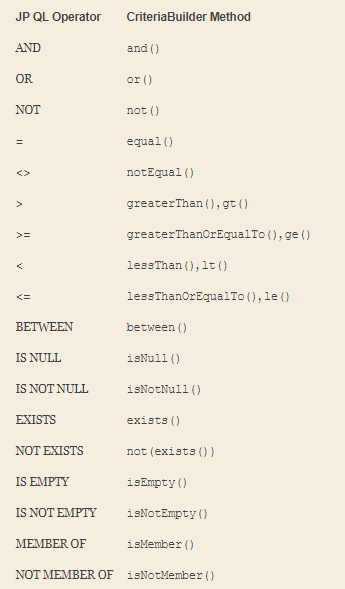
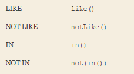

## Chapter 9, Criteria API

- Simple example.  The following JP QL query returns all the employees in the company with the name of “John Smith:”
   ```sql
   SELECT e
   FROM Employee e
   WHERE e.name = 'John Smith'
   ```
   And here is the equivalent query constructed using the Criteria API:
   ```sql
   CriteriaBuilder cb = em.getCriteriaBuilder();
   CriteriaQuery<Employee> cq = cb.createQuery(Employee.class);
   Root<Employee> emp = cq.from(Employee.class);
   cq.select(emp).where(cb.equal(emp.get("name"), "John Smith"));
   ```
- All of the conditional expression keywords, operators, and functions from JP QL are represented in some manner on the `CriteriaBuilder` interface.  
- The `CriteriaBuilder` interface provides three methods for creating a new select query definition, depending on the desired result type of the query. 
    - The first and most common method is the `createQuery(Class<T>)` method, passing in the class corresponding to the result of the query. 
    - The second method is `createQuery()`, without any parameters, and corresponds to a query with a result type of `Object`. 
    - The third method, `createTupleQuery()`, is used for projection or report queries where the SELECT clause of the query contains more than one expression and you wish to work with the result in a more strongly typed manner. 
      It is really just a convenience method that is equivalent to invoking `createQuery(Tuple.class)`. 
-  A root in a criteria query corresponds to an identification variable in JP QL, which in turn corresponds to a range variable declaration or join expression.
   ```sql
   CriteriaQuery<Employee> c = cb.createQuery(Employee.class);
   Root<Employee> emp = c.from(Employee.class);
   ```      
- Each call adds another root to the query, resulting in a Cartesian product when more than one root is defined if no further constraints are applied in the WHERE clause
  ```sql
    SELECT DISTINCT d
    FROM Department d, Employee e
    WHERE d = e.department
  ``` 
  Convert this query to the Criteria API
  ```java
    CriteriaQuery<Department> c = cb.createQuery(Department.class);
    Root<Department> dept = c.from(Department.class);
    Root<Employee> emp = c.from(Employee.class);
    c.select(dept)
     .distinct(true)
     .where(cb.equal(dept, emp.get("department")));
  ```
- Path Expressions
  ```sql
    SELECT e
    FROM Employee e
    WHERE e.address.city = 'New York'
  ```
  Convert this query to the Criteria API
  ```java
    CriteriaQuery<Employee> c = cb.createQuery(Employee.class);
    Root<Employee> emp = c.from(Employee.class);
    c.select(emp)
     .where(cb.equal(emp.get("address").get("city"), "New York"));
  ``` 
- Selecting Single Expressions
  
  This query will return all employee names, including any duplicates. 
  ```java
  CriteriaQuery<String> c = cb.createQuery(String.class);
  Root<Employee> emp = c.from(Employee.class);
  c.select(emp.<String>get("name"));
  ```  
- Selecting Multiple Expressions
  - The first form is for queries that have Object or Object[] as their result type. The list of expressions that make up each result are simply passed to the `multiselect()` method.  
  ```java
  CriteriaQuery<Object[]> c = cb.createQuery(Object[].class);
  Root<Employee> emp = c.from(Employee.class);
  c.multiselect(emp.get("id"), emp.get("name"));
  ```
  - The second form is a close relative of the first form, but for queries that result in Tuple. Again, the list of expressions is passed into the `multiselect()` call.
  ```java
  CriteriaQuery<Tuple> c = cb.createTupleQuery();
  Root<Employee> emp = c.from(Employee.class);
  c.multiselect(emp.get("id"), emp.get("name"));
  ```
  - The third and final form is for queries with constructor expressions that result in non-persistent types
  ```java
  CriteriaQuery<EmployeeInfo> c = cb.createQuery(EmployeeInfo.class);
  Root<Employee> emp = c.from(Employee.class);
  c.multiselect(emp.get("id"), emp.get("name"));
  
  This is equivalent to the following:
    
  CriteriaQuery<EmployeeInfo> c = cb.createQuery(EmployeeInfo.class);
  Root<Employee> emp = c.from(Employee.class);
  c.select(cb.construct(EmployeeInfo.class,
                        emp.get("id"),
                        emp.get("name")));
  ```
- Using Aliases
```java
CriteriaQuery<Tuple> c= cb.createTupleQuery();
Root<Employee> emp = c.from(Employee.class);
c.multiselect(emp.get("id").alias("id"), emp.get("name").alias("fullName"));
```
- Inner Joins
```java
Join<Employee,Project> project = emp.join("projects", JoinType.LEFT);

Join<Employee,Employee> directs = emp.join("directs");
Join<Employee,Project> projects = directs.join("projects");
Join<Employee,Department> dept = directs.join("dept");

Join<Employee,Project> project = dept.join("employees").join("projects");
```
- Joins Map
```java
SELECT e.name, KEY(p), VALUE(p)
FROM Employee e JOIN e.phones p

JPQL => Criteria API

CriteriaQuery<Object> c = cb.createQuery();
Root<Employee> emp = c.from(Employee.class);
MapJoin<Employee,String,Phone> phone = emp.joinMap("phones");
c.multiselect(emp.get("name"), phone.key(), phone.value());
```
- Fetch Joins of single-valued relationships Fetch Joins
```java
SELECT e
FROM Employee e JOIN FETCH e.address

JPQL => Criteria API

CriteriaQuery<Employee> c = cb.createQuery(Employee.class);
Root<Employee> emp = c.from(Employee.class);
emp.fetch("address");
c.select(emp);
```
- Collection-valued Fetch Joins
```java
CriteriaQuery<Employee> c = cb.createQuery(Employee.class);
Root<Employee> emp = c.from(Employee.class);
emp.fetch("phones", JoinType.LEFT);
c.select(emp)
 .distinct(true);
```
- The key to building up expressions with the Criteria API is the `CriteriaBuilder` interface. 
  This interface contains methods for all of the predicates, expressions, and functions supported by the JP QL language as well as other features specific to the Criteria API

- Building Expressions




- Creating Parameter Expressions
```java
CriteriaQuery<Employee> c = cb.createQuery(Employee.class);
Root<Employee> emp = c.from(Employee.class);
c.select(emp);
ParameterExpression<String> deptName =
    cb.parameter(String.class, "deptName");
c.where(cb.equal(emp.get("dept").get("name"), deptName));
```
- Subqueries
- The AbstractQuery interface provides the subquery() method for creation of subqueries
```java
public List<Employee> findEmployees(String name, String deptName,
                                        String projectName, String city) {
        CriteriaBuilder cb = em.getCriteriaBuilder();
        CriteriaQuery<Employee> c = cb.createQuery(Employee.class);
        Root<Employee> emp = c.from(Employee.class);
        c.select(emp);

        // ...

        if (projectName != null) {
            Subquery<Employee> sq = c.subquery(Employee.class);
            Root<Project> project = sq.from(Project.class);
            Join<Project,Employee> sqEmp = project.join("employees");
            sq.select(sqEmp)
              .where(cb.equal(project.get("name"),
                              cb.parameter(String.class, "project")));
            criteria.add(cb.in(emp).value(sq));
        }

        // ...
}
```
Criteria API => JPQL
```sql
SELECT e
FROM Employee e
WHERE e IN (SELECT emp
              FROM Project p JOIN p.employees emp
              WHERE p.name = :project)
```
- `correlate()` method from the `Subquery` interface   
```java
if (projectName != null) {
    Subquery<Project> sq = c.subquery(Project.class);
    Root<Employee> sqEmp = sq.correlate(emp);
    Join<Employee,Project> project = sqEmp.join("projects");
    sq.select(project)
      .where(cb.equal(project.get("name"),
                      cb.parameter(String.class,"project")));
    criteria.add(cb.exists(sq));
}
```
- In Expressions
```sql
SELECT e
FROM Employee e
WHERE e.address.state IN ('NY', 'CA')
```   
JPQL => Criteria API
```java
CriteriaQuery<Employee> c = cb.createQuery(Employee.class);
Root<Employee> emp = c.from(Employee.class);
c.select(emp)
 .where(emp.get("address")
           .get("state").in("NY","CA"));
```
- More In expression example
```sql
SELECT e
FROM Employee e
WHERE e.department IN
  (SELECT DISTINCT d
   FROM Department d JOIN d.employees de JOIN de.project p
   WHERE p.name LIKE 'QA%')
```
JPQL => Criteria API
```java
CriteriaQuery<Employee> c = cb.createQuery(Employee.class);
Root<Employee> emp = c.from(Employee.class);
Subquery<Department> sq = c.subquery(Department.class);
Root<Department> dept = sq.from(Department.class);
Join<Employee,Project> project = dept.join("employees").join("projects");
sq.select(dept.<Integer>get("id"))
  .distinct(true)
  .where(cb.like(project.<String>get("name"), "QA%"));
c.select(emp)
 .where(cb.in(emp.get("dept").get("id")).value(sq));
```
- Case Expressions
```sql
SELECT p.name,
       CASE WHEN TYPE(p) = DesignProject THEN 'Development'
            WHEN TYPE(p) = QualityProject THEN 'QA'
            ELSE 'Non-Development'
       END
FROM Project p
WHERE p.employees IS NOT EMPTY
```
JPQL => Criteria API
```java
CriteriaQuery<Object[]> c = cb.createQuery(Object[].class);
Root<Project> project = c.from(Project.class);
c.multiselect(project.get("name"),
         cb.selectCase()
           .when(cb.equal(project.type(), DesignProject.class),
                 "Development")
           .when(cb.equal(project.type(), QualityProject.class),
                 "QA")
           .otherwise("Non-Development"))
 .where(cb.isNotEmpty(project.<List<Employee>>get("employees")));
```
- COALESHE
```sql
SELECT COALESCE(d.name, d.id)
FROM Department d
```
JPQL => Criteria API
```java
CriteriaQuery<Object> c = cb.createQuery();
Root<Department> dept = c.from(Department.class);
c.select(cb.coalesce(dept.get("name"),
                     dept.get("id")));
```
- Function Expressions
```java
CriteriaQuery<String> c = cb.createQuery(String.class);
Root<Department> dept = c.from(Department.class);
c.select(cb.function("initcap", String.class, dept.get("name")));
```
- Outer Join Criteria
```sql
SELECT e FROM Employee e JOIN e.projects p ON p.name = 'Zooby'
```
JPQL => Criteria API
```java
CriteriaQuery<Employee> q = cb.createQuery(Employee.class);
Root<Employee> emp = q.from(Employee.class);
Join<Employee,Project> project = emp.join("projects", JoinType.LEFT)
            .on(cb.equal(project.get("name"), "Zooby"));
q.select(emp);
```
- The ORDER BY Clause
```java
CriteriaQuery<Tuple> c = cb.createQuery(Tuple.class);
Root<Employee> emp = c.from(Employee.class);
Join<Employee,Department> dept = emp.join("dept");
c.multiselect(dept.get("name"), emp.get("name"));
c.orderBy(cb.desc(dept.get("name")),
          cb.asc(emp.get("name")));
```
Criteria API => JPQL
```sql
SELECT d.name, e.name
FROM Employee e JOIN e.dept d
ORDER BY d.name DESC, e.name
```
- The GROUP BY and HAVING Clauses
```sql
SELECT e, COUNT(p)
FROM Employee e JOIN e.projects p
GROUP BY e
HAVING COUNT(p) >= 2
```
JPQL => Criteria API 
```java
CriteriaQuery<Object[]> c = cb.createQuery(Object[].class);
Root<Employee> emp = c.from(Employee.class);
Join<Employee,Project> project = emp.join("projects");
c.multiselect(emp, cb.count(project))
 .groupBy(emp)
 .having(cb.ge(cb.count(project),2));
```
- Bulk Update 
```sql
UPDATE Employee e
SET e.salary = e.salary + 5000
WHERE EXISTS (SELECT p
              FROM e.projects p
              WHERE p.name = 'Release2')
```
Criteria API => JPQL
```java
CriteriaUpdate<Employee> q = cb.createCriteriaUpdate(Employee.class);
Root<Employee> e = q.from(Employee.class);
Subquery<Project> sq = c.subquery(Project.class);
Root<Employee> sqEmp = sq.correlate(emp);
Join<Employee,Project> project = sqEmp.join("projects");
sq.select(project)
  .where(cb.equal(project.get("name"),"Release2"));
q.set(emp.get("salary"), cb.sum(emp.get("salary"), 5000))
 .where(cb.exists(sq));
```
- Bulk Delete
```sql
DELETE FROM Employee e
WHERE e.department IS NULL
```
Criteria API => JPQL
```java
CriteriaDelete<Employee> q = cb.createCriteriaDelete(Employee.class);
Root<Employee> emp = c.from(Employee.class);
q.where(cb.isNull(emp.get("dept"));
```
-  The `metamodel` of a persistence unit is a description of the persistent type, state, and relationships of entities, embeddables, and managed classes.
```java
Metamodel mm = em.getMetamodel();
EntityType<Employee> emp_ = mm.entity(Employee.class);
```
- The canonical metamodel consists of dedicated classes, typically generated, one per persistent class, that contain static declarations of the metamodel objects associated with that persistent class. 
  This allows you to access the same information exposed through the metamodel API, but in a form that applies directly to your persistent classes
```java
@StaticMetamodel(Employee.class)
public class Employee_ {
    public static volatile SingularAttribute<Employee, Integer> id;
    public static volatile SingularAttribute<Employee, String> name;
    public static volatile SingularAttribute<Employee, String> salary;
    public static volatile SingularAttribute<Employee, Department> dept;
    public static volatile SingularAttribute<Employee, Address> address;
    public static volatile CollectionAttribute<Employee, Project> project;
    public static volatile MapAttribute<Employee, String, Phone> phones;
}
```  
- If a persistent field or property in an entity is of a primitive type or a single-valued relationship, 
 then the like-named field in the canonical metamodel class will be of type `SingularAttribute`.
- If a persistent field or property is collection-valued, then the field in the canonical metamodel class will be of type 
  `ListAttribute`, `SetAttribute`, `MapAttribute`, or `CollectionAttribute`, depending upon the type of collection.
```java
CriteriaQuery<Object> c = cb.createQuery();
Root<Employee> emp = c.from(Employee.class);
MapJoin<Employee,String,Phone> phone = emp.join(Employee_.phones);
c.multiselect(emp.get(Employee_.name), phone.key(), phone.value());
```  