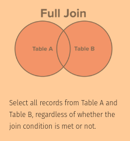
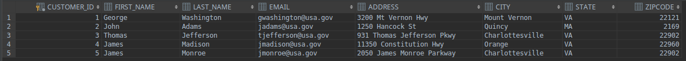
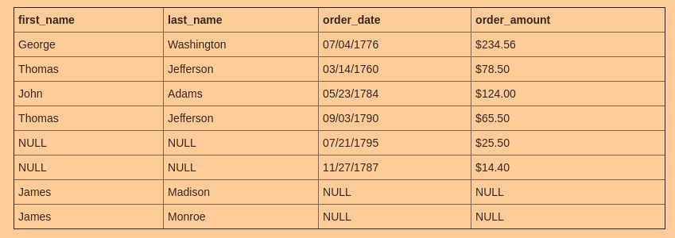

#### Full Join






Оператор SQL FULL JOIN осуществляет формирование таблицы из записей двух или нескольких таблиц. В операторе SQL FULL JOIN не важен порядок следования таблиц, он никак не влияет на окончательный результат, так как оператор является симметричным.

Оператор SQL FULL JOIN можно воспринимать как сочетание операторов SQL INNER JOIN + SQL LEFT JOIN + SQL RIGHT JOIN. 

Алгоритм его работы следующий:
 - Сначала формируется таблица на основе внутреннего соединения (оператор SQL INNER JOIN).
 - Затем, в таблицу добавляются значения не вошедшие в результат формирования из правой таблицы (оператор SQL LEFT JOIN). Для них, соответствующие записи из правой таблицы заполняются значениями NULL.
 - Наконец, в таблицу добавляются значения не вошедшие в результат формирования из левой таблицы (оператор SQL RIGHT JOIN). Для них, соответствующие записи из левой таблицы заполняются значениями NULL.

```sql
select first_name, last_name, order_date, order_amount
from customers c
full join orders o
on c.customer_id = o.customer_id
```

