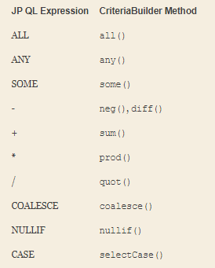
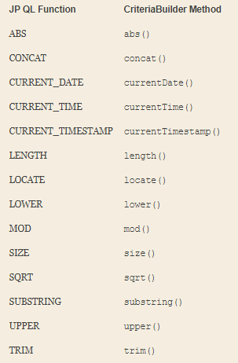
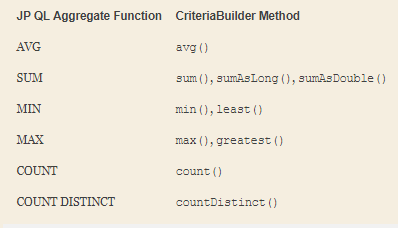

## Chapter 9, Criteria API

- Simple example.  The following JP QL query returns all the employees in the company with the name of “John Smith:”
   ```sql
   SELECT e
   FROM Employee e
   WHERE e.name = 'John Smith'
   ```
   And here is the equivalent query constructed using the Criteria API:
   ```sql
   CriteriaBuilder cb = em.getCriteriaBuilder();
   CriteriaQuery<Employee> cq = cb.createQuery(Employee.class);
   Root<Employee> emp = cq.from(Employee.class);
   cq.select(emp).where(cb.equal(emp.get("name"), "John Smith"));
   ```
- All of the conditional expression keywords, operators, and functions from JP QL are represented in some manner on the `CriteriaBuilder` interface.  
- The `CriteriaBuilder` interface provides three methods for creating a new select query definition, depending on the desired result type of the query. 
    - The first and most common method is the `createQuery(Class<T>)` method, passing in the class corresponding to the result of the query. 
    - The second method is `createQuery()`, without any parameters, and corresponds to a query with a result type of `Object`. 
    - The third method, `createTupleQuery()`, is used for projection or report queries where the SELECT clause of the query contains more than one expression and you wish to work with the result in a more strongly typed manner. 
      It is really just a convenience method that is equivalent to invoking `createQuery(Tuple.class)`. 
-  A root in a criteria query corresponds to an identification variable in JP QL, which in turn corresponds to a range variable declaration or join expression.
   ```sql
   CriteriaQuery<Employee> c = cb.createQuery(Employee.class);
   Root<Employee> emp = c.from(Employee.class);
   ```      
- Each call adds another root to the query, resulting in a Cartesian product when more than one root is defined if no further constraints are applied in the WHERE clause
  ```sql
    SELECT DISTINCT d
    FROM Department d, Employee e
    WHERE d = e.department
  ``` 
  Convert this query to the Criteria API
  ```java
    CriteriaQuery<Department> c = cb.createQuery(Department.class);
    Root<Department> dept = c.from(Department.class);
    Root<Employee> emp = c.from(Employee.class);
    c.select(dept)
     .distinct(true)
     .where(cb.equal(dept, emp.get("department")));
  ```
- Path Expressions
  ```sql
    SELECT e
    FROM Employee e
    WHERE e.address.city = 'New York'
  ```
  Convert this query to the Criteria API
  ```java
    CriteriaQuery<Employee> c = cb.createQuery(Employee.class);
    Root<Employee> emp = c.from(Employee.class);
    c.select(emp)
     .where(cb.equal(emp.get("address").get("city"), "New York"));
  ``` 
- Selecting Single Expressions
  
  This query will return all employee names, including any duplicates. 
  ```java
  CriteriaQuery<String> c = cb.createQuery(String.class);
  Root<Employee> emp = c.from(Employee.class);
  c.select(emp.<String>get("name"));
  ```  
- Selecting Multiple Expressions
  - The first form is for queries that have Object or Object[] as their result type. The list of expressions that make up each result are simply passed to the `multiselect()` method.  
  ```java
  CriteriaQuery<Object[]> c = cb.createQuery(Object[].class);
  Root<Employee> emp = c.from(Employee.class);
  c.multiselect(emp.get("id"), emp.get("name"));
  ```
  - The second form is a close relative of the first form, but for queries that result in Tuple. Again, the list of expressions is passed into the `multiselect()` call.
  ```java
  CriteriaQuery<Tuple> c = cb.createTupleQuery();
  Root<Employee> emp = c.from(Employee.class);
  c.multiselect(emp.get("id"), emp.get("name"));
  ```
  - The third and final form is for queries with constructor expressions that result in non-persistent types
  ```java
  CriteriaQuery<EmployeeInfo> c = cb.createQuery(EmployeeInfo.class);
  Root<Employee> emp = c.from(Employee.class);
  c.multiselect(emp.get("id"), emp.get("name"));
  
  This is equivalent to the following:
    
  CriteriaQuery<EmployeeInfo> c = cb.createQuery(EmployeeInfo.class);
  Root<Employee> emp = c.from(Employee.class);
  c.select(cb.construct(EmployeeInfo.class,
                        emp.get("id"),
                        emp.get("name")));
  ```
- Using Aliases
```java
CriteriaQuery<Tuple> c= cb.createTupleQuery();
Root<Employee> emp = c.from(Employee.class);
c.multiselect(emp.get("id").alias("id"), emp.get("name").alias("fullName"));
```
- Inner Joins
```java
Join<Employee,Project> project = emp.join("projects", JoinType.LEFT);

Join<Employee,Employee> directs = emp.join("directs");
Join<Employee,Project> projects = directs.join("projects");
Join<Employee,Department> dept = directs.join("dept");

Join<Employee,Project> project = dept.join("employees").join("projects");
```
- Joins Map
```java
SELECT e.name, KEY(p), VALUE(p)
FROM Employee e JOIN e.phones p

JPQL => Criteria API

CriteriaQuery<Object> c = cb.createQuery();
Root<Employee> emp = c.from(Employee.class);
MapJoin<Employee,String,Phone> phone = emp.joinMap("phones");
c.multiselect(emp.get("name"), phone.key(), phone.value());
```
- Fetch Joins of single-valued relationships Fetch Joins
```java
SELECT e
FROM Employee e JOIN FETCH e.address

JPQL => Criteria API

CriteriaQuery<Employee> c = cb.createQuery(Employee.class);
Root<Employee> emp = c.from(Employee.class);
emp.fetch("address");
c.select(emp);
```
- Collection-valued Fetch Joins
```java
CriteriaQuery<Employee> c = cb.createQuery(Employee.class);
Root<Employee> emp = c.from(Employee.class);
emp.fetch("phones", JoinType.LEFT);
c.select(emp)
 .distinct(true);
```
- The key to building up expressions with the Criteria API is the `CriteriaBuilder` interface. 
  This interface contains methods for all of the predicates, expressions, and functions supported by the JP QL language as well as other features specific to the Criteria API

- Building Expressions








   
   