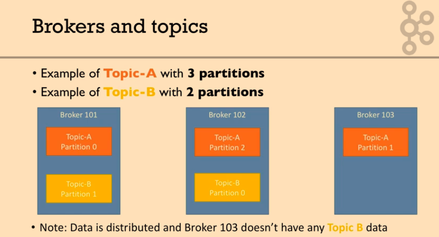
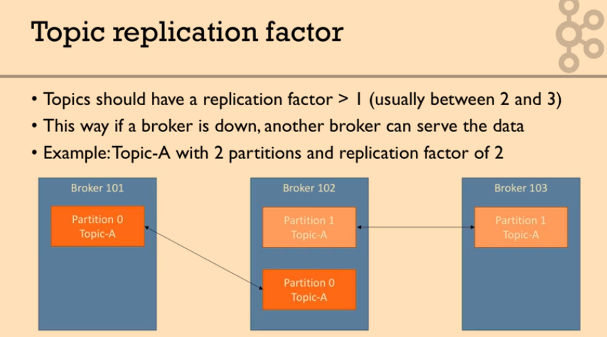
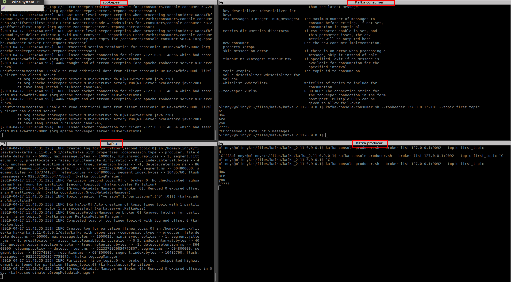
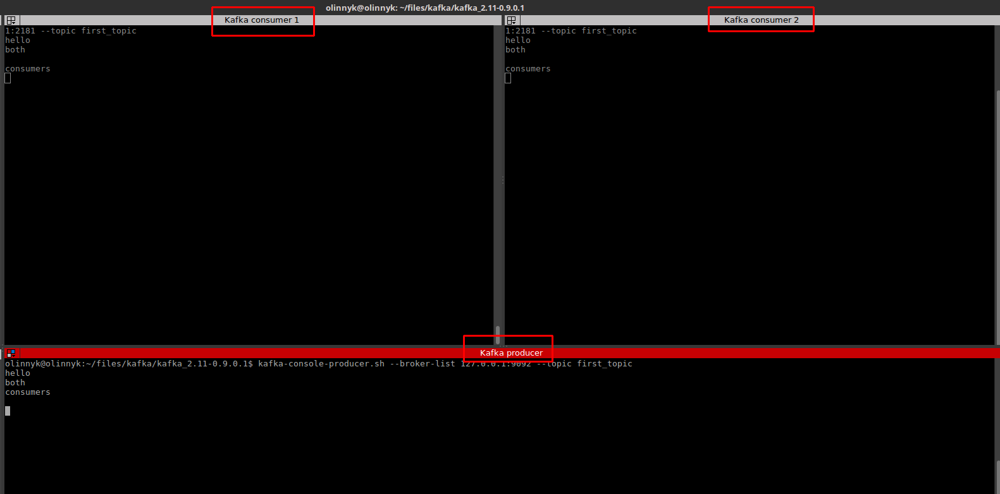
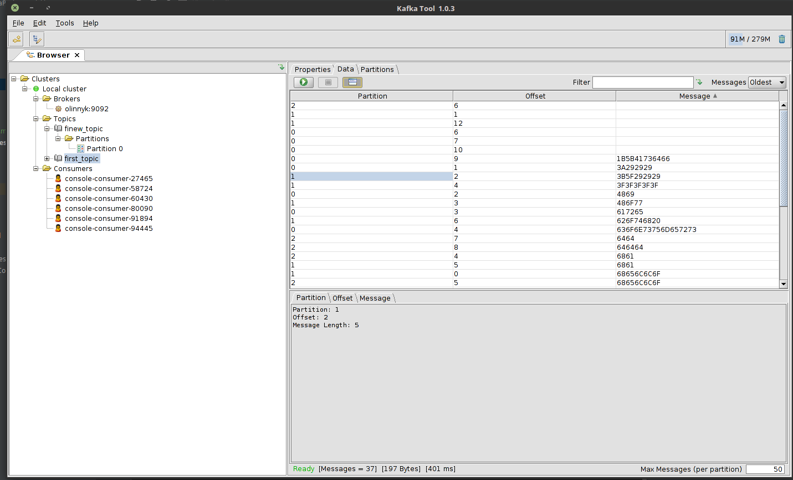
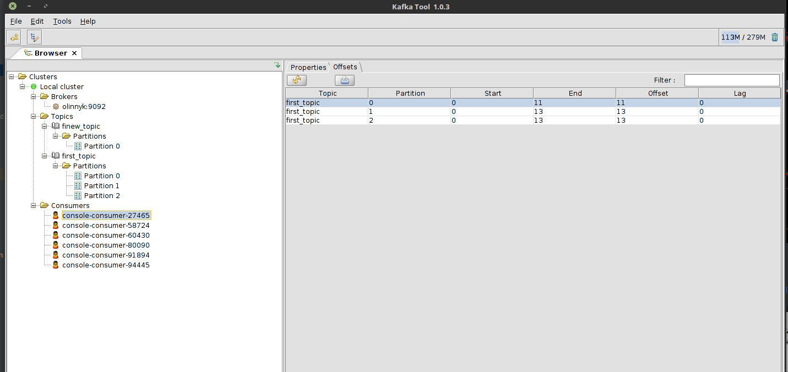
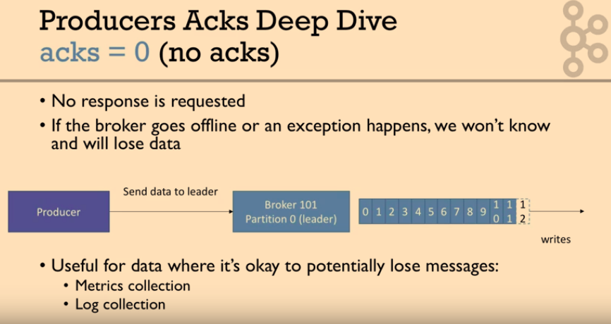

## Kafka 

### Setup


- Download Kafka
- Where Kafka is, create folder **data**
	- Inside folder **data** create folders **kafka** and **zookeeper**	
- Where Kafka is, update in folder **config**
	- For **zookeeper.properties** for `dataDir` specify where is **zookeeper** folder from **data** folder is
		- Example: `dataDir=/home/olinnyk/files/kafka/kafka_2.11-0.9.0.1/data/zookeeper`
	- For **server.properties** for `log.dirs` specify where is **kafka** folder from **data** folder is
		- Example: `log.dirs=/home/olinnyk/files/kafka/kafka_2.11-0.9.0.1/data/kafka`
- Add to `.bashrc`
	- `export PATH=/home/olinnyk/files/kafka/kafka_2.11-0.9.0.1/bin:$PATH`

### Start zookeeper

From folder where is Kafka run:

`zookeeper-server-start.sh config/zookeeper.properties`

 
### Start kafka

From folder where is Kafka run:

 `kafka-server-start.sh config/server.properties`
 
### Create topic

 

 

 

 

- Replication means you have a copy of data 
- Leader and ISR are determining by **zookeeper**

From folder where is Kafka run:

`kafka-topics.sh --zookeeper 127.0.0.1:2181 --topic first_topic --create --partitions 3 --replication-factor 1`

`kafka-topics.sh --zookeeper 127.0.0.1:2181 --create --topic twitter_tweets --partitions 6 --replication-factor 1`

Information:

Created topic "first_topic".

### Check topics

`kafka-topics.sh --zookeeper 127.0.0.1:2181 --list`

Information:

first_topic

### Check information about topic

`kafka-topics.sh --zookeeper 127.0.0.1:2181 --topic first_topic --describe`

Information:

```
Topic:first_topic	PartitionCount:3	ReplicationFactor:1	Configs:
Topic:first_topic	Partition: 0	   Leader: 0	Replicas: 0	Isr: 0
Topic:first_topic	Partition: 1	   Leader: 0	Replicas: 0	Isr: 0
Topic:first_topic	Partition: 2	   Leader: 0	Replicas: 0	Isr: 0
```

### Delete topic

From folder where is Kafka run:

`kafka-topics.sh --zookeeper 127.0.0.1:2181 --topic second_topic --delete`

Information:

Topic second_topic is marked for deletion
Note: This will have no impact if delete.topic.enable is not set to true.

### Produce messages

From folder where is Kafka run:

```
kafka-console-producer.sh --broker-list 127.0.0.1:9092 --topic first_topic

hello
oleh
linnyk
:)))
```

### Produce messages with acknowledge

From folder where is Kafka run:

```
kafka-console-producer.sh --broker-list 127.0.0.1:9092 --topic first_topic --producer-propty acks=all

some messgae this is acked
;_)))
```

### Consume messages 

From folder where is Kafka run:

`kafka-console-consumer.sh --bootstrap-server 127.0.0.1:9092 --topic kafka_topic`



### Consume messages from beginning

From folder where is Kafka run:

`kafka-console-consumer.sh --bootstrap-server 127.0.0.1:9092 --topic kafka_topic --from-beginning`

### Consume messages for group of consumers

From folder where is Kafka run:

`kafka-console-consumer.sh --bootstrap-server 127.0.0.1:9092 --topic kafka_topic --topic first_topic`




### Kafka Tools UI

[www.kafkatool.com/download.html](http://www.kafkatool.com/download.html)





### acks

 
 
  

  

 
 
  

