## Microservices

### Monolith architecture

	

	

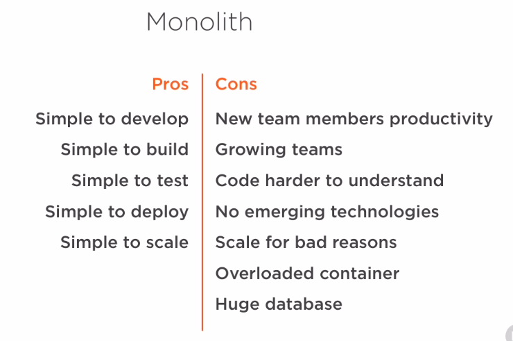	

### Microservices architecture

	

### Services

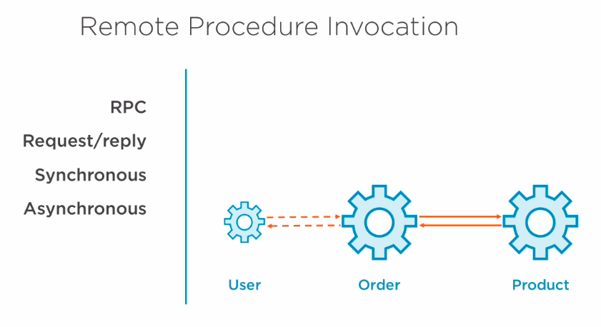

	
### Distributed services

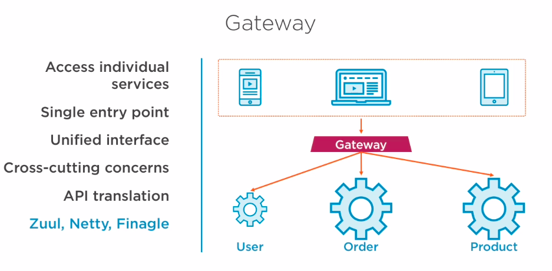

### Security

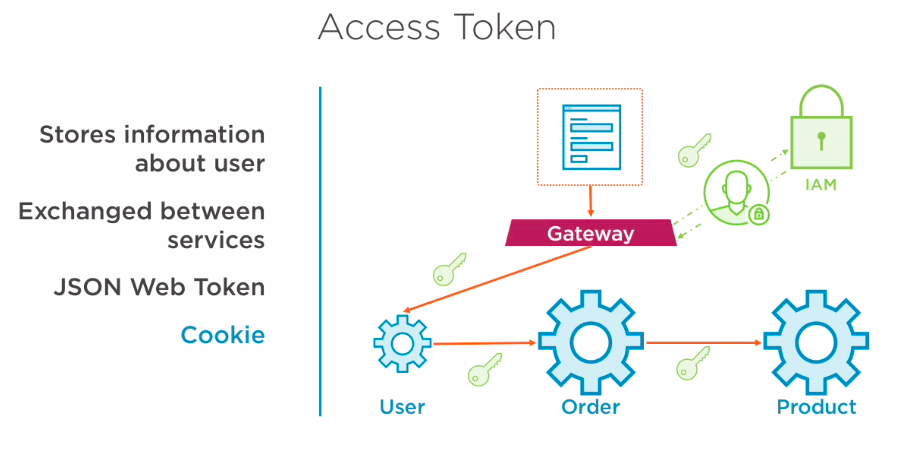

### Scalability and Availability

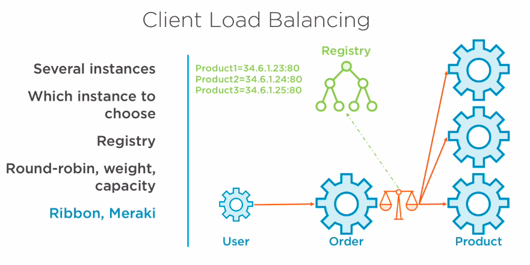

### Monitoring

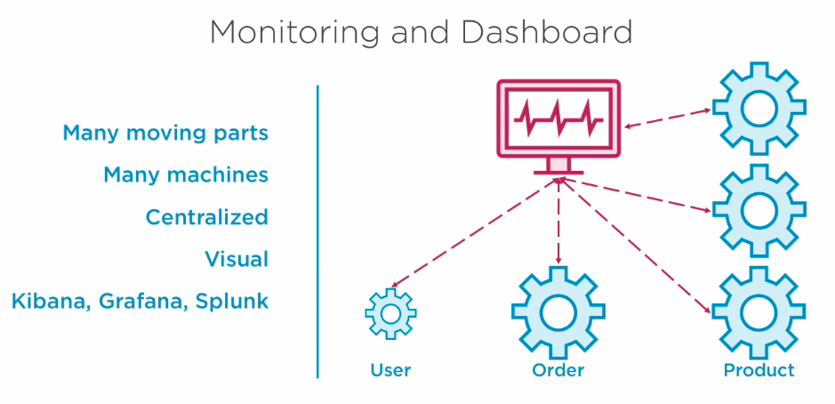

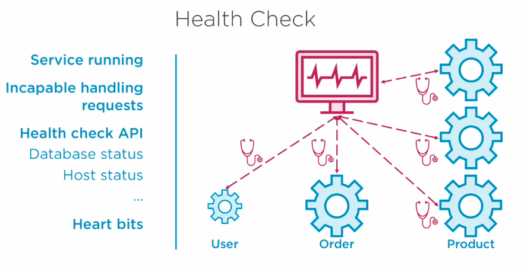

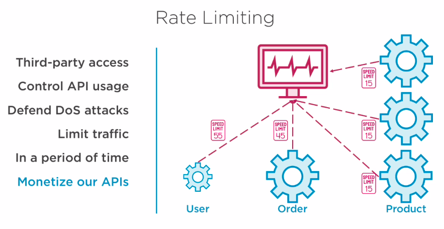

### Deployment

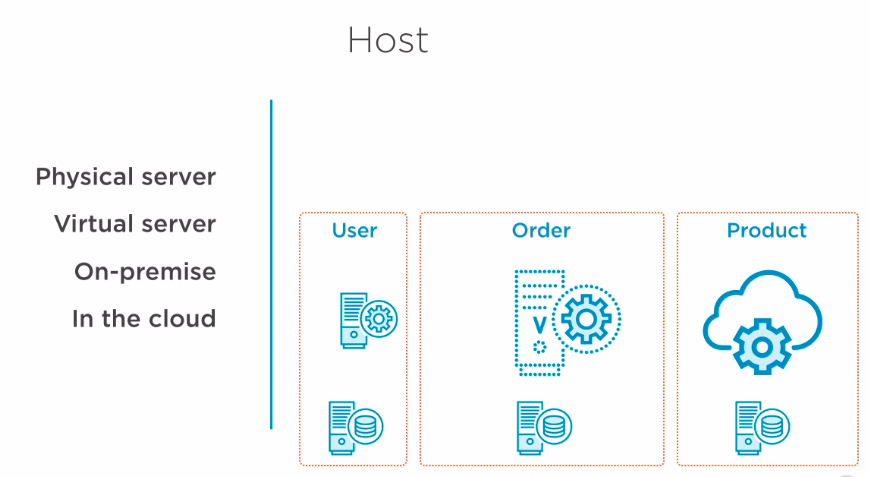

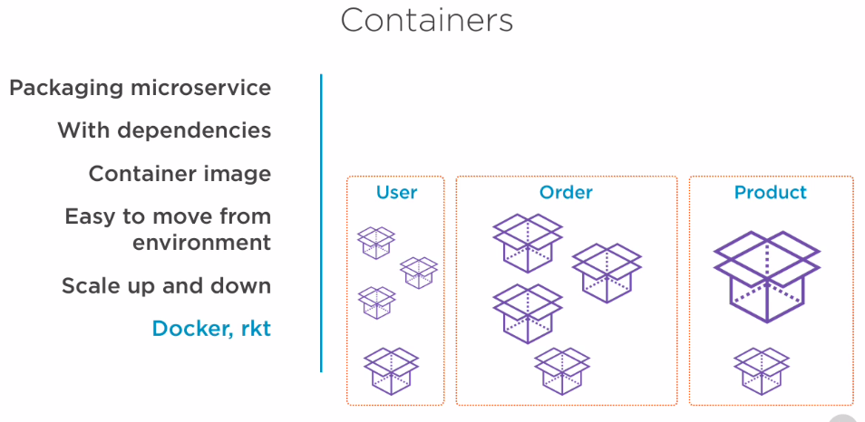

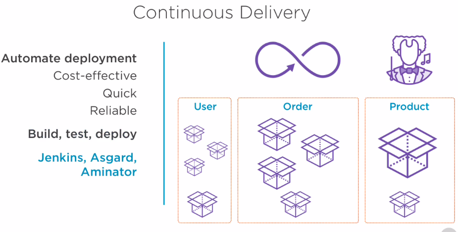

