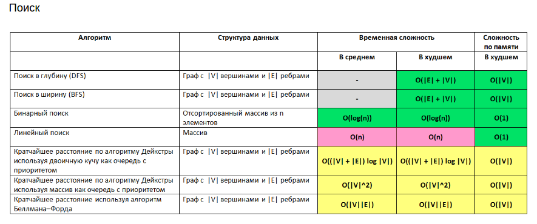
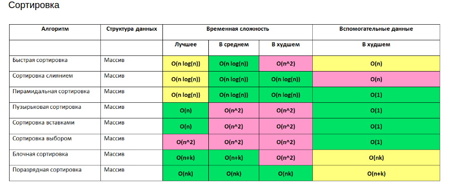
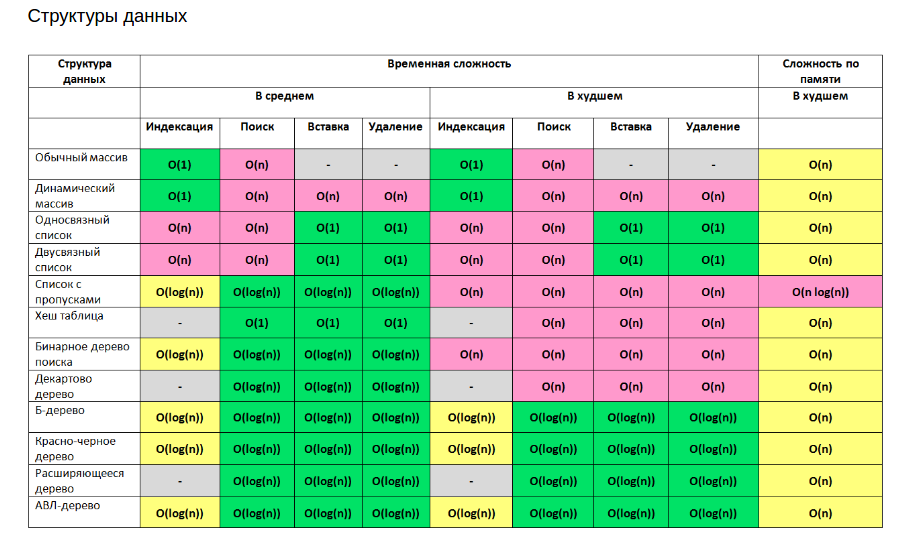
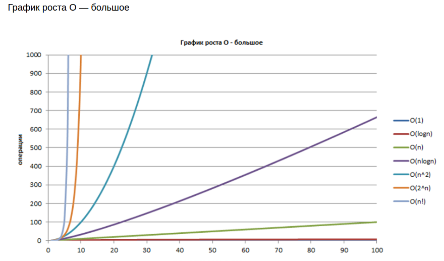

| <H3> Data structures                                                                             | <H3> Algorithms                                                                                  |<H3> Patterns                       			                  			                              | <H3> SOLID                                                                                 | <h3> AWS                             	     |
|--------------------------------------------------------------------------------------------------|--------------------------------------------------------------------------------------------------|-------------------------------------------------------------------------------------------------------|--------------------------------------------------------------------------------------------|---------------------------------------------|
| [Arrays](Lafore/src/main/resources/data_structures/arrays/arrays.md)                             | [Bubble sort](Lafore/src/main/resources/algorithms/bubble_sort/bubble_sort.md)                   |	[Creational](Patterns/src/main/java/com/linnik/wickiup/patterns/_1_creational/creational_patterns.md) |  [Single Responsibility Principle](Solid/src/main/resources/solid/single_responsibility.md)| [Intro](AWS/src/main/java/aws/intro.md) 	 |
| [Linked lists](Lafore/src/main/resources/data_structures/linked_lists/linked_lists.md)           | [Selection sort](Lafore/src/main/resources/algorithms/selection_sort/selection_sort.md)          |	[Structural](Patterns/src/main/java/com/linnik/wickiup/patterns/_2_structural/structural_patterns.md) |  [Open Closed Principle](Solid/src/main/resources/solid/open_close.md)                     | [IAM](AWS/src/main/java/aws/IAM/IAM.md)     | 
| [Hash tables](Lafore/src/main/resources/data_structures/hash_tables/hash_tables.md)              | [Insertion sort](Lafore/src/main/resources/algorithms/insertion_sort/insertion_sort.md)          | [Behavioral](Patterns/src/main/java/com/linnik/wickiup/patterns/_3_behavioral/behavioral_patterns.md) |  [Liskov’s Substitution Principle](Solid/src/main/resources/solid/liskov_substitution.md)  | [EC2](AWS/src/main/java/aws/EC2/ec2_map.md) |
| [Binary trees](Lafore/src/main/resources/data_structures/binary_trees/binary_trees.md)           |                                                                                                  |	                                   			                  			                              |  [Interface Segregation Principle](Solid/src/main/resources/solid/interface_segregation.md)| [S3](AWS/src/main/java/aws/S3/S-3.md)
| [Red black trees](Lafore/rc/main/resources/data_structures/red_black_trees/red_black_trees.md)   |                                                                                                  |                                    			                   			                              |  [Dependency Inversion Principle](Solid/src/main/resources/solid/dependency_inversion.md)  |
| [Stack](Lafore/src/main/resources/data_structures/stack/stack.md)                                |                                                                                                  |                                    			                  			                              |                                                                                            |

 

### Algorithms complexity

 
 
 
 
 
 
 > In order to run benchmarking
 
 > mvn clean install -DskipTests
 > java -jar target/benchmarks.jar
