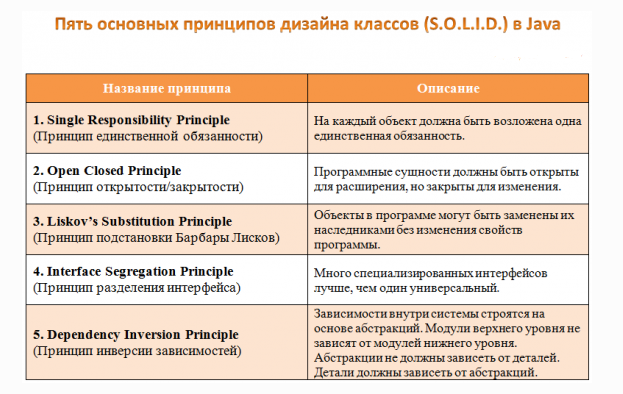

[Main Information](src/main/resources/main_info.md)

| <H3> Data Structures                                                                             | <H3> Algorithms                                                                                  |<H3> Patterns      | <H3> SOLID                                                                           |
|--------------------------------------------------------------------------------------------------|--------------------------------------------------------------------------------------------------|-------------------|--------------------------------------------------------------------------------------|
| [Arrays](src/main/resources/data_structures/arrays/arrays.md)                                    | [Bubble sort](src/main/resources/algorithms/bubble_sort/bubble_sort.md)                          |  Singleton        |  [Single Responsibility Principle](src/main/resources/solid/single_responsibility.md)|
| [Linked lists](src/main/resources/data_structures/linked_lists/linked_lists.md)                  | [Selection sort](src/main/resources/algorithms/selection_sort/selection_sort.md)                 |  Abstract Factory |  [Open Closed Principle](src/main/resources/solid/open_close.md)                     |
| [Hash tables](src/main/resources/data_structures/hash_tables/hash_tables.md)                     | [Insertion sort](src/main/resources/algorithms/insertion_sort/insertion_sort.md)                 |  Template method  |  [Liskov’s Substitution Principle](src/main/resources/solid/liskov_substitution.md)  |
| [Binary trees](src/main/resources/data_structures/binary_trees/binary_trees.md)                  |                                                                                                  |  Proxy            |  Interface Segregation Principle       												 |
| [Red black trees](src/main/resources/data_structures/red_black_trees/red_black_trees.md)         |                                                                                                  |  Strategy         |  Dependency Inversion Principle       												 |

 

### Algorithms complexity

 
 
 
 
 
 
 
