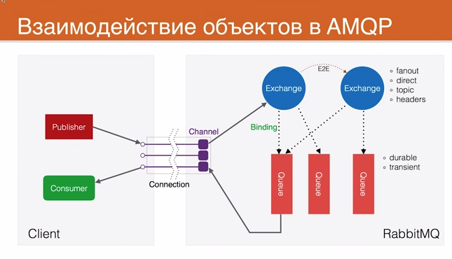
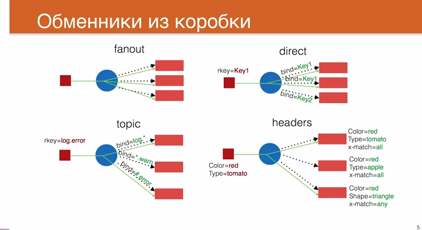

Hello World (python) - https://habrahabr.ru/post/149694/
Очередь задач (python) - https://habrahabr.ru/post/150134/
Публикация/Подписка (php) - https://habrahabr.ru/post/200870/
Роутинг (php) - https://habrahabr.ru/post/201096/
Тематики (php) - https://habrahabr.ru/post/201178/
Удаленный вызов процедур (python) - https://habrahabr.ru/post/236221/

https://www.slideshare.net/somic/introduction-to-amqp-messaging-with-rabbitmq
https://github.com/rabbitmq/rabbitmq-tutorials/tree/master/java
http://tryrabbitmq.com/

Why messaging system?
	- Loosely coupled
	- Non blocking
	- Guaranteed delivery
	- Scalable
	- Clustered

Messaging Systems
	- ActiveMQ - apache
	- RabbitMQ - pivotal
	- HornetQ - jboss
	- SQS - amazon
	- Kafka - apache
	- IBM Websphere MQ - ibm

AMQP - Advanced Messaging Queueing Protocol
	- Open standard application layer protocol for message-oriented middleware
	- Enables client application to communicate with broker
	- Publisher, consumer and broker all can reside on separate machine
	- Specify message format to allow interoperability between amqp providers
	- JMS is a Java API specification vs AMQP is wire-level protocol specification
	- AMQP vs HTTP

AMQP Model - Overview
												*----------*
												|  Broker  |
								*---------------*----------*--------------*
								|										  |
		*---------*	  Publish   |   *----------*   Routes   *-------*     |  Consumes  *----------*
		|Publisher|---------------->| Exchange |----------->| Queue |----------------->| Consumer |
		*---------*			    |   *----------*			*-------*     |            *----------*
								|									      |
								*-----------------------------------------*

AMQP Model - Explained
	- AMQP -Programmable protocol
	- Exchange
	- Queue - buffer
	- Bindings (https://habrahabr.ru/post/200870/)
	- Publisher - client pushing message
	- Consumer - consume message
	- Acknowledgements
	- Connection & Channels
	- Virtual hosts
	- DLX

RabbitMQ
	- Open source message Broker (Message-Oriented Middleware) implements AMQP
	- Written in Erlang
	- Provides client library for interactions with RabbitMW Server
	- Runs om major OS
	- Supports various messaging patterns
	- start rabbitmq-server - sudo service rabbitmq-server start on http://localhost:15672
	- stop rabbitmq-server - sudo service rabbitmq-server stop
	
	

	   

 - Channel - канал 
        - deliveryTag - тэг от получателя
 		- requeue - в случае если не запроцесилось сообщение, переотправляет в ту же очередь
 - Queue - fifo очередь, к которой могут подключаться consumers и забирать из нее сообщения.
 		- durable - информация будет записана на диск и будет востановлена, после рестарта сервера
 		- transient - временная информация, которая храниться только в оперативной памяти
 - Exchange - маршрутизатор сообщений, который не хранит, а сразу доставляет сообщения по очередям.
       - fanout - самый быстрый, достаточно начилие связи, сообщения попадает во все очереди
       - direct - при создании связи используется строкой ключ, который нужен для поиска очереди, в которую отправится сообщение
       - topic - ключ рассматривается как наор токенов, разделенных точкой.
       		- * - любое значение  - (log.*)
       		- # - любые токены - (#.error)
       - header - не смотрят на ключ маршрутизации, а используют заголовки
       		- x-match - (all = && и any = ||)
 - Binding - привязка между Queue и Exchange, для того, чтобы Exchange понимала в какие Queue отправлять сообщения
	
