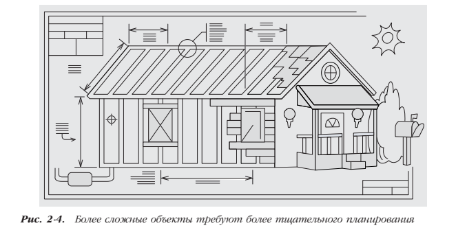

Стив Макконнелл "Совершенный код"

Глава 2.

 - Конструирование — главный этап разработки ПО, без которого не обходится ни один проект.

 - Основные этапы конструирования: детальное проектирование, кодирование,
   отладка, интеграция и тестирование приложения разработчиками (блочное тестирование и интеграционное тестирование).
 
 - Чтобы не тратить время на исправление ошибок, которых можно избежать, вы должны как можно лучше выполнить проектирование 
   Материалы, необходимые для создания программного продукта, стоят дешевле, чем стройматериалы, однако затраты на рабочую силу в обоих случаях примерно одинаковы. Изменение формата отчета
   обходится ничуть не дешевле, чем перемещение стены дома, потому что главным компонентом затрат в обоих случаях является время людей. 
 
 
 
 - Какие еще параллели можно провести между сооружением дома и разработкой ПО? При возведении дома никто не пытается конструировать вещи, которые можно
   купить. Здравомыслящему человеку и в голову не придет самостоятельно разрабатывать и создавать стиральную машину, холодильник, шкафы, окна и двери, если
   все это можно приобрести. Создавая программную систему, вы поступите так же. Вы будете в полной мере использовать возможности высокоуровневого языка
   вместо того, чтобы писать собственный код на уровне ОС. Возможно, вы используете также встроенные библиотеки классов контейнеров, научные функции, классы пользовательского интерфейса и классы для работы с БД. Обычно невыгодно
   писать компоненты, которые можно купить готовыми.
   
 - Хорошо спланированный проект открывает больше возможностей для
   изменения решения на более поздних этапах работы. Чем лучше вам известен тип создаваемого ПО, тем больше деталей вы можете принимать как данное. 
   
Глава 3.
   
   