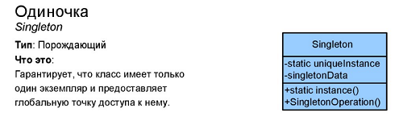
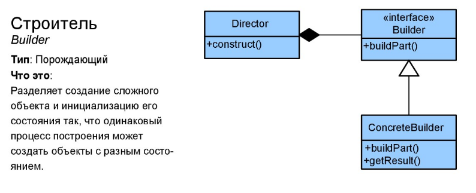
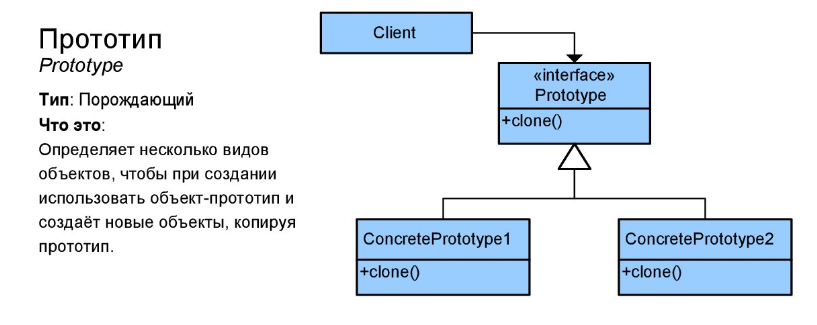
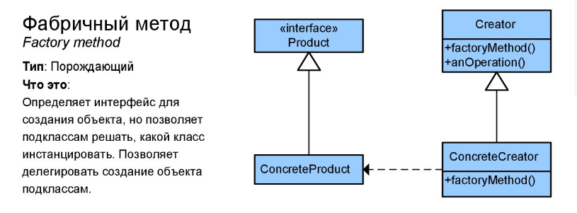
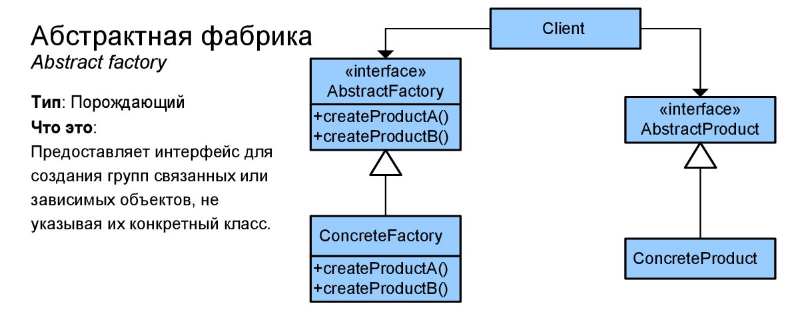

***Паттерны которые создают новые объекты, или позволяют получить доступ к уже существующим. 
То есть те шаблоны, по которым можно создать новый автомобиль и как это лучше сделать.***

### 1. Singleton (одиночка)

#### Concept:
 - Guarantees only one instance is going to be created. 
 - Guarantees the control of a resource. Since this is a creational pattern,
 the instantiation of it all controlled through the implementation of the pattern.
 - Lazily loaded.
 
#### Design: 
 - Class is responsible for lifecycle.
 - Static in nature.
 - Need to be thread safe.
 - Private instance.
 - Private constructor.
 - No parameters required for construction.
   There are no parameters, and if you require parameters that is typically a factory pattern and violates the rules of a singleton.
 
#### Pitfalls:
 - Often overused, once people discover the power and simplicity of this
   pattern, they have the tendency to make everything a singleton
   when it doesn't necessarily need to be.
 - Performance problem , if you make everything a singleton, it will slow your application down.
 - Since singletons don't expose an interface and have private constructors, as well as private member.
   variables, they can often be difficult to unit test.
 - If not careful, not thread-safe.
 
#### Metaphor
Один из самых известных и, пожалуй, самых спорных паттернов.
Представьте, что в городе требуется организовать связь между жителями. С одной стороны мы можем связать всех жителей между собой протянув между ними кабели телефонных линий, но полагаю вы понимаете насколько такая система неверна. 
Например, как затратно будет добавить еще одного жителя в связи (протянуть по еще одной линии к каждому жителю). Чтобы этого избежать, мы создаем телефонную станцию, которая и будет нашим «одиночкой». 
Она одна, всегда, и если кому-то потребуется связаться с кем-то, то он может это сделать через данную телефонную станцию, потому что все обращаются только к ней. Соответственно для добавления нового жителя нужно будет изменить только записи на самой телефонной станции. 
Один раз создав телефонную станцию все могут пользоваться ей и только ей одной, в свою очередь эта станция помнит всё что с ней происходило с момента ее создания и каждый может воспользоваться этой информацией, даже если он только приехал в город.
Основной смысл «одиночки» в том, чтобы когда вы говорите «Мне нужна телефонная станция», вам бы говорили «Она уже построена там-то», а не «Давай ее сделаем заново». «Одиночка» всегда один.
 
[example](_1_singleton)  

### 2. Builder (строитель)

#### Concept:
  - A lots of of arguments.
  - Large number of parameters.
  - Immutability.
  
#### Design: 
  - Flexibility over telescoping constructors.
  - Static inner class.
  - Calls appropriate constructors.
  - Negate the need for exposed setters.
  - Since java 1.5 can take advantage pf generics.
  
#### Pitfalls:
  - Immutable.
  - Inner static class.
  - Designed first.
  - Complexity.
  
#### Metaphor
Данный паттерн очень тесно переплетается с паттерном «фабрики». Основное различие заключается в том, что «строитель» внутри себя, как правило, содержит все сложные операции по созданию объекта (пакета сока). Вы говорите «хочу сока», а строитель запускает уже целую цепочку различных операций (создание пакета, печать на нем изображений, заправка в него сока, учет того сколько пакетов было создано и т.п.). 
Если вам потребуется другой сок, например ананасовый, вы точно также говорите только то, что вам нужно, а «строитель» уже позаботится обо всем остальном (какие-то процессы повторит, какие-то сделает заново и т.п.). В свою очередь процессы в «строителе» можно легко менять (например изменить рисунок на упаковке), 
однако потребителю сока этого знать не требуется, он также будет легко получать требуемый ему пакет сока по тому же запросу.

[example](_2_builder)  

### 3. Prototype (прототип)

#### Concept:
  - Avoid costly creation.
  - Avoid subclassing.
  - Typically doesn't use 'new'.
  - Often utilizes an Interface.
  - Usually implemented with a Registry. The original object is created and then kept in out registry
    When another object is needed, we create clone from the registry
  
#### Design: 
  - Implements the clone/cloneable interface.
  - Avoids keyword 'new'.
  - Although a copy, each instance is unique.
  - Costly construction not handled by clients.
  - Shallow VS Deep Copy. A shallow copy just copies the immediate properties, whereas a deep copy will copy any of its object references as well.

#### Pitfalls:
  - Sometimes not clear when to use.
  - Used with another patterns.
  - Shallow VS Deep Copy.
  
#### Metaphor
Данный паттерн чем-то напоминает «фабрику», он также служит для создания объектов, однако с немного другим подходом. 
Представьте что у вас есть пустой пакет (из под сока), а вам нужен полный с апельсиновым соком. Вы «говорите» пакету «Хочу пакет апельсинового сока», он в свою очередь создает свою копию и заполняет ее соком, который вы попросили. 
Немного «сказочный пример», но в программировании часто так и бывает. В данном случае пустой пакет и является «прототипом», и в зависимости от того что вам требуется, он создает на своей основе требуемые вами объекты (пакеты сока).
Клонирование не обязательно должно производится на самом «пакете», это может быть и какой-то другой «объект», главное лишь что данный «прототип» позволяет получать его экземпляры.

[example](_3_prototype)  

### 4. Factory method (фабричный метод)

#### Concept:
  - Doesn't expose instantiation logic.
  - It is able to do this by deferring the instantiation or creation logic to the subclass.
  - Common interface that is known by all clients.

#### Design: 
  - Factory is responsible for lifecycle, at least the creation part of lifecycle.
  - Common interface.
  - Parameterized create method.
  
#### Pitfalls:  
  - Complexity.
  - Creation in subclass.
  - Refactoring.

#### Metaphor
Ключевой сложностью объяснения данного паттерна является то, что это «метод», поэтому метафора метода будет использовано как действие, то есть например слово «Хочу!». Соответственно, паттерн описывает то, как должно выполнятся это «Хочу!».
Допустим ваша фабрика производит пакеты с разными соками. Теоретически мы можем на каждый вид сока делать свою производственную линию, но это не эффективно. Удобнее сделать одну линию по производству пакетов-основ, 
а разделение ввести только на этапе заливки сока, который мы можем определять просто по названию сока. Однако откуда взять название?
Для этого мы создаем основной отдел по производству пакетов-основ и предупреждаем все под-отделы, что они должны производить нужный пакет с соком про простому «Хочу!» (т.е. каждый под-отдел должен реализовать паттерн «фабричный метод»). 
Поэтому каждый под-отдел заведует только своим типом сока и реагирует на слово «Хочу!».
Таким образом если нам потребуется пакет апельсинового сока, то мы просто скажем отделу по производству апельсинового сока «Хочу!», а он в свою очередь скажет основному отделу по созданию пакетов сока, 
«Сделай ка свой обычный пакет и вот сок, который туда нужно залить».  
	
[example](_4_factory_method)  

### 5. Abstract factory (Абстрактная фабрика)

#### Concept:
  - Factory of Factories.
  - Factory of related objects.
  - Common interface.
  - Defer to subclasses.
  
#### Design: 
  - Groups Factories together.
  - Factory is responsible for lifecycle.
  - Common interface.
  - Concrete Classes.
  - Parameterized create method.
  - Composition !
  
#### Pitfalls:  
  - Complexity.
  - Runtime switch
  - Pattern within a pattern.
  - Starts as a Factory.
  
#### Metaphor
Суть паттерна практически полностью описывается его названием. Когда вам требуется получать какие-то объекты, например пакеты сока,
вам нужно, сначало выбрать фабрику по производству сока, и получив фабрика,
сказать ей какой сок сделать, апельсиновый или яблочный и фабрика начнет производить конечный продукт.
Но если вдруг вам нужно производить шины, нужно выбрать другую фабрику по производству 
шин и сделать определенную шину, с определенными параметрами.

[example](_5_abstract_factory)  

