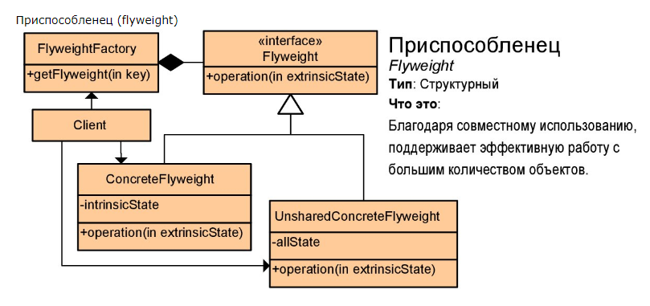

***Данные паттерны помогают внести порядок и научить разные объекты более правильно взаимодействовать друг с другом.***

### 1. Adapter или wrapper (адаптер, обертка)

> The adapter pattern is a great pattern for connecting new code to legacy code without 
> having to change the working contract that was produced from the legacy code originally.
> Works after code is designed

#### Concept:
 - Convert interface into another interface.
 - Usually when one portion of our system is a legacy app or module that we don't want to, or can't possibly change.
 - Translating requests from the client the code we are adapting to, a client to talking to a legacy app or an adapting to 
 - Client, Adapter, Adaptee
 - Examples:
 	 - Arrays -> Lists
 	 - Streams
 	 
#### Design:
 - Client centric
 - Integrate new with old
 - Interface
 - Adaptee cen be the implementation
 
#### Pitfalls:
 - Not a lot
 - Don't complicate
 - Multiple Adapters
 - Don't add functionality, if you are adding functionality to your legacy code, 
   then you should probably be considering the `decorator` or some other type of structural pattern!
 
#### Metaphor 
Данный паттерн полностью соответствует своему названию. Чтобы заставить работать «советскую» вилку через евро-розетку требуется переходник. 
Именно это и делает «адаптер», служит промежуточным объектом между двумя другими, которые не могут работать напрямую друг с другом.
 
[example](_1_adapter/)  

### 2. Bridge (мост)

> Основное отличие от адаптера, то что, адаптер работает с legacy кодом, а мост с новым кодом.
> Designed upfront, in advance

#### Concept:
 - Decoupling abstraction and implementation
 - Changes in abstraction won't affect client
 
#### Design:
 - Interfaces and abstract classes
 - Composition over Inheritance
 - Expect change from both side
 - Abstraction, Implementor, Refined abstraction, Concrete implementor
 
#### Pitfalls:
 - Increases complexity
 - Conceptually difficult to plan
 - What goes where is your code
 
#### Metaphor  
 Представим ситуацию, когда вам требуется работать на разных автомобилях, однако садясь в новый автомобиль вам уже желательно знать как им управлять. 
 Таким образом вы сталкиваетесь с паттерном «мост». С одной стороны вы имеете множество различных автомобилей (разные модели и марки), 
 но среди все них есть общая абстракция (интерфейс) ввиде руля, педалей, коробки передач и так далее. 
 Таким образом мы задаем как-бы правила изготовления автомобилей по которым мы можем создавать любые их виды, 
 но за счет сохранения общих правил взаимодействия с ними, мы можем одинаково управлять каждым из них. 
 «Мостом» в данном случае является пара двух «объектов»: конкретного автомобиля и правил взаимодействия с этим (и любым другим) автомобилем.
 
### 3. Composite (компоновщик)

> Composite != Composition.
> The composite pattern is dealing with that hierarchical structure where composition is 
> just one object containing another.

#### Concept:
 - Components represent part or whole structure
 - Compose object into tree structures
 - Same operations applied on individual and composites

#### Design:
 - Tree structured !!!
 - Root is a component
 - Leaf or Composite, same operations
 - Composite knows about child objects
 - Component, Leaf, Composite
 
#### Pitfalls:
 - Can overly simplify system
 - Difficult to restrict
 - Implementation can possible be costly

#### Metaphor 
Довольно интересный паттерн суть которого заключается в минимизации различий в управлении как группами объектов так и индивидуальными объектами. 
Для примера можно рассмотреть управление солдатами в строю. Существует строевой устав, который определяет как управлять строем и согласно этого устава 
абсолютно не важно кому отдается приказ (например «шагом марш») одному солдату или целому взводу. 
Соответственно в устав (если его в чистом виде считать паттерном «компоновщик») нельзя включить команду, которую может исполнить только один солдат, но не может исполнить группа, или наоборот.

### 4. Decorator (декоратор)

#### Concept:
 - Also called a wrapper
 - Add behavior without affecting others
 - More that just inheritance
 - Single responsibility principle
 - Compose behavior dynamically
 - Contains another entity
 - Modifies behaviour
 
#### Design:
 - Inheritance based
 - Utilizes composition and inheritance
 - Constructor requires instance from hierarchy
 
#### Pitfalls:
 - New class for every feature added
 - Multiple little objects
 - Often confused with simple inheritance
 
#### Metaphor 
Как понятно из названия, данный паттерн чаще всего используется для расширения исходного объекта до требуемого вида.
Например мы условно можем считать «декоратором» человека с кистью и красной краской. 
Таким образом, какой бы объект (или определенный тип объектов) мы не передали в руки «декоратору», на выходе мы будем получать красные объекты.

### 5. Facade (фасад)

#### Concept:
 - Make an API easier to use
 - Reduce dependencies on outside code
 - Simplify the interface or client usage
 - Usually a refactoring pattern
 - Examples:
    - java.net.URL
 
#### Design:
  - Class that utilizes composition
  - Shouldn't have a need for inheritance
  - Cleaner API
  
#### Pitfalls:
  - Typically used to clea up code
  - Should think about API desing
  - Flat problem/structure
  - The "Singleton" of Structural Pattern
  
#### Metaphor 
Паттерн «фасад» используется для того, чтобы делать сложные вещи простыми. Возьмем для примера автомобиль. 
Представьте, если бы управление автомобилем происходило немного по-другому: нажать одну кнопку чтобы подать питание с аккумулятора, 
другую чтобы подать питание на инжектор, третью чтобы включить генератор, четвертую чтобы зажечь ламочку на панели и так далее. 
Всё это было бы очень сложно. Для этого такие сложные наборы действий заменяются более простыми и комплексные как «повернуть ключ зажигания». 
В данном случае поворот ключа зажигания и будет тем самым «фасадом» для всего обилия внутренних действий автомобиля.
  
### 6. Flyweight (приспособленец)

 
 
#### Concept:
 - More efficient use of memory
 - Large number of similar objects
 - Immutable
 - Examples:
    - java.lang.String
    - java.lang.Integer#valueOf(int)
 
#### Design:
 - Pattern of patterns
 - Utilize a Factory
 - Creational pattern inside Structural pattern
 - Client, Factory, Flyweight, ConcreteFlyweight

#### Pitfalls:
 - Complex pattern
 - Premature optimization
 - Must understand Factory
 
#### Metaphor 
 Самым лучшим примером (который я смог найти в реальной жизни) для метафорического сравнения паттерна «приспособленец» является театральная постановка. 
 Представьте что нам требуется поставить пьесу. Однако по сценарию в этой пьесе задействованы несколько десятков людей, 
 которые по своей сути выполняют одинаковые действия, например участвуют в массовках различных сцен в разные промежутки времени, 
 но между ними всё же есть какие-то различия (например костюмы). 
 Нам бы стоило огромных денег нанимать для каждой роли отдельного актера, поэтому мы используем паттерн «приспособленец». 
 Мы создадим все нужные нам костюмы, но для каждой массовки будем переодевать небольшую группу актеров в требуемые для этой сцены костюмы. 
 В результате мы имеем возможность ценой малых ресурсов создавать видимость управления большим количеством казалось бы разных объектов.
 
 ### 7. Proxy (прокси)
 
  
 
#### Concept:
 - Interface to something else
 - Interface by wrapping
 - Can add more functionality to wrapper
 - Proxy called to access real object
 - Examples:
 	- java.lang.reflect.Proxy
 	- java.rmi.*
 	
#### Design:
 - Intermediate object intercepts calls
 - Interface and Implementation class
 - Client, Interface, InvocationHandler, Proxy, Implementation

#### Pitfalls:
 - Only one proxy
 - Added another abstraction
 - Similar to another patterns

#### Metaphor 
Данный паттерн позволяет создавать какие-либо специальные механизмы доступа к объекту, что чаще всего направлено именно на улучшение производительности отдельных частей программы. 
В реальной жизни можно привести следующий пример: сотрудникам одного из подразделений фирмы регулярно требуется получать информацию о том, какого числа бухгалтерия планирует выплатить зарплату. 
С одной стороны каждый из них может индивидуально и регулярно ездить в бухгалтерию для выяснения этого вопроса (полагаю такая ситуация нередко встречается во многих организациях). 
С другой стороны, при приближении планируемой даты подразделение может выбрать одного человека, который будет выяснять эту информацию у бухгалтерии, 
а в последствии уже все в подразделении могут выяснить эту информацию у него (что значительно быстрее). Вот именно этот человек и будет реализованным «прокси» паттерном, 
который будет предоставлять специальный механизм доступа к информации из бухгалтерии.