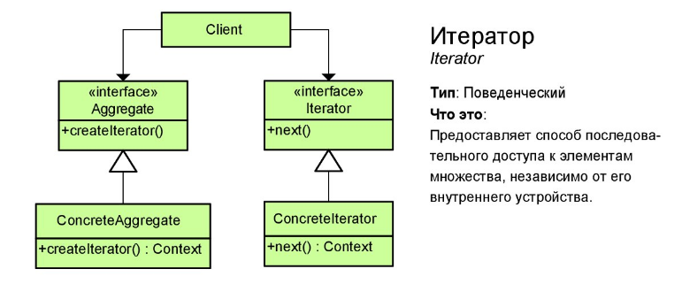
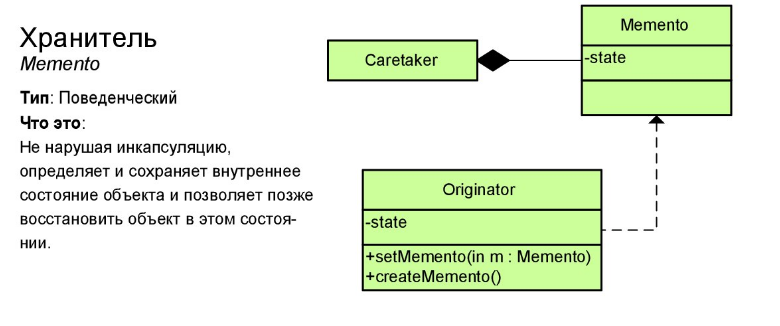
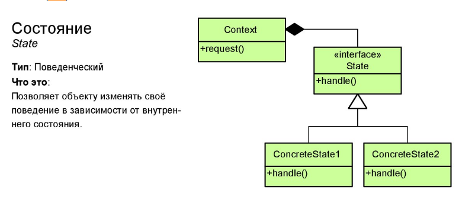

**Эта группа паттернов позволяет структурировать подходы к обработке поведения и взаимодействия объектов. 
  Проще говоря, как должны проходить процессы в которых существует несколько вариантов протекания событий.**
  
### 1. Chain of Responsibility  (цепочка обязанностей)  

#### Concept:
 - Decoupling of sender and receiver
 - Receiver contains reference to next receiver
 - Promotes loose coupling
 - No handler - OK
 - Examples:
 	- java.util.logging.Logger#log()
 	- javax.servlet.Filter#doFilter()
 	- Spring security filter chain
 	
#### Design:
 - Chain of receiver objects
 - Handler is interface based
 - ConcreteHandler for each implementation
 - Each handler has a reference to the next
 - Handler, ConcreteHandler

#### Pitfalls:
 - Handling.Handler guarantee
 - Runtime configuration risk
 - Chain length/performance issue

#### Metaphor 
 Самым простым примером цепочки обязанностей можно считать получение какого-либо официального документа. Например вам требуется получить справку со счета из банка. 
 Так или иначе, вы должны эту справку получить, однако кто именно ее должен вам дать — пока не ясно. 
 Вы приходите в местное отделение банка, вам говорят что «мы сейчас заняты, идите в другое отделение», дальше вы идете в другое, там вам отвечают «мы этим не занимаемся», 
 вы идете в региональное отделение и там получаете нужную справку. 
 Таким образом паттерн реализует «цепочку обязанностей» отдельные объекты которой (отделения банка) должны обработать ваш запрос. 
 Соответственно ваш запрос может быть обработан в первом же отделении, или же в нескольких, в зависимости от самого запроса и обрабатывающих объектов.
  
[example](_1_chain_of_resposibility/)  

### 2. Command (команда)  

#### Concept:
 - Encapsulate request as an Object
 - Object-oriented callback
 - Decouple sender from processor
 - Often used to "undo" functionality
 - Examples:
 	- java.lang.Runnable

#### Design:
 - Object per command
 - Command interface
 - Execute method
 - 'Unexecute' method
 - Reflection
 - Command, Invoker, ConcreteCommand
 
#### Pitfalls:
 - Dependence of other patterns
 - Multiple Commands
 - Make use Memento
 - Prototype of copies
 
#### Metaphor 
Паттерн «команда» очень похож в реальной жизни на кнопки выключателей света в наших квартирах и домах. 
Каждый выключатель по своей сути делает одно простое действие — разъединяет или соединяет два провода, однако что стоит за этими проводами выключателю не известно. 
Что подключат, то и произойдет. Точно также действует и паттерн «команда». Он лишь определяет общие правила для объектов (устройств), 
в виде соединения двух проводов для выполнения команды, а что именно будет выполнено уже определяет само устройство (объект).
Таким образом мы можем включать одним типом выключателей как свет в комнате, так и пылесос.

[example](_2_command/)

### 3. Interpreter (переводчик) 

#### Concept:
 - Represent grammar
 - Interpret a sentence
 - Map a domain
 - Examples:
    - java.util.Pattern
    - java.text.Format
   
#### Design:
 - AbstractExpression
 - Interpret
 - TerminalExpression
 - NonterminalExpression 
   
#### Pitfalls:
 - Complexity
 - Class per rule 
 - Use of another patterns
 - Specific case
   
[example](_3_interpreter/)
   
#### Metaphor 
Сравнить данный паттерн можно с тем, как вы закладываете часто используемые действия в сокращенный набор слов, чтобы сам «интерпретатор» потом превратил этот набор в более комплексные осмысленные действия. 
По сути каждый человек постоянно является «интерпретатором». Хотите провести жизненный эксперимент? Если из дома выходит кто-то из вашей семьи (муж, жена, ребенок), скажите ему простой набор слов 
«Литр молока, половинку белого, 200 грамм творога». По сути вы ничего особенного не сказали, лишь перечислили набор продуктов, однако велик шанс того, что «интерпретатор» транслирует это в команду 
«зайди по дороге в продуктовый магазин и купи следующее … и принеси это домой». Паттерн «интерпретатор» призван сократить часто исполняемые действия в более короткое их описание.    

### 4. Iterator (Итератор) 

#### Concept:
 - Traverse a container
 - Doesn't expose underlying structure
 - Decouples algorithms
 - Sequential
 - Examples:
    - java.util.Iterator
    - java.util.Enumeration
    
#### Design:
 - Interface based
 - Factory method
 - Enumerators are fail safe
 
#### Pitfalls:
 - No access to index
 - Directional
 - Speed/Efficiency
 
#### Metaphor 
Все помнят школьное «на первый второй рассчитайся!»? Вот именно в этот момент шеренга вашего класса и являлась реализацией паттерна «итератор», хотя в программировании это конечно более функциональное понятие, но суть примерно та же. 
«Итератор» предоставляет правила доступа к списку каких-либо объектов независимо от того, что это за объекты. То есть не важно какой именно класс построен и из каких учеников, должны быть общие правила подсчета и обращения как каждому ученику по списку, 
вроде «13-ый, выйти из строя». Нередко паттерн «итератор» используется для доступа к «реестру». 
Ссылки, которые вы видите на многих сайтах для переходов по страницам, вроде «следующая», «предыдущая», «в начало» и т.п. по своей сути также являются доступом «итератору» который отвечает за страницы сайта.

[example](_4_iterator/)

### 5. Mediator (посредник) 

#### Concept:
 - Loose coupling
 - Well defined, but complex
 - Reusable components
 - Hub/Router
 - Examples:
    - java.util.Timer
    - java.lang.reflect.Method#invoke()
    
#### Design:
 - Interface based
 - Concrete class
 - Minimizes inheritance
 - Mediator knows about colleagues
 - Mediator, ConcreteMediator
 
#### Pitfalls:
 - Deity object
 - Limits subclassing
 - Over or with Command pattern
 
#### Metaphor 
Вспомним пример из паттерна «одиночка». Так вот телефонная станция в том примере по сути также являлась паттерном «посредник», 
то есть обеспечивала взаимодействие группы объектов без необходимости обеспечения связи каждого объекта друг с другом.
Однако дополнительной ответственность этого «паттерна» является также управление этой группой через «посредника». 
То есть если мы возьмем пример с армейским строем, то медиатором будет командир отделения, 
то есть нам нет необходимости взаимодействовать с каждым солдатом в отдельности, достаточно отдавать приказания лишь командиру отделения, 
а он уже сам решит какие действия должны быть выполнены внутри его отделения.
 
[example](_5_mediator/)

### 6. Memento (хранитель) 

#### Concept:
 - Restore object to previous state
 - Undo/Rollback
 - Examples:
 	- java.util.Date
 	- java.io.Serializable

#### Design:
 - Class based
 - Originator
 - Caretaker
 - Memento

#### Pitfalls:
 - Can be expensive
 - Deletes/history
 - Exposing information

#### Metaphor
Никогда не просили друга с сотовым телефоном на время запомнить (записать себе) тот номер, что диктуют вам по телефону, потому что вы не можете его запомнить сами (телефон занят)? 
В этот момент ваш друг реализовывал паттерн «хранитель». Он служит для тех случаев, когда какому-либо объекту требуется сохранить своё состояние (состояние знания номера) в другом объекте (вашем друге), 
и при необходимости его потом восстановить (спросить у друга номера и тем самым восстановить состояние когда вы его знали). 
Также уместен аналог с тем, как в играх работает сохранение. Файл «сейва» как раз и будет тем самым паттерном «хранитель».

[example](_6_memento/)

### 7. Observer (наблюдатель) 

#### Concept:
 - One to many
 - Decoupled
 - Event handled
 - Pub/sub
 - MVC
 - Examples:
   	- java.util.Observer
   	- java.util.EventListener

#### Design:
 - Subject
 - Observer
 - Observable
 - Views are Observers
 - Subject, Concrete subject, Observer, Concrete Observer

#### Pitfalls:
 - Unexpected updates
 - Large sized consequences
 - What changed
 - Debugging difficult

#### Metaphor
Очень распространенный паттерн в реальной жизни. Например если вы подписались на какую-либо email (или смс) рассылку, 
то ваш email (или номер сотового телефона) начинает реализовывать паттерн «наблюдатель». 
Как только вы подписываетесь на событие (например новая статья или сообщение), всем кто подписан на это событие (наблюдателям) будет выслано уведомление, 
а они уже в свою очередь могут выбрать как на это сообщение реагировать.

[example](_7_observer/)

### 8. State (состояние) 

#### Concept:
 - Localize state behavior
 - State Object
 - Separates What from Where
 - Open close principle

#### Design:
 - Abstract Class / Interface
 - Class based
 - Context unaware
 - Context, State, ConcreteState

#### Pitfalls:
 - Must know all your States
 - More classes
 - Keep logic out of Context
 - State change triggers

#### Metaphor
В реальной жизни каждый человек может прибывать в разных состояниях. Точно также порой требуется чтобы объекты в программе вели себя по разному в зависимости от каких-либо их внутренних состояний. 
По аналогии с реальной жизнью можно например привести следующий пример:
Если вы устали то на фразу «Сходи в магазин» вы будете выдавать «Не пойду», если вам нужно сходить в магазин (за пивом?), то на «Сходи в магазин» вы будете выдавать «Уже бегу!». 
Человек (объект) один и тот же, а поведение разное. Именно для этих целей и используют паттерн «состояние».

[example](_8_state/)