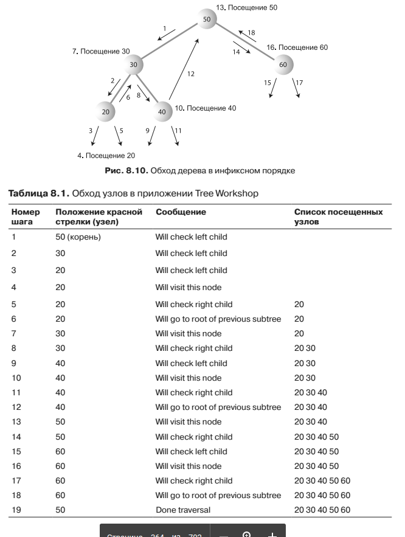
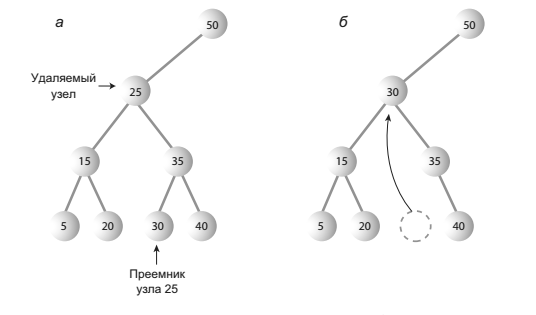

## Binary trees

 - How to run **Binary tree** applet:
 
   ```
   appletviewer http://cs.brynmawr.edu/Courses/cs206/spring2004/WorkshopApplets/Chap08/Tree/Tree.html
   ```
   
*Что такое дерево?*

Дерево состоит из узлов, соединенных ребрами.


Ребра (соединительные линии между узлами) представляют отношения между узлами. Упрощенно говоря, программа может легко (и быстро) перейти от узла
к узлу, если между ними имеется соединительная линия. 
Обычно на верхнем уровне дерева располагается один узел, который соединяется с другими узлами на втором уровне; те, в свою очередь, соединяются с еще
большим количеством узлов на третьем уровне и т. д. Таким образом, деревья постепенно расширяются сверху вниз.

> Каждый узел двоичного дерева имеет не более двух потомков.

*Путь*


*Корень*

> Узел на верхнем уровне дерева называется корневым узлом (корнем). Дерево имеет только один корень. 
> Чтобы совокупность узлов и ребер могла называться деревом, от корня к любому другому узлу должен вести один (и только один!) путь.
   
*Родитель*

> Любой узел (кроме корневого) имеет ровно одно ребро, уходящее вверх к другому узлу. 
> Узел, расположенный выше него, называется родительским узлом (или просто родителем) по отношению к данному узлу.   


*Потомок*

> Любой узел может иметь одно или несколько ребер, соединяющих его с узлами более низкого уровня. Такие узлы, находящиеся ниже заданного узла, называются его потомками.

*Лист*

> Узел, не имеющий потомков, называется листовым узлом (или просто листом).
> Дерево всегда имеет только один корень, но листьев может быть несколько.

*Поддерево*

> Любой узел может рассматриваться как корень поддерева, состоящего из его потомков, потомков его потомков и т. д.

*Посещение*

> Переход программы к узлу (обычно с целью выполнения некоторой операции,
> например проверки значения одного из полей данных или вывода) называется посещением.

*Обход*

> Обходом дерева называется посещение всех его узлов в некотором заданном порядке. 
> Например, все узлы дерева могут перебираться в порядке возрастания ключей.
> Как будет вскоре показано, существуют и другие способы обхода деревьев.

*Уровни*

> Уровенем узла называется количество поколений, отделяющих его от корня. 
> Если считать, что корень находится на уровне 0, то его потомки находятся на уровне 1, потомки потомков — на уровне 2 и т. д.

*Ключи*

> Одно из полей данных объекта часто назначается ключевым. Ключ используется при поиске элемента или выполнения с ним других операций.
> На древовидных диаграммах узел, содержащий данные, обычно обозначается кружком, а внутри кружка отображается значение ключа.

*Двоичное дерево*

> Если каждый узел дерева имеет не более двух потомков, такое дерево называется двоичным.
> Два потомка каждого узла двоичного дерева называются левым потомком и правым потомком в зависимости от позиции на изображении дерева


*Несбалансированные*

> Некоторые деревья являются несбалансированными,
> то есть большинство узлов сосредоточено с одной или с другой стороны корня.
> Несбалансированными также могут быть отдельные поддеревья.


---

*Класс Node*

Класс для представления объектов узлов.

```java
class Node{
    
    int iData; // Данные, используемые в качестве ключа
    Node leftChild; // Левый потомок узла
    Node rightChild; // Правый потомок узла
    
}
```
или более реальный пример из жизни

```java
class Node{
    
    Person p1; // Ссылка на объект person
    Node leftChild; // Левый потомок узла
    Node rightChild; // Правый потомок узла
    
}

class Person{
    
    int iData;
    double fData;
    
}
```

---

### Поиск 

Найти узел, представляющий элемент с ключом 57


```java
public Node find(int key){ 
    
    Node current = root; // Начать с корневого узла
    while(current.iData != key){ // Пока не найдено совпадение
        if(key < current.iData){ // Двигаться налево?
            current = current.leftChild;
        }else{
            current = current.rightChild; // Или направо?
        } 
        if(current == null){ // Если потомка нет,
            return null; // поиск завершился неудачей
        } 
    }
    return current; // Элемент найден
}
```

### Вставка

```java
public void insert(int iData, double dData){
	final Node newNode = new Node(); // Создание нового узла
	newNode.iData = iData;     // Вставка данных
	newNode.dData = dData;

	if(root == null) {        // Корневой узел не существует
		root = newNode;
	} else {
		Node current = root;   // Начать с корневого узла
		Node parent;

		while(true) {          // (Внутренний выход из цикла)
			parent = current;
			if(iData < current.iData) {  // Двигаться налево?
				current = current.leftChild;
				if(current == null){     // Если достигнут конец цепочки вставить слева
					parent.leftChild = newNode;
					return;
				}

			} else {                     // Или направо?
				current = current.rightChild;
				if(current == null) {    // Если достигнут конец цепочки вставить справа
					parent.rightChild = newNode;
					return;
				}
			}
		}
	}
}
```

### Обход дерева

> Обходом дерева называется посещение всех его узлов в определенном порядке.

Существуют три простых алгоритма обхода дерева:
 
- прямой (preorder)
- симметричный (inorder) 
- обратный (postorder)


#### Симметричный обход

> При симметричном обходе двоичного дерева все узлы перебираются в порядке возрастания ключей. 
> Если вам потребуется создать отсортированный список данных двоичного дерева — это одно из возможных решений.



```java
private void inOrder(Node localRoot) {
	if(localRoot != null) {
		inOrder(localRoot.leftChild);
		System.out.print(localRoot.iData + " ");
		inOrder(localRoot.rightChild);
	}
}
```

### Удаление

Удаление начинается с поиска удаляемого узла. Когда узел будет найден, необходимо рассмотреть три возможных случая:

 - Удаляемый узел является листовым (не имеет потомков).
 - Удаляемый узел имеет одного потомка.
 - Удаляемый узел имеет двух потомков.
 
 
#### Случай 1. Удаляемый узел не имеет потомков

> Чтобы удалить листовой узел, достаточно изменить поле соответствующего потомка в родительском узле, сохранив в нем null вместо ссылки на узел. 
> Узел продолжает существовать, но перестает быть частью дерева

Удаление узла `7` пример:


#### Случай 2. Удаляемый узел имеет одного потомка

> Второй случай тоже обходится без особых сложностей. Узел имеет только две связи: с родителем и со своим единственным потомком. Требуется «вырезать» узел
> из этой цепочки, соединив родителя с потомком напрямую. Для этого необходимо изменить соответствующую ссылку в родителе (leftChild или rightChild), 
> чтобы она указывала на `потомка` удаляемого узла.


#### Случай 3. Удаляемый узел имеет двух потомков

> Если удаляемый узел имеет двух потомков, нельзя просто заменить его одним из этих потомков.
> Чтобы удалить узел с двумя потомками, замените его преемником.



##### Поиск преемника

> Как найти преемника узла?
> Сначала программа переходит к правому потомку исходного узла, ключ которого должен быть больше ключа узла. Затем она переходит к левому потомку
> правого потомка (если он существует), к левому потомку левого потомка и т. д., следуя вниз по цепочке левых потомков. Последний левый потомок на этом пути является преемником исходного узла


_Как работает этот алгоритм?_

 #### _*`Фактически мы ищем наименьший узел в наборе узлов, больших исходного узла.`*_
 
 