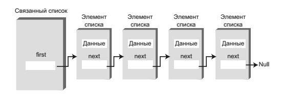
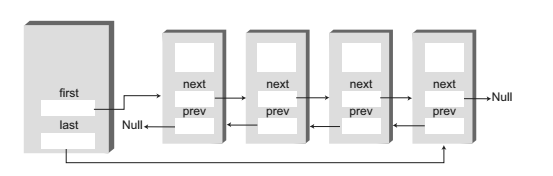
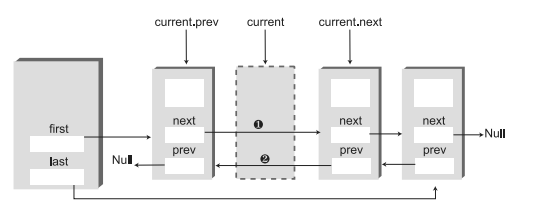

##Linked lists

 - How to run **Linked lists** applet:
 
   ```
   appletviewer http://cs.brynmawr.edu/Courses/cs206/spring2004/WorkshopApplets/Chap05/LinkList/LinkList.html
   ```
   

###Простой связный список

В связанном списке каждый элемент данных встраивается в специальный объект, называемый элементом списка (классу, на основе которого создаются такие объекты, 
часто присваивается имя Link). Так как список содержит много однотипных элементов, для них удобно создать отдельный класс, отличный от класса самого
связанного списка. Каждый элемент (то есть объект Link) содержит ссылку на следующий элемент списка; поле, в котором эта ссылка хранится, обычно называется
next. 
Объект списка содержит ссылку на первый элемент first.




```java
class Link{
   
    public int iData;    // Данные
    public double dData; // Данные
    public Link next;    // Ссылка на следующий элемент списка

}

```
**Как искать елемент в списке**

В списке конкретный элемент можно найти только одним способом: отследив его по цепочке элементов от начала списка. Поиск больше напоминает отношения
между людьми. Допустим, вы спрашиваете Гарри, где находится Боб. Гарри этого не знает, но он думает, что Джейн может вам помочь. Вы идете и спрашиваете
Джейн. Она видела, что Боб уходил из офиса с Салли; вы звоните на сотовый телефон Салли. Оказывается, Салли рассталась с Бобом у офиса Питера... В общем,
вы поняли. Обратиться к элементу данных напрямую невозможно, для поиска приходится использовать отношения между элементами. Вы начинаете с первого
элемента, переходите ко второму, потом к третьему — пока не найдете тот, который вам нужен.

**Метод delete()**

Для поиска удаляемого элемента метод delete() использует тот же способ, что и метод find(). Однако этот метод должен хранить ссылку не только на текущий
элемент списка (current), но и на предыдущий элемент (previous). Это необходимо из-за того, что при удалении текущего элемента метод должен связать предыдущий
элемент со следующим (рис. 5.8). Чтобы обратиться к предыдущему элементу, необходимо сохранить ссылку на него.


###Двусторонние списки

Двусторонний список похож на обычный связанный список с одной дополнительной возможностью: в нем хранится ссылка не только на первый, но и на последний элемент.


Наличие ссылки на последний элемент позволяет вставлять новые элементы не только в начале, но и в конце списка. Конечно, новый элемент можно вставить
в конце и обычного односвязного списка, перебирая все его содержимое до последнего элемента, но такое решение неэффективно.

**Эффективность связанных списков**

Вставка и удаление в начале связанного списка выполняются очень быстро. Операция сводится к изменению одной или двух ссылок, выполняемому за время O(1).
Поиск, удаление и вставка рядом с конкретным элементом требует перебора в среднем половины элементов списка, для которого необходимо O(N) сравнений.
У массива эти операции тоже выполняются за время O(N), но связанный список все равно работает быстрее, потому что он не требует перемещения элементов при вставке 
или удалении. Повышение эффективности может быть весьма значительным, особенно если копирование занимает существенно больше времени, чем сравнение.
Другое важное преимущество связанных списков перед массивами заключается в том, что связанный список всегда использует ровно столько памяти, сколько
необходимо, и может расширяться вплоть до всей доступной памяти. Фиксация размера массива при создании обычно приводит либо к неэффективному исполь-
зованию памяти (если массив слишком велик) или исчерпанию всей доступной памяти (если массив слишком мал).

###Сортированные списки

Чтобы вставить элемент в отсортированный список, алгоритм сначала перебирает элементы в поисках подходящей позиции для вставки
Обнаружив позицию для вставки, алгоритм вставляет элемент обычным способом: в поле next нового элемента заносится ссылка на следующий элемент, а в поле
next предыдущего элемента заносится ссылка на новый элемент. Однако при этомприходится учитывать особые случаи: вставку нового элемента в начале или в конце списка.

Код метода вставки:
```java
public void insert(long key) {

    Link newLink = new Link(key); 
    Link previous = null; 
    Link current = first;
    
    while(current != null && key > current.dData){ 
        previous = current;
        current = current.next; 
    }

    if(previous == null){ 
        first = newLink; 
    }else {
        previous.next = newLink; 
    }
   newLink.next = current; 
}
```

**Эффективность сортированных списков**

- Вставка и удаление произвольных элементов в сортированных связанных списках требуют O(N) сравнений (в среднем N/2), 
потому что позицию для выполнения операции приходится искать перебором списка.
- Поиск или удаление наименьшего значения выполняется за время O(1), потому что оно всегда
находится в начале списка. Если приложение часто обращается к наименьшему элементу, а скорость вставки не критична, 
то сортированный связанный список будет достаточно эффективным.

###Двусвязные списки

Двусвязный список позволяет перемещаться по списку как в прямом, так и в обратном направлении. Дело в том, что
каждый элемент хранит ссылки на два других элемента вместо одного. Первая ссылка указывает на следующий элемент, как и в обычных списках. 
Вторая ссылка указывает на предыдущий элемент.



```java
class Link{

    public long dData;    // Данные
    public Link next;     // Ссылка на следующий элемент списка
    public link previous; // Ссылка на предыдущий элемент списка

}
```

К **недостаткам** двусвязных списков следует отнести то, что при каждой вставке
или удалении ссылки вам приходится изменять четыре ссылки вместо двух: две
связи с предыдущим элементом и две связи со следующим элементом. И конечно,
каждый элемент списка занимает чуть больше места из-за дополнительной ссылки.

**Вставка (insertFirst())**


Метод **insertLast()** выполняет те же действия в конце списка; он является своегорода «зеркальным отражением» insertFirst().

**Вставка (insertAfter())**


**Удаление**

```java
    current.previous.next = current.next;
    current.next.previous = current.previous;
```




**Итоги**

- Связанный список состоит из одного объекта linkedList и некоторого числа объектов Link.
- Объект linkedList содержит ссылку на первый элемент списка (которой часто присваивается имя first).
- Каждый объект Link содержит данные и ссылку на следующий элемент списка (которой часто присваивается имя next).
- Если поле next равно null, это является признаком конца списка.
- Чтобы вставить элемент в начале связанного списка, необходимо сохранить в поле next нового элемента ссылку, хранившуюся ранее в поле first списка, а в поле first — ссылку на новый элемент.
- Чтобы удалить элемент в начале списка, необходимо присвоить first ссылку на элемент first.next.
- Чтобы перемещаться по связанному списку, необходимо начать с элемента first, а затем последовательно переходить по ссылке next к следующему элементу списка.
- Поиск элемента с заданным ключом осуществляется перемещением по списку.
  Когда элемент будет найден, пользователь может вывести его содержимое,удалить или выполнить с ним другую операцию.
- После того как элемент с заданным значением ключа будет найден, можно вставить новый элемент до или после него.
- Двусторонний список хранит ссылку на последний элемент списка (которая часто называется last) наряду со ссылкой на первый элемент.
- В двустороннем списке возможна вставка элементов в конце списка.
- В сортированном связанном списке элементы упорядочиваются по возрастанию (а иногда по убыванию) значения ключа.
- Вставка в сортированном списке выполняется за время O(N), потому что алгоритм должен найти правильную позицию для выполнения операции. Удаление наименьшего элемента выполняется за время O(1).
- В двусвязном списка каждый элемент содержит ссылку как на следующий, так и на предыдущий элемент.
- Двусвязный список поддерживает перемещение в обратном направлении и удаление в конце списка.